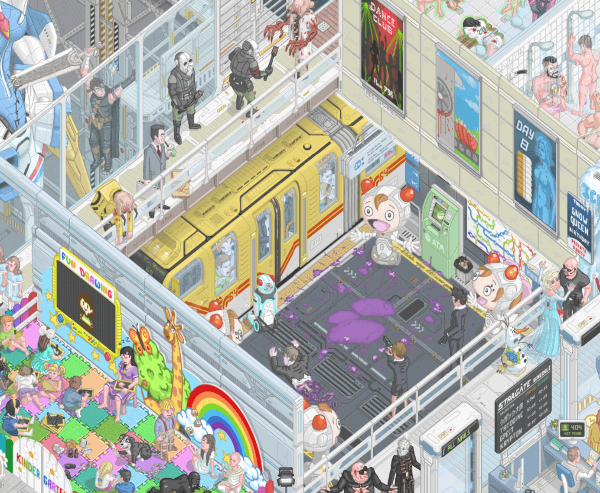
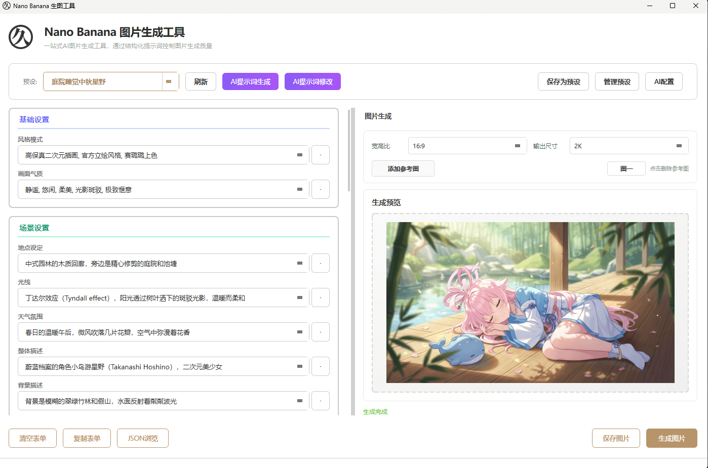
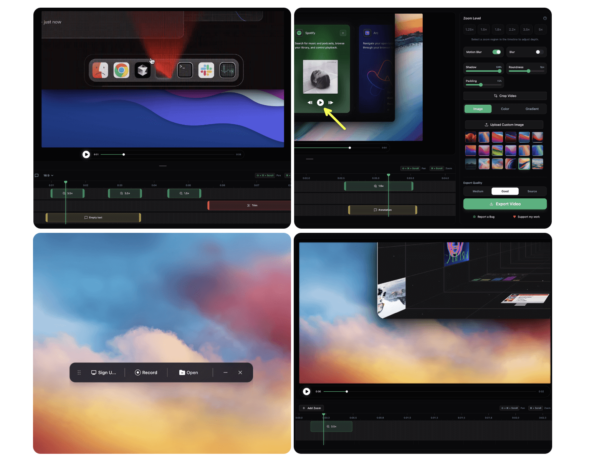
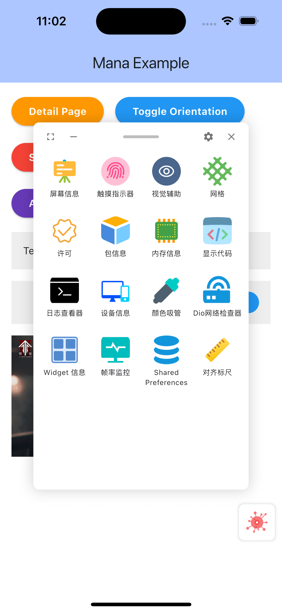
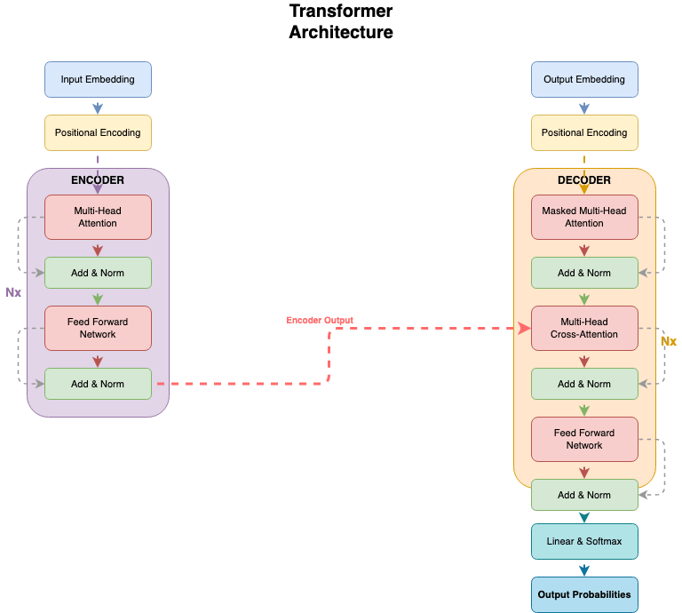
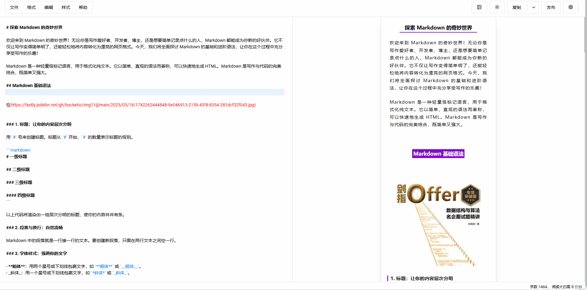
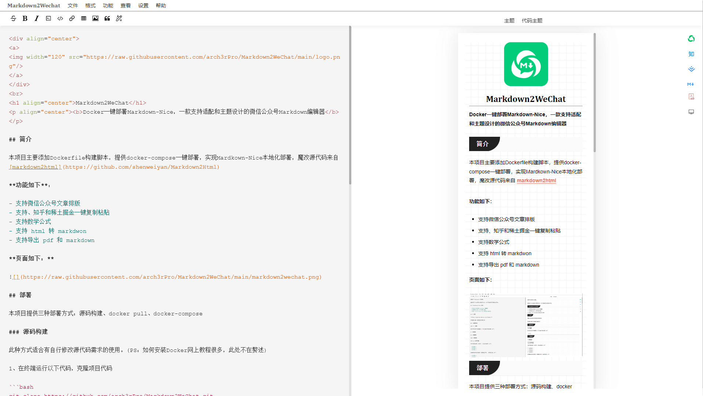
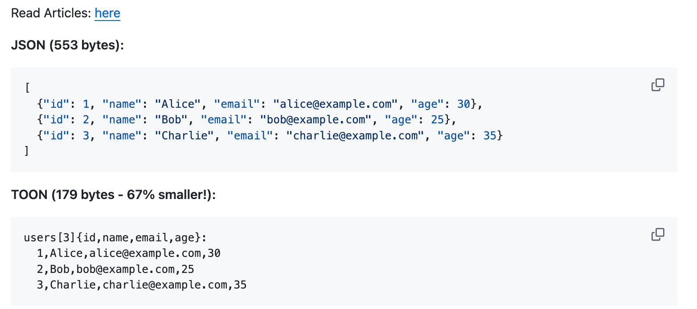
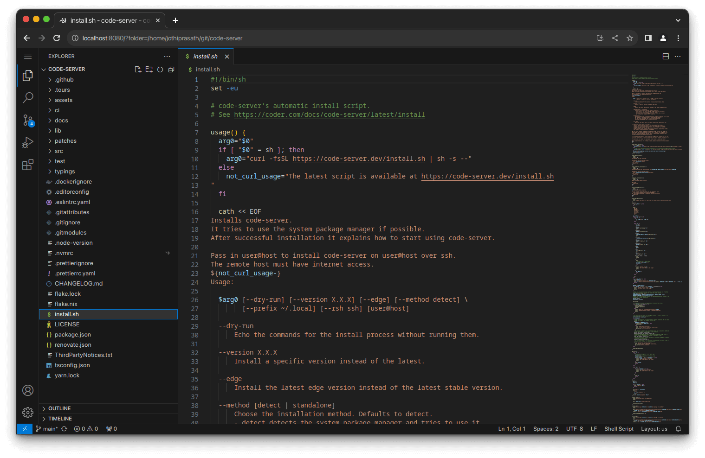
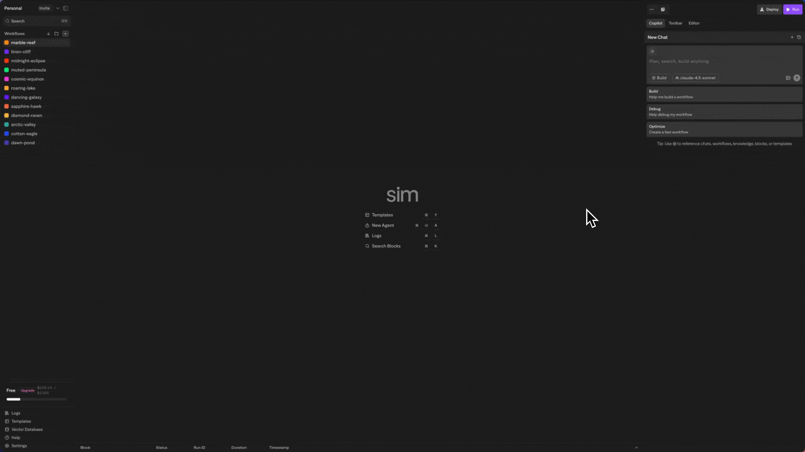

## 📖好文章
* 📄[Flutter - 详情页 TabBar 与模块联动？秒了！](https://juejin.cn/post/7538868042961911817)
* 📄[从千问灵光 App 看生成式 UI 技术的发展](https://juejin.cn/post/7583613222345310234)
* [KToon: Tiny Tables, Big Savings Plug TOON into Your @Serializable Kotlin Classes](https://proandroiddev.com/ktoon-tiny-tables-big-savings-plug-toon-into-your-serializable-kotlin-classes-4bf6f65c208f)
* [隐藏的 Flutter 模式：正在浪费你应用 30% 的性能](https://juejin.cn/post/7519412199027752969)

## 🎮好玩的

**Floor796**  

https://floor796.com/

 Floor796 is an animated scene showing the lives of characters from various works on the 796th floor of a huge space station. The animation is regularly expanded with new blocks (rooms) and characters from movies, TV series, games, anime, memes, etc.

IP设计灵感来源

## 🔨好工具

**lissettecarlr/nano-banana-prompt-studio**  

https://github.com/lissettecarlr/nano-banana-prompt-studio

一站式AI图片生成工具，通过结构化提示词控制图片生成质量。

**siddharthvaddem/openscreen**  

https://github.com/siddharthvaddem/openscreen

OpenScreen is your free, open-source alternative to Screen Studio (sort of).

一个开源免费使用的截屏工具。

**lhlyu/flutter_mana**  

https://github.com/lhlyu/flutter_mana

Flutter应用内调试工具平台

 

**DayuanJiang/next-ai-draw-io**  

https://github.com/DayuanJiang/next-ai-draw-io

A Next.js web application that integrates AI capabilities with draw.io diagrams. Create, modify, and enhance diagrams through natural language commands and AI-assisted visualization.

一个集成了AI功能的Next.js网页应用，与draw.io图表无缝结合。通过自然语言命令和AI辅助可视化来创建、修改和增强图表。

**doocs/md**  

https://github.com/doocs/md

Markdown 文档自动即时渲染为微信图文，让你不再为微信内容排版而发愁！只要你会基本的 Markdown 语法（现在有了 AI，你甚至不需要会 Markdown），就能做出一篇样式简洁而又美观大方的微信图文。

**arch3rPro/Markdown2WeChat**  

https://github.com/arch3rPro/Markdown2WeChat

Docker一键部署Markdown-Nice，一款支持适配和主题设计的微信公众号Markdown编辑器

## 🎈优秀开源

**JosephSanjaya/ktoon**  

https://github.com/JosephSanjaya/ktoon

KToon is a Kotlin Multiplatform serialization library implementing the TOON format (Token-Oriented Object Notation). Think of it as JSON's efficient cousin—perfect for mobile apps, IoT devices, and anywhere bandwidth matters. Build for kiroween hackaton

Efficient serialization for Kotlin Multiplatform(Cut your API payload sizes by 30-60% without changing your code)

KToon 是一个实现 TOON 格式（面向令牌的对象表示法）的 Kotlin 多平台序列化库。

**coder/code-server**

https://github.com/coder/code-server

Run VS Code on any machine anywhere and access it in the browser.

网页版本VS Code

**simstudioai/sim**  

https://github.com/simstudioai/sim

Build and deploy AI agent workflows in minutes.

Design agent workflows visually on a canvas—connect agents, tools, and blocks, then run them instantly.

