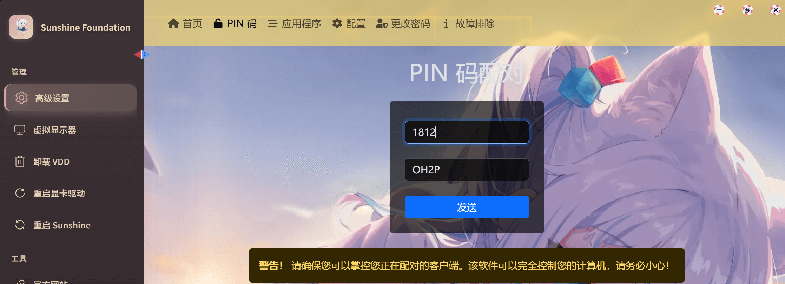
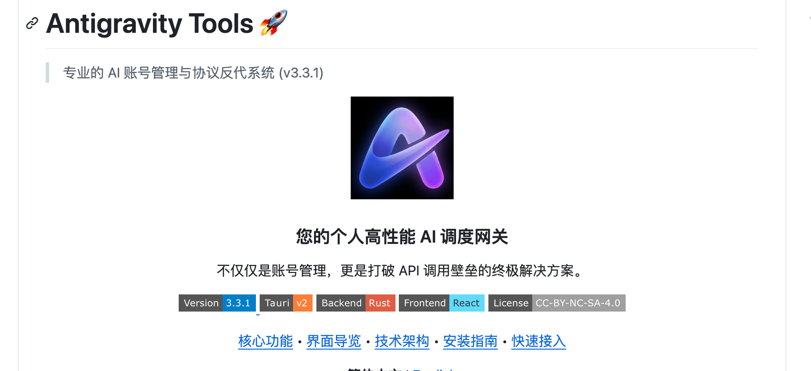
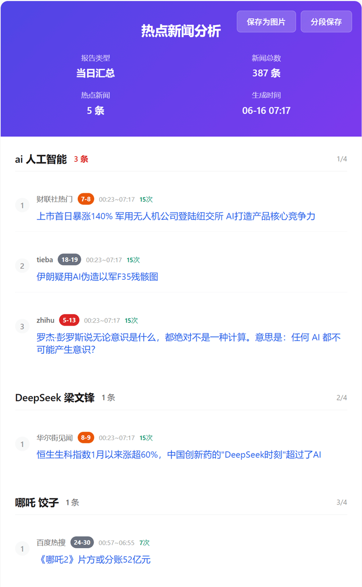
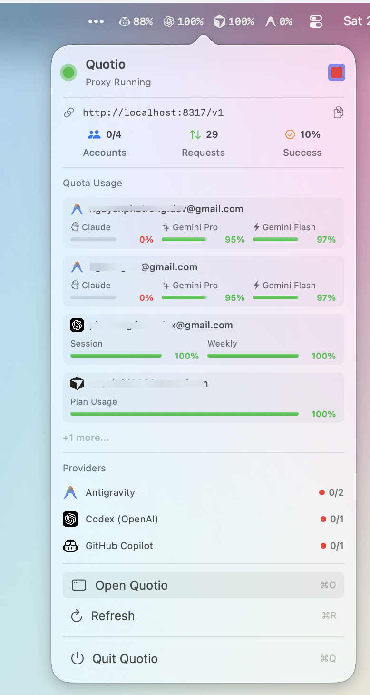
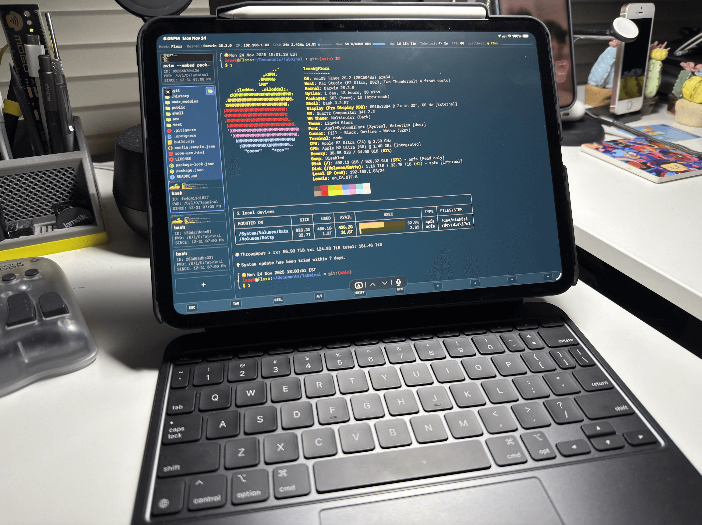
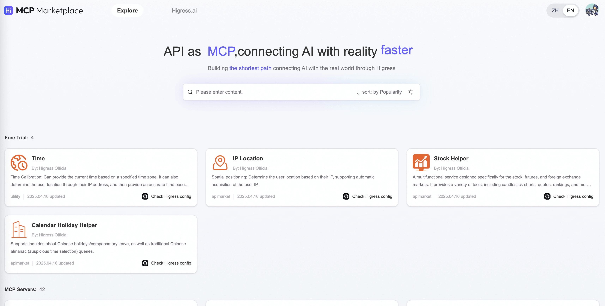
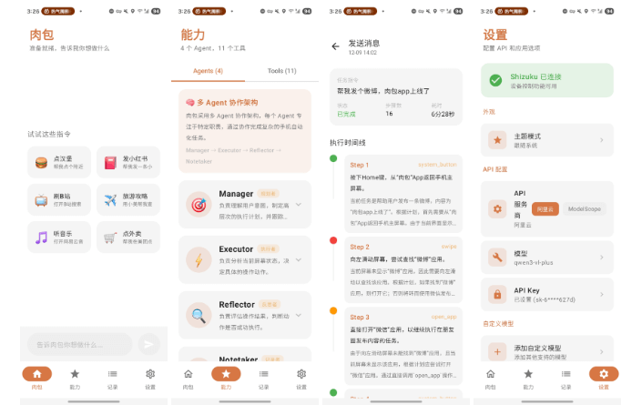
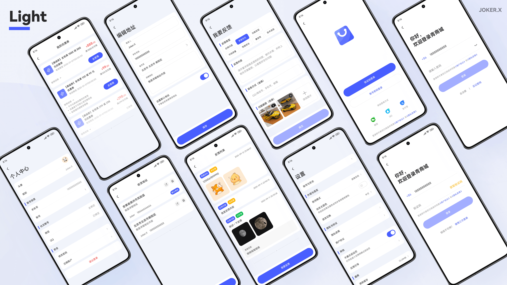
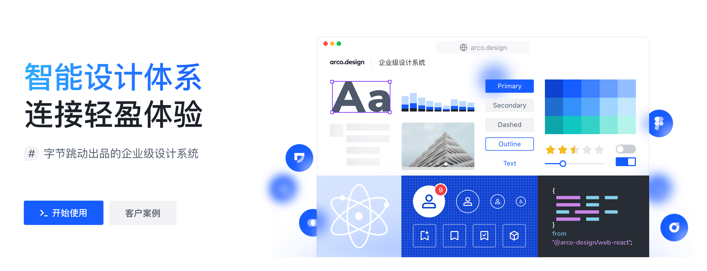

## 📖好文章
* 📄[AI大佬Karpathy焦虑了：作为程序员，我从未感到如此落后](https://mp.weixin.qq.com/s/dWhnYawB3lAMgmMl-lgPyA)
* 📄[Model Context Protocol（MCP）：AI助手与数据系统的桥梁Model Context Protoc](https://juejin.cn/post/7442616449339162676)
* 📄[分库分表正在被淘汰如果我们现在在搭建新的业务架构](https://juejin.cn/post/7561245020045918249)
* 📄[还在手动翻译国际化词条？AST解析+AI翻译实现一键替换国际化项目](https://juejin.cn/post/7588487605247836169)
* 📄[Android车机卡顿案例剖析:从Binder耗尽到单例缺失的深度排查](https://juejin.cn/post/7588098335791316992)

## 🔨好工具

**jwxa/moonlight-xiaoai**  

https://github.com/jwxa/moonlight-xiaoai

Moonlight-XiaoAI

**lbjlaq/Antigravity-Manager**  

https://github.com/lbjlaq/Antigravity-Manager

Antigravity Tools 是一个专为开发者和 AI 爱好者设计的全功能桌面应用。它将多账号管理、协议转换和智能请求调度完美结合，为您提供一个稳定、极速且成本低廉的 本地 AI 中转站。

**sansan0/TrendRadar**  

https://github.com/sansan0/TrendRadar

🚀 最快30秒部署的热点助手 —— 告别无效刷屏，只看真正关心的新闻资讯

**nguyenphutrong/quotio**  

https://github.com/nguyenphutrong/quotio

Quotio is a native macOS application for managing CLIProxyAPI - a local proxy server that powers your AI coding agents. It helps you manage multiple AI accounts, track quotas, and configure CLI tools in one place.

 

**Leask/Tabminal**  

https://github.com/Leask/Tabminal

Tab(ter)minal, the Cloud-Native, Proactive AI Integrated Terminal works in modern browsers. Seamlessly code from your desktop, tablet, or phone with an intelligent, persistent, and rich experience. This project was built using Gemini and Codex wich 80% vibe-coding, means built for the vibe, with the vibe.

## 🎈优秀开源

**alibaba/higress**  

https://github.com/alibaba/higress

Higress is a cloud-native API gateway based on Istio and Envoy, which can be extended with Wasm plugins written in Go/Rust/JS. It provides dozens of ready-to-use general-purpose plugins and an out-of-the-box console (try the demo here).

Higress 是一款云原生 API 网关，内核基于 Istio 和 Envoy，可以用 Go/Rust/JS 等编写 Wasm 插件，提供了数十个现成的通用插件，以及开箱即用的控制台（demo 点这里）

**Turbo1123/roubao**

https://github.com/Turbo1123/roubao

首款无需电脑的开源 AI 手机自动化助手 | AI Phone Automation Assistant

**Joker-x-dev/CoolMallKotlin** 

https://github.com/Joker-x-dev/CoolMallKotlin

这是一个基于 Kotlin 和 Jetpack Compose 打造的开源电商学习项目，核心功能已基本完成。项目采用了 Google 推荐的应用架构和最佳实践，参考了 Now in Android 的架构设计，旨在展示如何运用现代 Android 开发技术构建一个完整的电商应用。项目具备完整的电商业务流程，包括用户认证、商品展示、购物车、订单支付等核心功能，适合开发者学习参考现代 Android 开发技术。

**arco-design/arco-design-vue** 

https://github.com/arco-design/arco-design-vue
https://arco.design/

A comprehensive Vue UI components library based on the Arco Design system.

基于 Arco Design 的 Vue UI 组件库。

