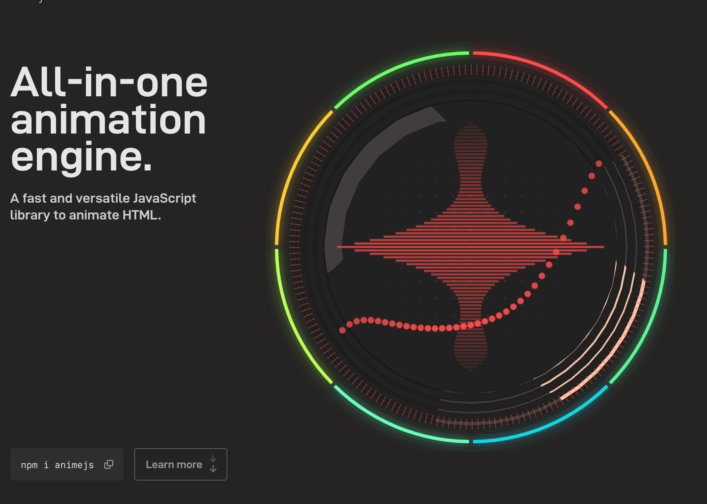
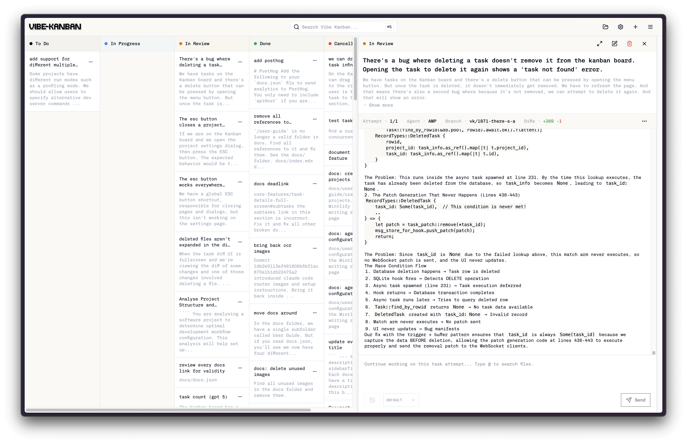
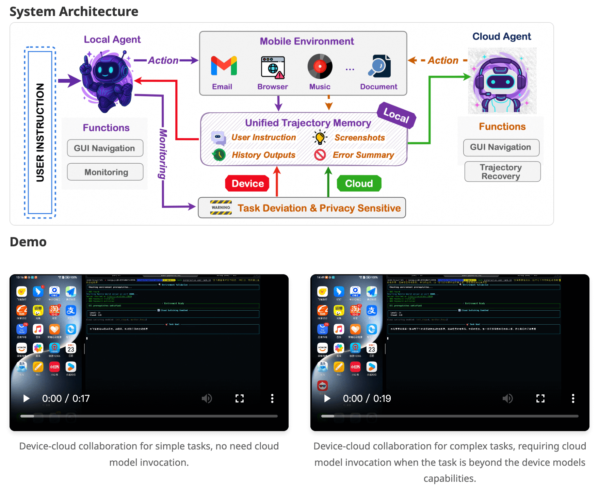
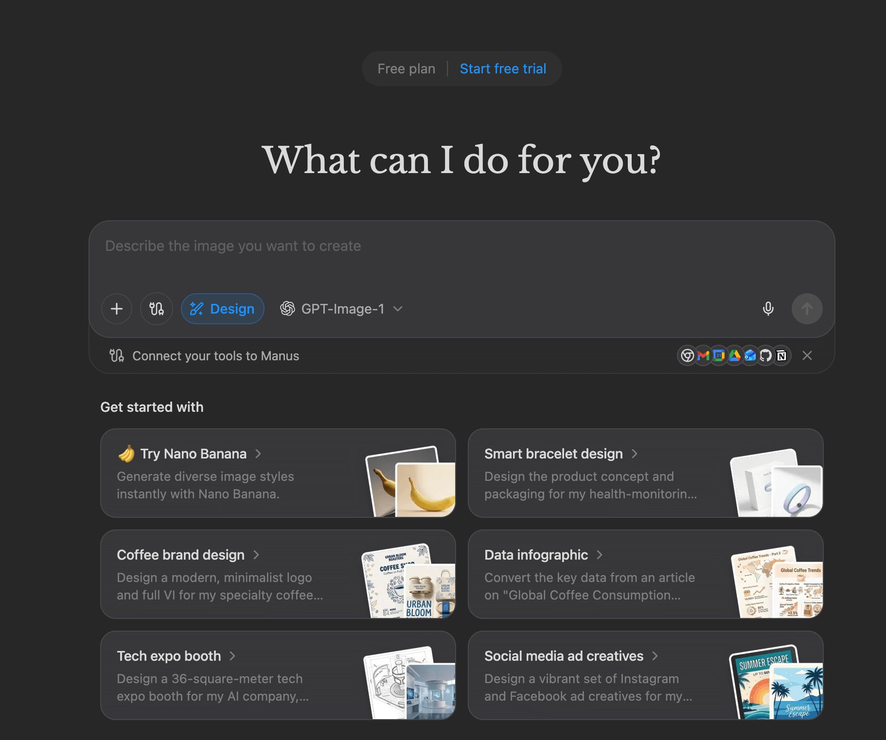
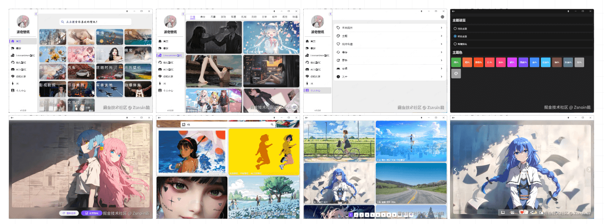
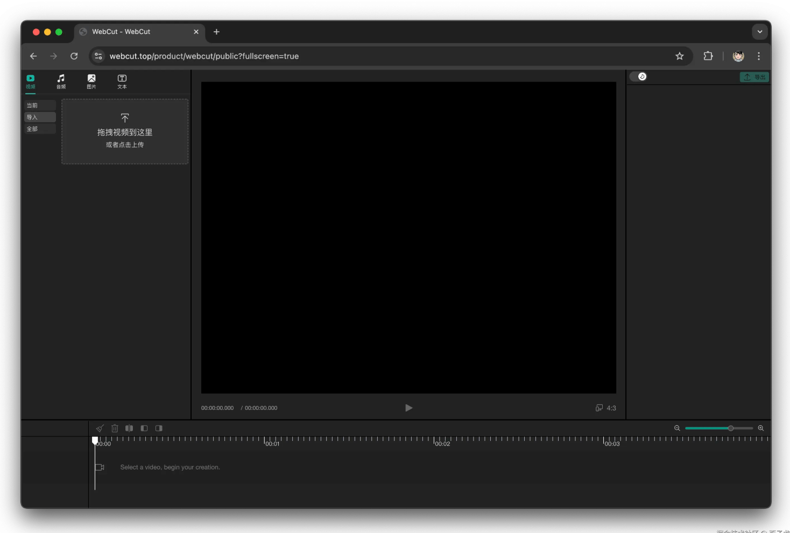
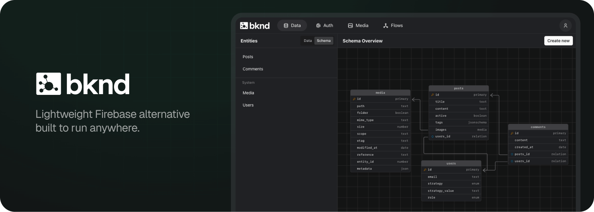

## 📖好文章

* 📄[别搞混了！MCP 和 Agent Skill 到底有什么区别](https://juejin.cn/post/7584057497205817387)
* 📄[再次紧急修复Flutter针对WebView无法点击问题增加新的快速修复](https://juejin.cn/post/7584443518162141220)
* 📄[给大龄（35岁+）程序员的绝地求生计划书](https://juejin.cn/post/7543976401176985643)
* 📄[微信小游戏包体限制4M，一个字体就11.24M，怎么玩？](https://juejin.cn/post/7572087181608353842)

## 🎮好玩的

**Anime.js**  

https://animejs.com/

JavaScript Animation Engine

**ruvnet/wifi-densepose**  

https://github.com/ruvnet/wifi-densepose

A cutting-edge WiFi-based human pose estimation system that leverages Channel State Information (CSI) data and advanced machine learning to provide real-time, privacy-preserving pose detection without cameras.

一种基于 WiFi 的尖端人体姿势估计系统，利用信道状态信息 (CSI) 数据和先进的机器学习，无需摄像头即可提供实时、保护隐私的姿势检测。(用wifi信号来检查人体姿势？居然有4.6k的Start,当个好玩的项目来看看好了。)

## 🔨好工具

**SPACE TYPE GENERATOR**  

https://spacetypegenerator.com/

一个非常强大的文字效果生成器

**BloopAI/vibe-kanban**  

https://github.com/BloopAI/vibe-kanban

Vibe Kanban lets you run coding agents in parallel without conflicts, and perform code review through our diff tool. Now you can focus on planning and quality instead of watching terminal logs.

**Tongyi-MAI/MAI-UI**  

https://github.com/Tongyi-MAI/MAI-UI

https://tongyi-mai.github.io/MAI-UI/

MAI-UI: Real-World Centric Foundation GUI Agents.

MAI-UI ：阿里通义开源的全尺寸GUI智能体基座模型

**Manus**  

https://manus.im/app

Manus AI is an autonomous general AI agent designed to complete tasks and deliver results. Unlike traditional chatbots that simply answer questions, Manus AI takes action. Think of Manus AI as a virtual colleague with its own computer,capable of planning, executing, and delivering complete work products from start to finish.

刚被Meta收购的Manus AI智能体，与其说它是AI工具不如说它是一个智能产品：AI领域的垂直应用。

**Zsnoin/windows_wallpaper**  

https://gitee.com/zsnoin-can/windows_wallpaper

这是一个 Flutter 项目，主要用于展示和管理壁纸。该项目支持多种壁纸来源，包括本地图片、网络图片等，并提供了丰富的功能如主题切换、壁纸收藏、壁纸搜索等。

**tangshuang/webcut**  

https://github.com/tangshuang/webcut

A powerful web video editing UI framework, empowering web applications to quickly integrate professional-grade video editing capabilities.

## 📚好资源

**freemediaheckyeah**  

https://fmhy.net/

The largest collection of free stuff on the internet!

各类集合资源站

**AI智库导航**  

https://aiguide.cc/

每日最新AI工具及资讯

## 🎈优秀开源

**HighCapable/YukiHookAPI**  

https://github.com/HighCapable/YukiHookAPI

https://highcapable.github.io/YukiHookAPI/zh-cn/

⛱️ An efficient Hook API and Xposed Module solution built in Kotlin.

**bknd-io/bknd**  

https://github.com/bknd-io/bknd

bknd simplifies app development by providing a fully functional visual backend for database management, authentication, media and workflows. Being lightweight and built on Web Standards, it can be deployed nearly anywhere, including running inside your framework of choice. No more deploying multiple separate services!

## 📝记录

25年的最后一篇周刊，结束这一年的过往~
来年继续努力，祝大家新年快乐🎉~

另外：新的一年周刊内容分类或许要做一些调整，希望能做到更精致化一些。