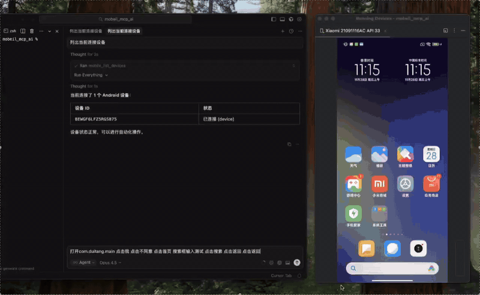
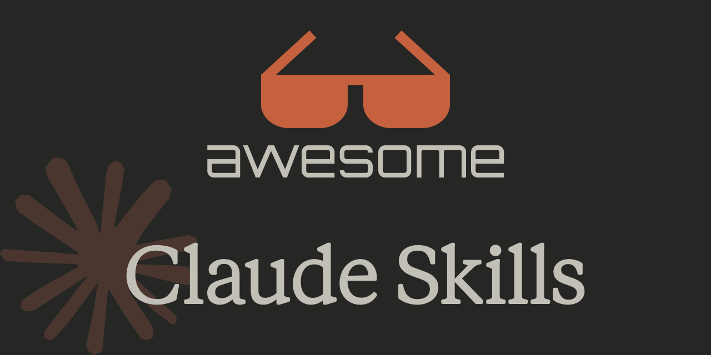
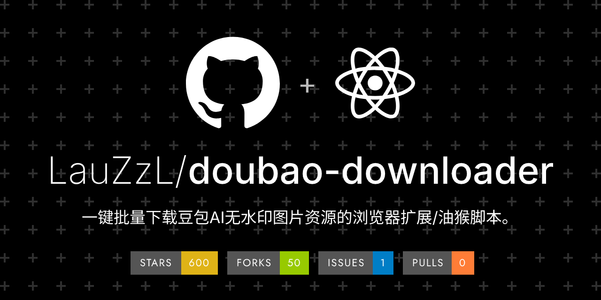
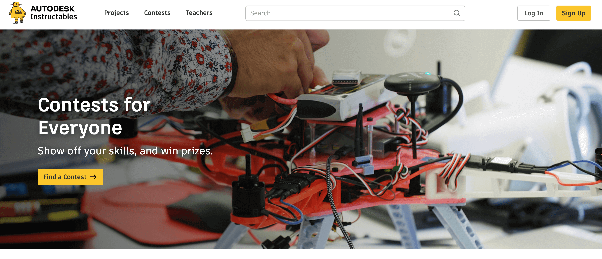
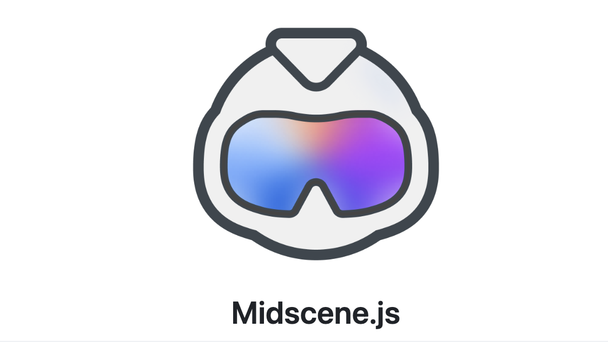

## 📕 精选文章

* 📄[海外一人公司创作者天花板Dan Koe：12条规则：在12个月内改变你的生活](https://zhuanlan.zhihu.com/p/1956122334827111454)
* 📄[前端已死？我用 Trae + Gemini 零代码手搓 3D 塔罗牌，找到了新出路](https://juejin.cn/post/7588124225702363176)
* 📄[一杯咖啡成本搞定多模态微调：FC DevPod + Llama-Factory 极速实战](https://juejin.cn/post/7581858890608050212)
* 📄[2025 年终醒悟，AI  让我误以为自己很强，未来程序员的转型之路](https://juejin.cn/post/7587845752681807935)
* 📄[Agent Skills：AI 能力扩展的新范式](https://zhuanlan.zhihu.com/p/1977330573967116091)

## 🤖 AI前沿

**datawhalechina/hello-agents**  

📚 《从零开始构建智能体》——从零开始的智能体原理与实践教程

https://github.com/datawhalechina/hello-agents

**mobile-mcp**  

让 Cursor 直接控制手机的 MCP 工具(📱 支持 Android 和 iOS 双平台)

https://gitee.com/chang-xinping/mobile-mcp

**travisvn/awesome-claude-skills**  

Claude Skills teach Claude how to perform tasks in a repeatable way

Claude常用技能汇总

https://github.com/travisvn/awesome-claude-skills

**steveyegge/beads**  

A memory upgrade for your coding agent

Beads provides a persistent, structured memory for coding agents. It replaces messy markdown plans with a dependency-aware graph, allowing agents to handle long-horizon tasks without losing context.

beads（命令行工具为 bd）是一个面向 AI 代理的分布式、基于 git 的图形化问题跟踪器，旨在为编码代理提供持久化、结构化的内存，替代混乱的 markdown 计划，通过依赖感知的图形化结构帮助代理处理长周期任务而不丢失上下文。

https://github.com/steveyegge/beads

**x1xhlol/system-prompts-and-models-of-ai-tools**  

Make your LLM predictable in production

20多款AI工具系统内置提示词

https://github.com/x1xhlol/system-prompts-and-models-of-ai-tools

**AiShort - AI Prompt Library**

精选 AI 提示词，让每次对话更高效

https://www.aishort.top/

## 🔨 实用工具

**myip.ms**

Find Hosting Company On Any Website / Owner on Any IP Address

一个帮助用户寻找类似同行独立站的站点

https://myip.ms/

**LauZzL/doubao-downloader**  

浏览器插件：浏览器扩展工具-图片下载

https://github.com/LauZzL/doubao-downloader

**rainxchzed/Github-Store**  

GitHub Store is a cross‑platform “play store” for GitHub releases. It discovers repositories that ship real installable binaries and lets you install, track, and update them across platforms from one place.

GitHub Store 是一个面向 GitHub Releases 的跨平台 “Play Store”。 它可以发现真正可安装的二进制文件仓库，并让你在一个地方完成 安装、跟踪和更新。

https://github.com/rainxchzed/Github-Store

## 📚 宝藏资源
 
**Yours for the making**  

手工技能学习站点，一个教你提高动手能力的教学网。

https://www.instructables.com/

**12 Rules To Change Your Life In 12 Months**  

学习12法则重建你的生活秩序

https://www.youtube.com/watch?v=IajTL2RCJ_k&t=347s

## 💡 优秀项目

**code-yeongyu/oh-my-opencode**  

No stupid token consumption massive subagents here. No bloat tools here.

帮助你减少Token消耗的工具

https://github.com/code-yeongyu/oh-my-opencode

**web-infra-dev/midscene**  

Driving all platforms UI automation with vision-based model

视觉模型驱动，支持全平台的 UI 自动化 SDK

https://midscenejs.com/zh/introduction.html
https://github.com/web-infra-dev/midscene

