## 📕 精选文章
* 📄[有了 MCP，为什么Claude 还要推出 Skills？](https://juejin.cn/post/7562129514665000995)
* 📄[2025年年终总结（二）](https://zhuanlan.zhihu.com/p/1991073922217709984)
* 📄[如何用 Dart 写个自己的MCP服务](https://juejin.cn/post/7591350620189114374)
* 📄[专题从零构建你的第一个 Claude Skill：实践教程系列](https://www.80aj.com/topic/claudecode-skills/)
* 📄[🚀程序员福音！学习新框架从此不用看文档？Skill Seeker让Claude成为你的技术导师，CrewAI、AutoGen、LangGraph随便上，自动生成完整项目代码，告别学习曲线陡峭的噩梦！不用再啃文档了！这个工具让 Claude 秒懂任何技术框架](https://www.aivi.fyi//aiagents/introduce-Skill-Seeker)
* 📄[Claude Code Skills：讓 AI 變身專業工匠](https://kaochenlong.com/claude-code-skills)
* 📄[我用 Chrome 扩展验证了 MCP 的安全风险，结果发现](https://zhuanlan.zhihu.com/p/1977331115808289236)

## 🤖 AI前沿

**mrgoonie/claudekit-skills**  

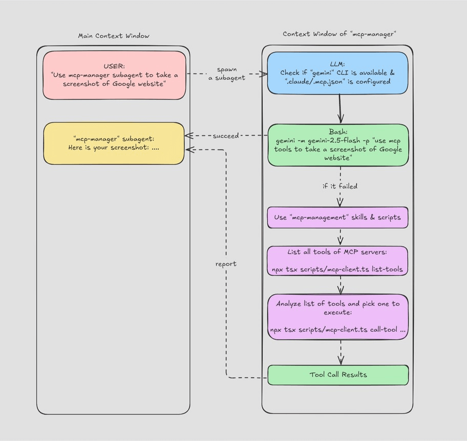

Agent Skills are specialized workflows that empower Claude to perform complex, multi-step tasks with precision and reliability. They combine mission briefs, guardrails, and integration hints to transform generic AI assistance into disciplined automation.

Claude专门的工作流程能够精确可靠地执行复杂的多步骤任务：结合任务简介、集成提示，将通用人工智能辅助转变为严格的自动化。

https://github.com/mrgoonie/claudekit-skills

**yusufkaraaslan/Skill_Seekers**  

Automatically convert documentation websites, GitHub repositories, and PDFs into Claude AI skills in minutes.在几分钟内自动将文档网站、GitHub 存储库和 PDF 转换为 Claude AI 技能。

支持快速将文档或者git仓库内容转变为CC的Skill为AI开发提效。

https://github.com/yusufkaraaslan/Skill_Seekers

**Claude Code Templates**  

Supercharge Your AI Development with Anthropic Claude

Claude Code Templates 是一款开源 CLI 工具，可配置 Claude Code 项目并提供专用组件来增强 AI 驱动的开发工作流程。其收录了智能体、mcp、skill、插件、设置等。

https://www.aitmpl.com/skills
https://github.com/davila7/claude-code-templates

**charmbracelet/crush**  

你的新编程伙伴，现在就在你最爱的终端中。
你的工具、代码和工作流，都与您选择的 LLM 模型紧密相连。

Crush 是由 Charmbracelet 开发的终端原生 AI 开发助手，专为软件开发人员设计，核心目标是在终端中提供 AI 驱动的代码辅助能力，无需离开终端即可完成代码编写、调试、分析和理解等任务。

目前原作者 + Charm 团队持续开发。

https://github.com/charmbracelet/crush

原先是opencode仓库已归档（Archived），不再维护，仅保留溯源用途。
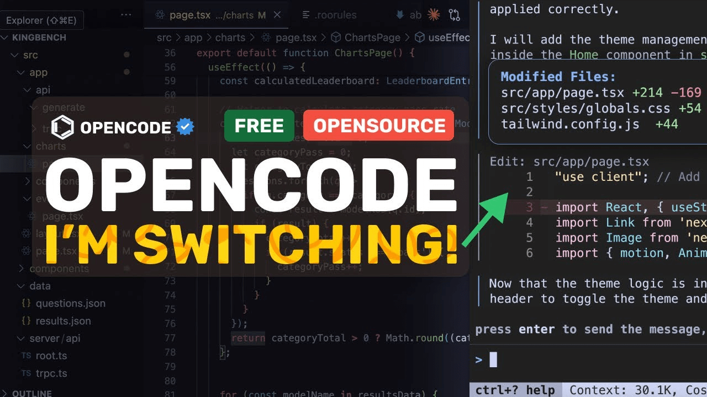

https://github.com/opencode-ai/opencode

## 🔨 实用工具

**TurixAI/TuriX-CUA**

 
 
This is the official website for TuriX Computer-use-Agent

电脑桌面智能体工具

https://github.com/TurixAI/TuriX-CUA
https://turix.ai/

**mobile-dev-inc/Maestro**  

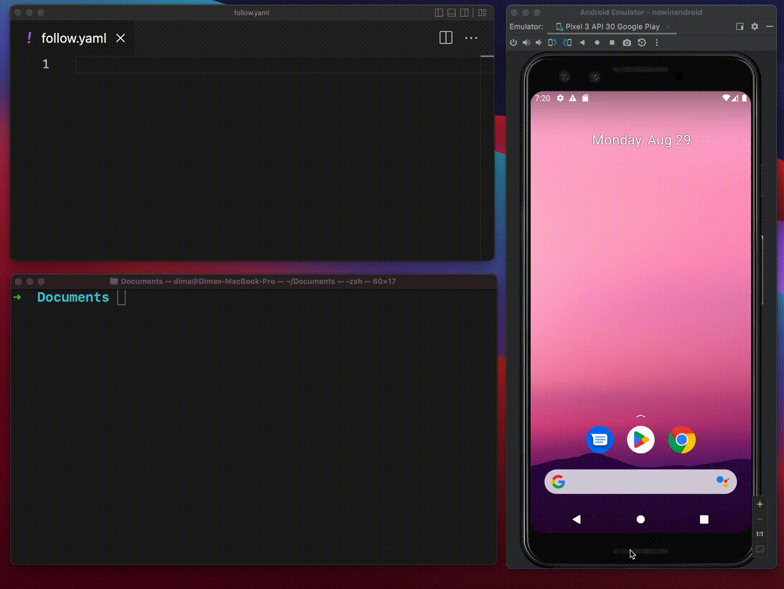

Maestro is an open-source framework that makes UI and end-to-end testing for Android, iOS, and web apps simple and fast.

自动化UI测试工具，支持多平台：Android, iOS, Web

https://github.com/mobile-dev-inc/Maestro
https://maestro.dev/

**bmax121/APatch:** 

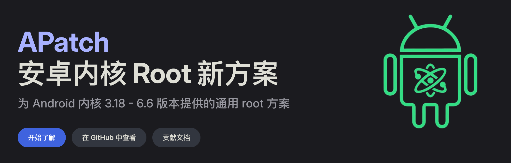

The patching of Android kernel and Android system.
为 Android 内核 3.18 - 6.6 版本提供的通用 root 方案

https://apatch.dev/zh_CN/
https://github.com/bmax121/APatch

**Dia Browser | AI Chat With Your Tabs**  

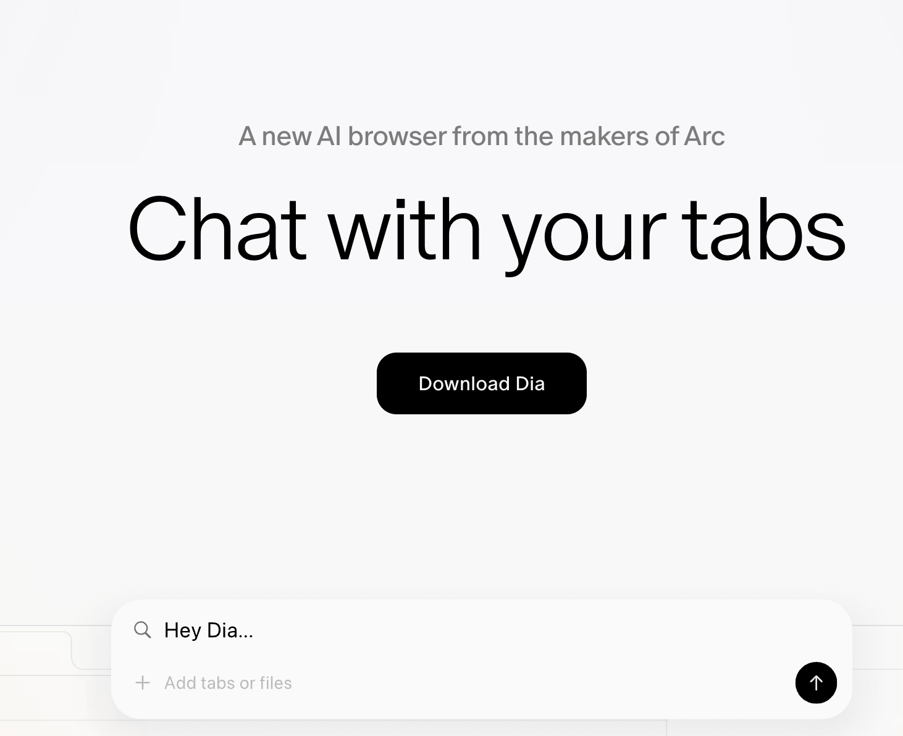

A new AI browser from the makers of Arc

Dia Browser 是由 The Browser Company（Arc 浏览器母公司）推出的 AI 原生浏览器，将 AI 深度整合到浏览体验中。

https://www.diabrowser.com/

**deltazefiro/Amarok-Hider**  

Amarok is a lightweight Android privacy tool that shields your files and apps from prying eyes without the overhead of encryption.

Amarok 是一款轻量级隐私保护工具，一键隐藏你的隐私文件和应用。

 
https://github.com/deltazefiro/Amarok-Hider

## 📚 宝藏资源

**skywind3000/RenderHelp**  

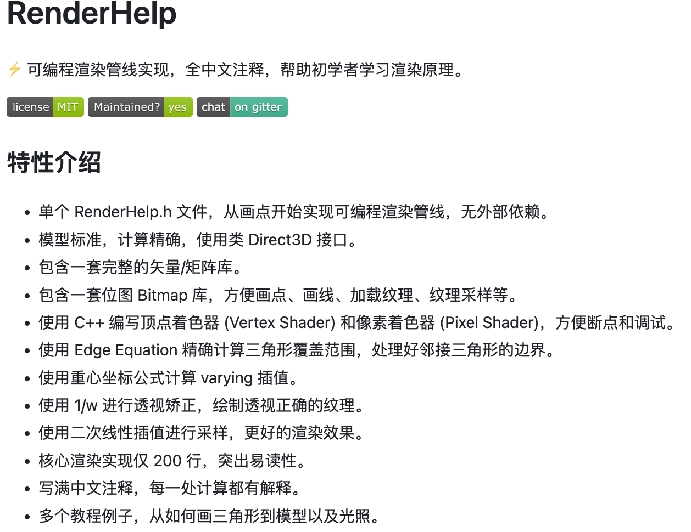

⚡ 可编程渲染管线实现，全中文注释，帮助初学者学习渲染原理。

https://github.com/skywind3000/RenderHelp

**CS146S: The Modern Software Developer - Stanford University** 

斯坦福VibeCoding课程教学

https://themodernsoftware.dev/

**PacktPublishing/LLM-Engineers-Handbook**  

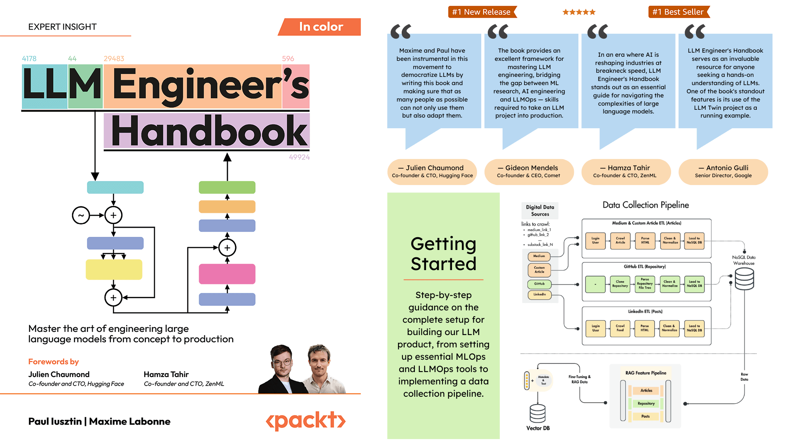

The LLM's practical guide: From the fundamentals to deploying advanced LLM and RAG apps to AWS using LLMOps best practices

书籍《LLM-Engineers-Handbook》线上实践代码仓库

https://github.com/PacktPublishing/LLM-Engineers-Handbook

**SylphAI-Inc/LLM-engineer-handbook**  

LLM-工程师手册:收藏了许多作为工程师所需的知识、书籍、框架、工具等等资源内容。

https://github.com/SylphAI-Inc/LLM-engineer-handbook

## 💡 优秀项目

**snappdevelopment/JsonTree**

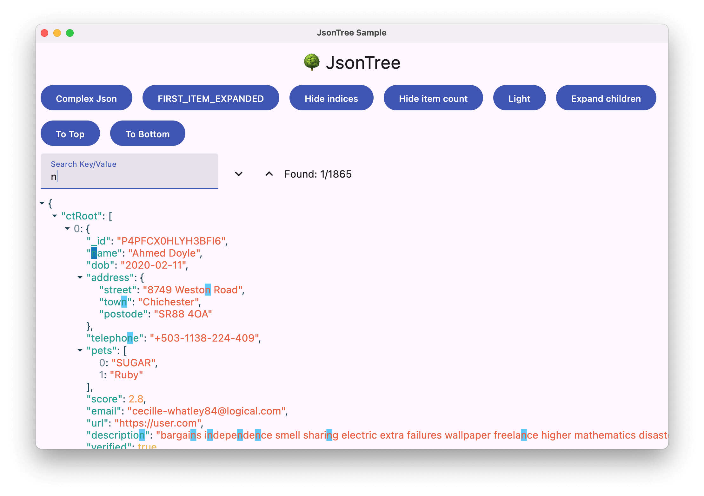

JsonTree is a Compose Multiplatform library to display JSON data in Compose with syntax highlighting and more.

JsonTree 是一个 Compose 多平台库，用于在 Compose 中显示 JSON 数据，并具有语法突出显示等功能。

https://github.com/snappdevelopment/JsonTree

**noties/Markwon**  

Android markdown library (no WebView)

Android平台上支持展示markdown开源库

https://github.com/noties/Markwon
https://noties.io/Markwon/

**shadcn-ui/ui**  

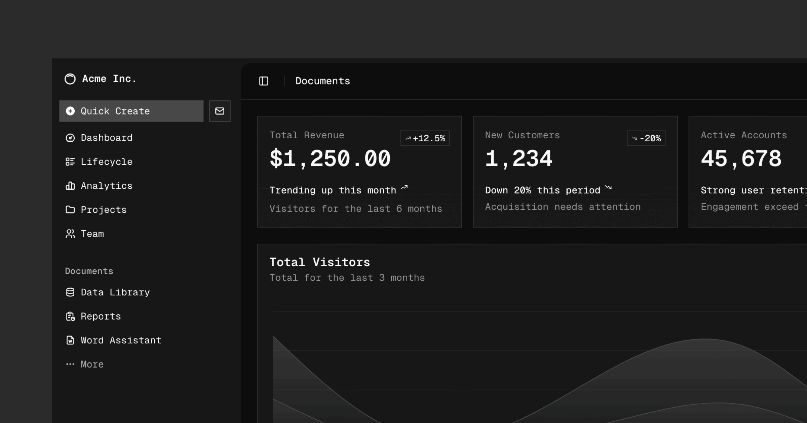

A set of beautifully designed components that you can customize, extend, and build on. Start here then make it your own. Open Source. Open Code. Use this to build your own component library.

开源的前端UI组件，可在其原UI组件库基础上再自定义设计你自己专属的UI组件库

https://github.com/shadcn-ui/ui
http://ui.shadcn.com/docs

**IamCreateAI/NeoVerse**

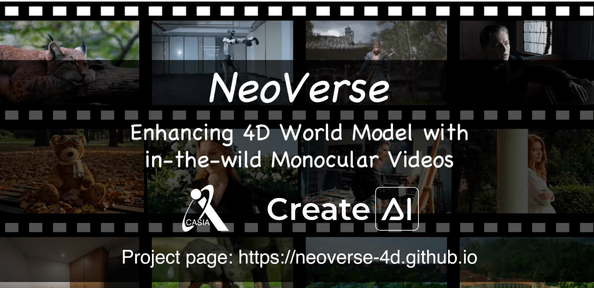
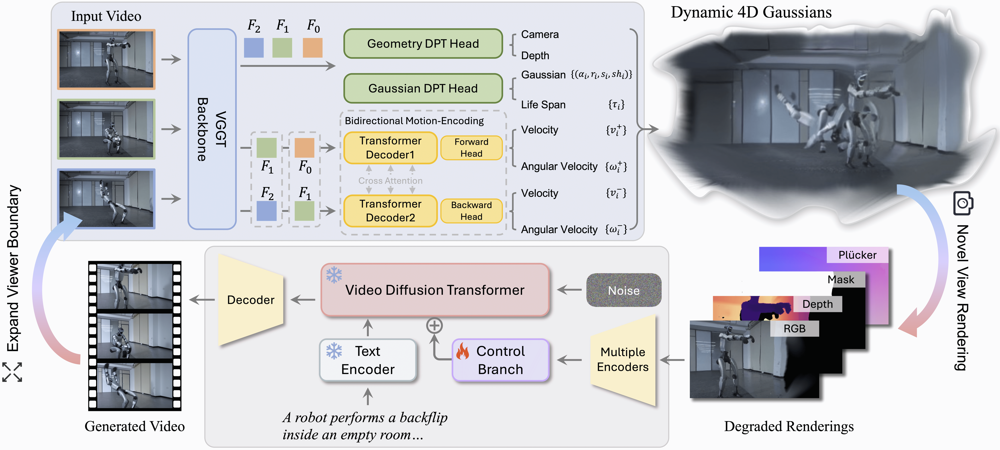

NeoVerse: Enhancing 4D World Model with in-the-wild Monocular Videos

通过单目视频增强 4D 世界模型。

https://github.com/IamCreateAI/NeoVerse
https://neoverse-4d.github.io/

