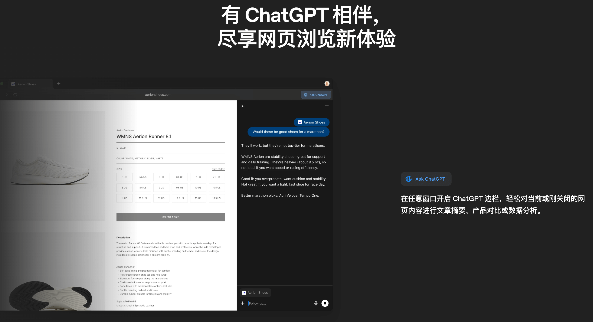
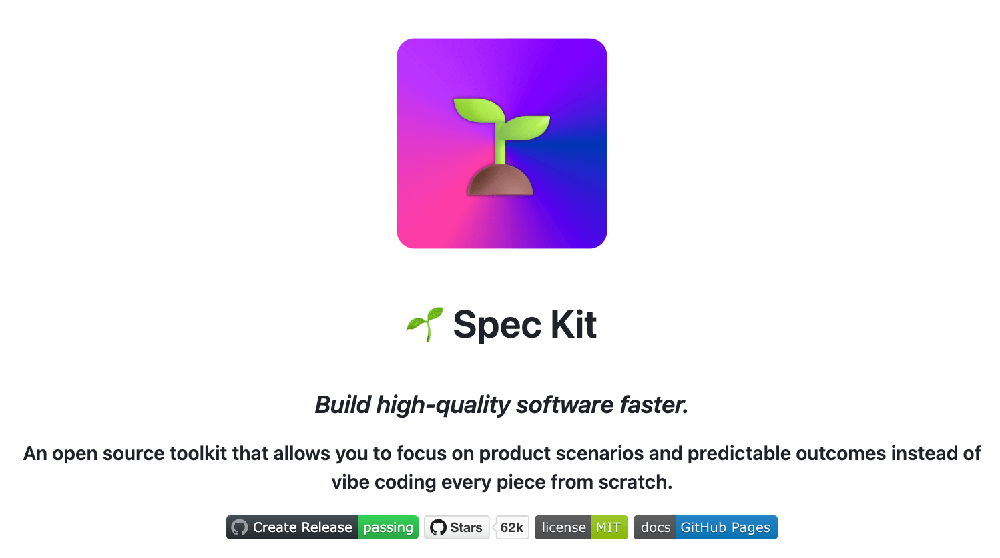
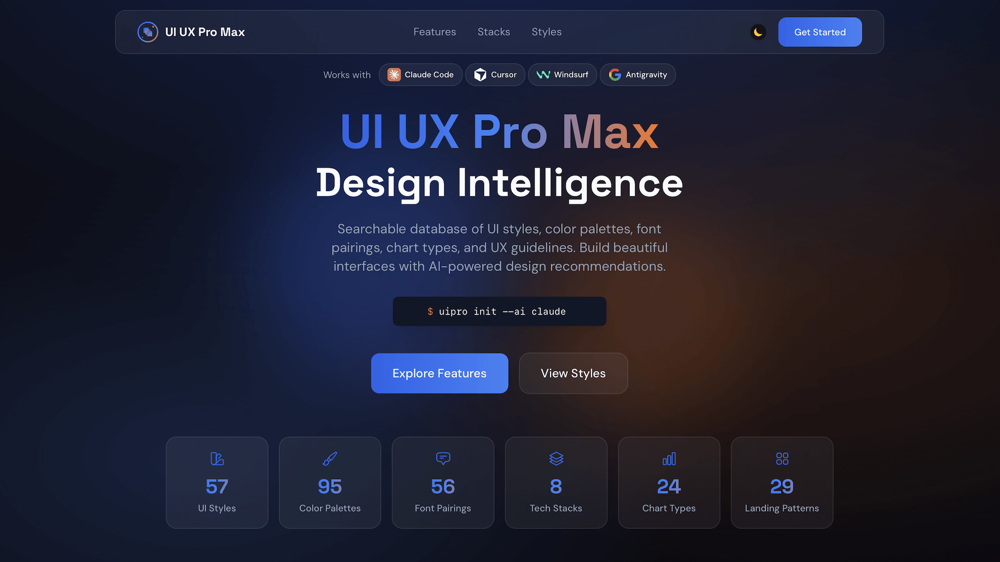
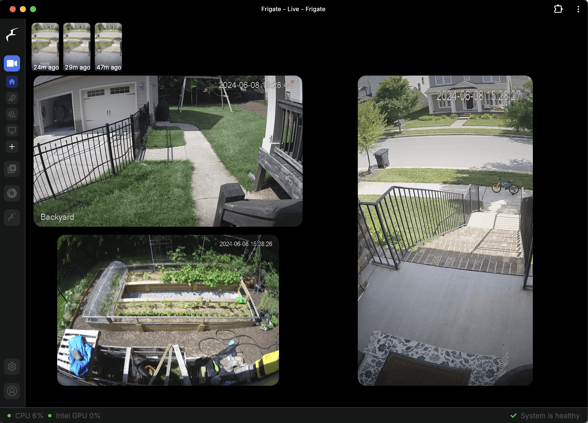
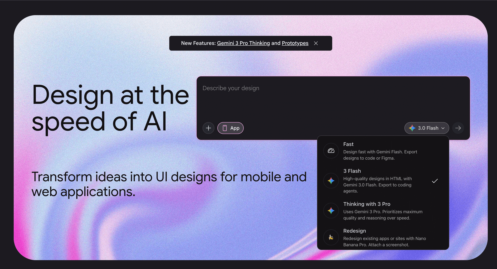
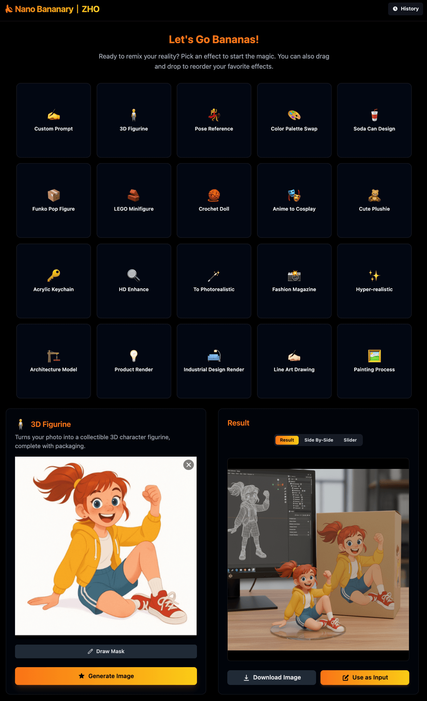
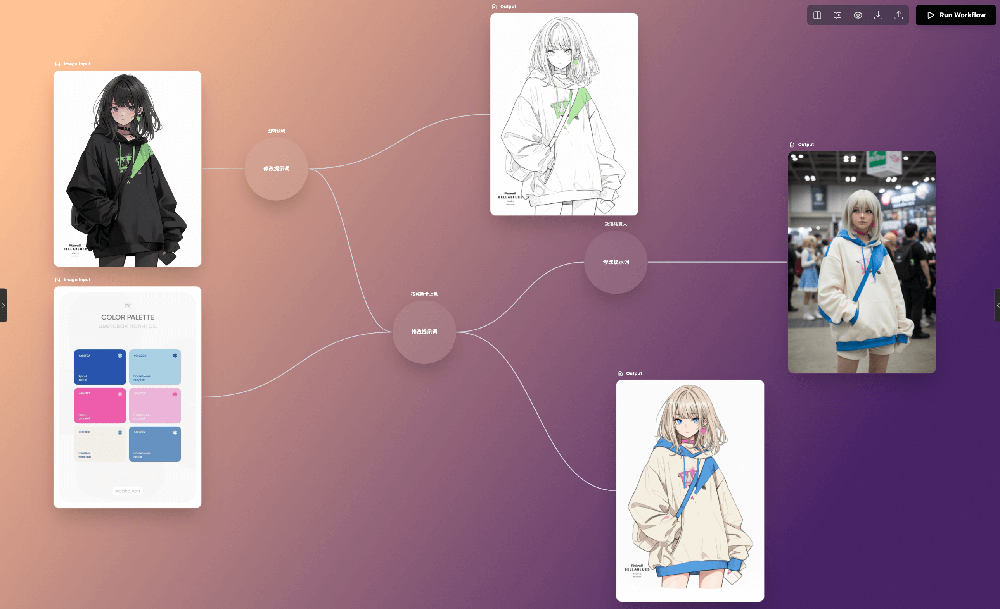
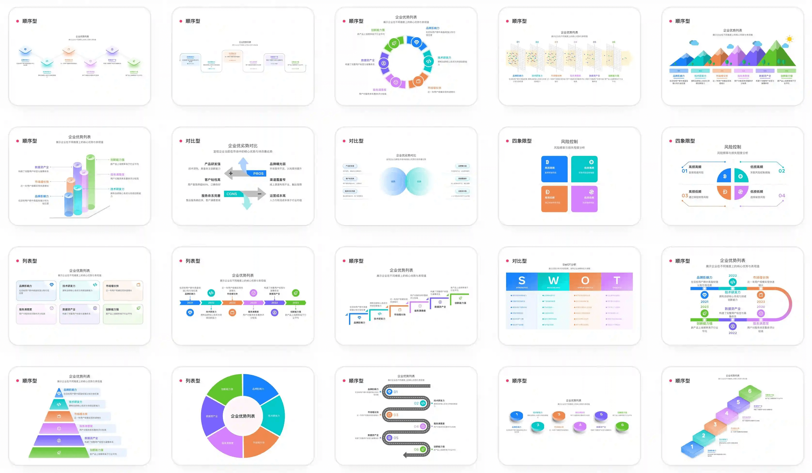
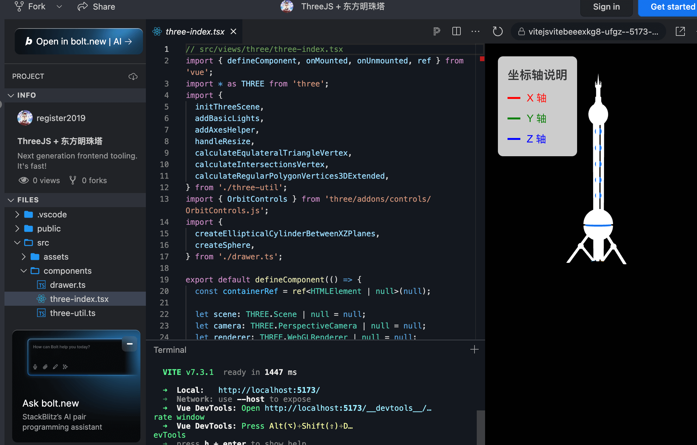

## 📕 精选文章
* 📄[AI Agent 框架演进](https://juejin.cn/post/7593771861323546650)
* 📄[OpenSpec最近火了，规范驱动开发是AI编程的未来吗？](https://www.zhihu.com/question/1969140298404853132)
* 📄[从美团全栈化看 AI 冲击](https://juejin.cn/post/7581999251368460340)
* 📄[如何看待英伟达 CEO 黄仁勋在2026 CES上的演讲，有哪些信息值得关注？](https://www.zhihu.com/question/1991576605823299604)

## 🤖 AI未来

**APP从0 → 上线发布！免费Vibe Coding 流程**  

完整演示了一套「真正能上线」的 Vibe Coding 开发流程 🚀

https://www.xiaohongshu.com/explore/69622c38000000002103c7c6?app_platform=android&ignoreEngage=true&app_version=9.15.0&share_from_user_hidden=true&xsec_source=app_share&type=video&xsec_token=CBR81ikJF-kBVmItjQrw1DaR7-wMrmwsbyAchub7UJrRs=&author_share=1&xhsshare=&shareRedId=N0k7Qjw7OTk2NzUyOTgwNjc1OTdISDtA&apptime=1768150454&share_id=8b702783b8ae4f179f4791efc7cd928e&share_channel=wechat

**ChatGPT Atlas**  

Atlas——ChatGPT 全新推出的浏览器
随时随地利用 ChatGPT 浏览网页，获取即时答案、智能建议并处理任务。

https://chatgpt.com/zh-Hans-CN/atlas/

**spec-kit**  

💫 Toolkit to help you get started with Spec-Driven Development

Spec Kit 是 GitHub 推出的一套 “规范驱动开发(Spec-Driven Development, SDD)”工具包，它将产品需求（规格）作为开发的核心，利用AI 技术实现从高层需求到可执行代码的系统化、自动化流程，让团队更关注业务场景而非繁琐编码，从而提高软件开发效率和质量。

https://github.com/github/spec-kit

**Fission-AI/OpenSpec**  

Spec-driven development (SDD) for AI coding assistants.

OpenSpec是海外很火的一个规范化和自动化工作流程系统，会在先代码前，先跟用户明确需求，并且有较强的规范约束能力，让写出的代码更符合用户需求。

https://github.com/Fission-AI/OpenSpec

**nextlevelbuilder/ui-ux-pro-max-skill**  

An AI SKILL that provide design intelligence for building professional UI/UX multiple platforms

为跨多个平台和框架构建专业的 UI/UX 提供设计智能Skills。

https://github.com/nextlevelbuilder/ui-ux-pro-max-skill

**NVIDIA GTC 主题演讲回放**

观看 NVIDIA CEO 黄仁勋在 GTC 2025 上揭示 AI 和加速计算的新动向。从 Blackwell GPU 架构到代理式 AI、AI 工厂和机器人技术突破，了解 NVIDIA 如何将计算从数据中心转向企业。不要错过 AI 的未来趋势。立即观看。

https://www.nvidia.cn/gtc/keynote/

**langchain-ai**

Build context-aware reasoning applications with LangChain’s flexible abstractions and AI-first toolkits.

利用 LangChain 灵活的抽象和人工智能优先的工具包构建上下文感知推理应用程序。

https://github.com/langchain-ai
https://www.langchain.com/

## 🔨 实用工具

**blakeblackshear/frigate**  

NVR with realtime local object detection for IP cameras

主要用于视频监控和物体检测，它结合了机器学习和计算机视觉技术，提供了实时的对象检测和人脸识别功能，适用于家庭安全、监控和自动化等场景。

https://github.com/blakeblackshear/frigate

**Stitch - Design with AI**  

Transform ideas into UI designs for mobile and web applications.

谷歌推出的AI交互产出工具，通过提示词让AI帮助你设计一套完整稿子并可导出到figma。

https://stitch.withgoogle.com/

**rberg27/doom-coding**  

A guide for how to use your smartphone to code anywhere at anytime.

随时随地来一把vibe coding。使用Claude在手机上实现每一刻都在编程。

https://github.com/rberg27/doom-coding

## 📚 宝藏资源

**automata/aicodeguide**  

AI Code Guide is a roadmap to start coding with AI

有关人工智能编码/人工智能辅助代码生成的实践和工具资源集合。

https://github.com/automata/aicodeguide

## 💡 优秀项目

**GZHO-ZHO-ZHO/Nano-Bananary**  

香蕉超市｜各种玩法一键生成，无需提示词，支持局部涂选、连续编辑

https://github.com/ZHO-ZHO-ZHO/Nano-Bananary

**ZHO-ZHO-ZHO/BananaFlow-ZHO**  

香蕉工厂：基于 Nano Banana 和 Veo3 模型/工具，轻松实现流程自动化

https://github.com/ZHO-ZHO-ZHO/BananaFlow-ZHO

**antvis/Infographic**  

🦋 An Infographic Generation and Rendering Framework, bring words to life with AI!

AntV Infographic 是 AntV 推出的新一代声明式信息图可视化引擎，通过精心设计的信息图语法，能够快速、灵活地渲染出高质量的信息图，让信息表达更高效，让数据叙事更简单。

https://github.com/antvis/Infographic

**libxposed/api**  

Xposed框架生态中的一个开源项目（库），它提供了一套标准化的通用API接口，旨在简化开发者为Xposed框架（包括其现代版本，如LSPosed）开发模块的过程，使模块能更方便地与Android应用进行交互、修改系统行为，实现功能扩展和定制化。 

https://github.com/libxposed/api

## 🎮 好玩有趣

**ThreeJS + 东方明珠塔 - StackBlitz**  

用ThreeJS做一个东方明珠电视塔模型。

https://stackblitz.com/edit/vitejs-vite-beeexkg8?file=src%2Fcomponents%2Fthree-index.tsx

