## 📕 精选文章

* 📄[一文读懂 Skills｜从概念到实操的完整指南](https://mp.weixin.qq.com/s?__biz=MzkxMTY4NTAyNQ==&mid=2247504906&idx=1&sn=3ded275d061cec5592bad151a30b6206&poc_token=HLQAd2mjwYS9y-u2aJoZVpSvVRQ3yxjIbWS3Tba7)
* 📄[从理解到应用 | 在 TRAE 中快速上手 Skills](https://mp.weixin.qq.com/s/z_c6-hlEdTgfGyY-oyZhIw)
* 📄[2025 年终回顾：25 岁，从“混吃等死”到别人眼中的“技术专家”](https://juejin.cn/post/7592789801708896297)
* 📄[节食正在透支程序员的身体](https://juejin.cn/post/7542086955077648434)
* 📄[Flutter 里的像素对齐问题，深入理解为什么界面有时候会出现诡异的细线？](https://juejin.cn/post/7518607166904991807)
* 📄[Claude Cowork 新功能来了！不需要代码，直接操作电脑文件](https://mp.weixin.qq.com/s/8MLI2yjRj6ZdAqXaycxq6w)

## 🤖 AI前沿

**VoltAgent/awesome-clawdbot-skills**  

A collection of 565+ community-built skills for Clawdbot, categorized for easy discovery.

超过565个为Clawdbot构建的技能社区集合。

https://github.com/VoltAgent/awesome-clawdbot-skills

**clawdbot/clawdbot**  

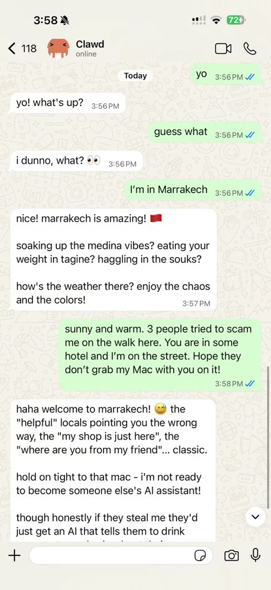

Clawdbot is a personal AI assistant you run on your own devices. It answers you on the channels you already use (WhatsApp, Telegram, Slack, Discord, Google Chat, Signal, iMessage, Microsoft Teams, WebChat), plus extension channels like BlueBubbles, Matrix, Zalo, and Zalo Personal. It can speak and listen on macOS/iOS/Android, and can render a live Canvas you control. The Gateway is just the control plane — the product is the assistant.

Clawdbot 是您在自己的设备上运行的个人人工智能助手。它会在您已使用的渠道（WhatsApp、Telegram、Slack、Discord、Google Chat、Signal、iMessage、Microsoft Teams、WebChat）以及 BlueBubbles、Matrix、Zalo 和 Zalo Personal 等扩展渠道上答复您。它可以在 macOS/iOS/Android 上说话和听，并可以渲染您控制的实时画布。网关只是控制平面——产品是助手。

https://github.com/clawdbot/clawdbot
https://docs.clawd.bot/

**obra/superpowers**  

An agentic skills framework & software development methodology that works.

Superpowers 是为您的编码代理提供的完整软件开发工作流程，建立在一组可组合的“技能”和一些确保您的代理使用它们的初始指令之上。

https://github.com/obra/superpowers

**ChrisWiles/claude-code-showcase**  

Comprehensive Claude Code project configuration example with hooks, skills, agents, commands, and GitHub Actions workflows

全面的Claude Code项目配置示例，包含挂钩、技能、代理、命令和GitHub Actions工作流程

https://github.com/ChrisWiles/claude-code-showcase

**用Skill拯救你的AI网页设计审美！**  

Claude Skill 一开始我觉得是噱头，直到用它做了100个网页后突然顿悟：它解决的根本不是技术问题，而是让普通人轻松调用专家级设计能力。从蓝紫色的AI味到专业级网页，只需一个技能包。

https://www.xiaohongshu.com/explore/69609382000000000b00afa5?xsec_token=ABrLs2apwUG4ZXO3eIPefHwyz6WhVfJWqYvvomF2UeztE=&xsec_source=pc_user

**小白必看！3个技巧教你具像化撰写AI提示词**  

三个步骤教你如何让抽象词具象化；第一步：拆解情绪为画面要素；第二步：把画面要素转成结构；第三步：用细节强化情绪感

https://www.xiaohongshu.com/explore/696e037a000000000a03eb89?xsec_token=ABLK6-3fMv-9H5MMGZdCFMsbEtbJNAYvcg9Ki9BUpaRXI=&xsec_source=pc_user

**AI视频最大的问题就是不可控？看我怎么治它**

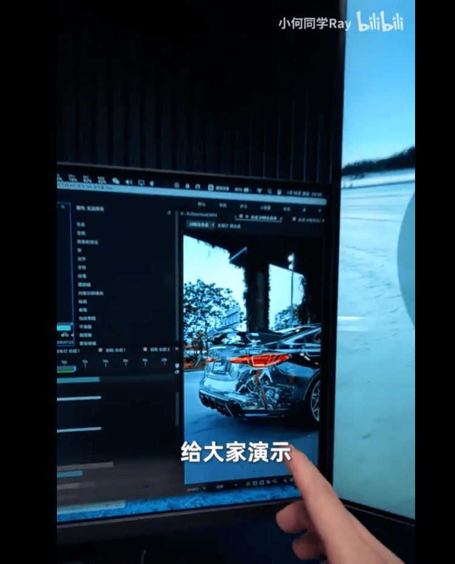

https://www.bilibili.com/video/BV12yrCBiEGv/

## 🔨 实用工具

**xun082/DocFlow**  

一个基于 Tiptap 和 Next.js 构建的现代化协同文档编辑器，集成了丰富的编辑能力与多人实时协作功能，支持插件扩展、主题切换与持久化存储。适合团队写作、教育笔记、在线文档平台等场景。

https://github.com/xun082/DocFlow
https://www.codecrack.cn/

**deltazefiro/Amarok-Hide**

Hide private files and apps with a single click.

Amarok 是一款轻量级隐私保护工具，一键隐藏你的隐私文件和应用。

https://github.com/deltazefiro/Amarok-Hider

## 📚 宝藏资源

**AI提示词库**  

598个Midjourney/Stable Diffusion/ChatGPT提示词案例 | Gem Nana AI 提示词库

https://gemnana.com/

**WaytoAGI** 

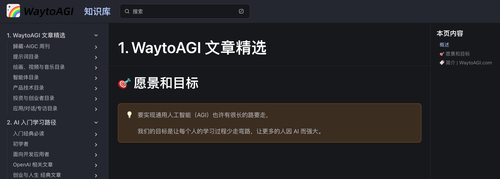

欢迎来到《通往 AGI 之路》知识库！这里旨在提供一个全面系统的 AI 学习路径，帮助您了解从 AI 常见名词到 AI 应用等各方面知识，更重要的是希望引发您思考：「我可以用 AI 做什么，帮助自己更强大」。 

https://articles.waytoagi.com/

**Learn Anything**  

学你想学的

https://learn-anything.xyz/

**CSS Loaders**  

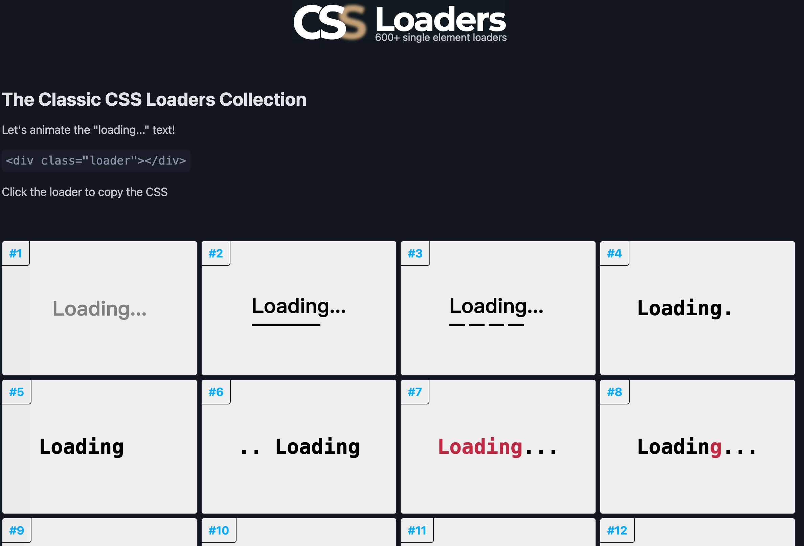

A collection of more than 600 loading animations

如果你是UI设计师和开发者，那么这个网站可以为你提供免费的CSS加载动画，选择你喜欢的风格，直接一键复制到你的项目里即可使用，进阶大神可以修改色值和字体来更好适配你的项目。

https://css-loaders.com/

**AiWind - AI Prompt Library**  

AI生图提示词：1000+套提示词免费参考。

https://www.aiwind.org/

**Design Systems Database & Gallery**  

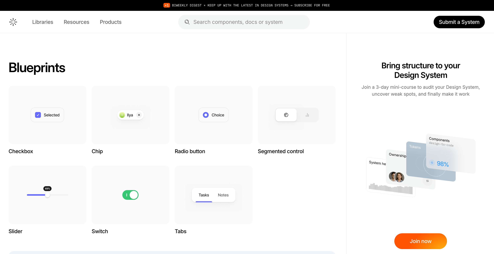

Best-in-class Design Systems with components and foundations references from top-tier tech companies and leading UI teams

各个大厂的设计系统都在这:一流的设计系统，其组件和基础参考来自顶级科技公司和领先的UI团队。

https://designsystems.surf/

**那墨先森**

免费商用素材平台

https://www.tsieina.com/

**Myinstants**  

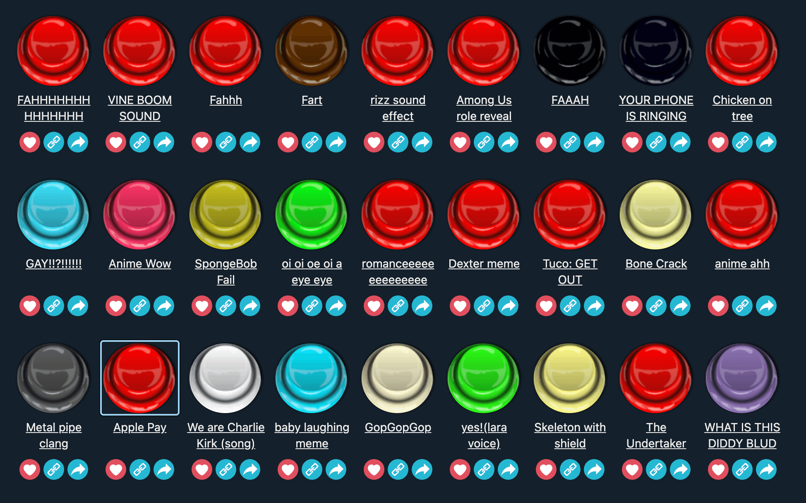

Trending Funny Sounds of United States
沙雕音效资源网

https://www.myinstants.com/

## 💡 优秀项目

**mindverse/Second-Me** 

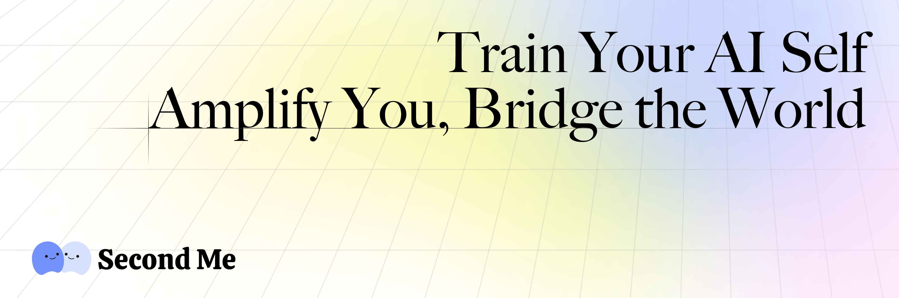

Train your AI self, amplify you, bridge the world

使用AI原生内存训练您的AI自我

https://github.com/mindverse/Second-Me

**jingyaogong/minimind-v**  

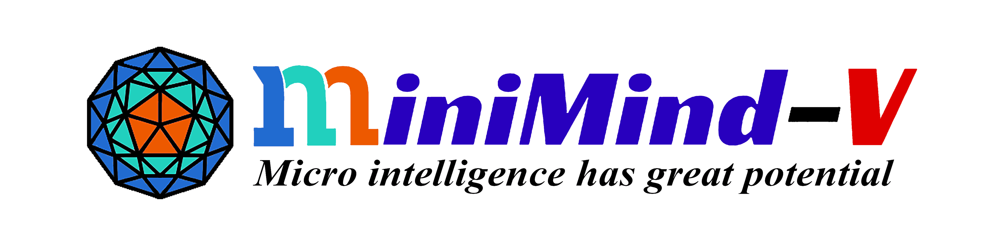

此项目旨在从0开始，仅用1.3块钱成本 + 1小时！即可训练出26M参数的超小多模态视觉语言模型MiniMind-V。

https://github.com/jingyaogong/minimind-v

**json-render**  

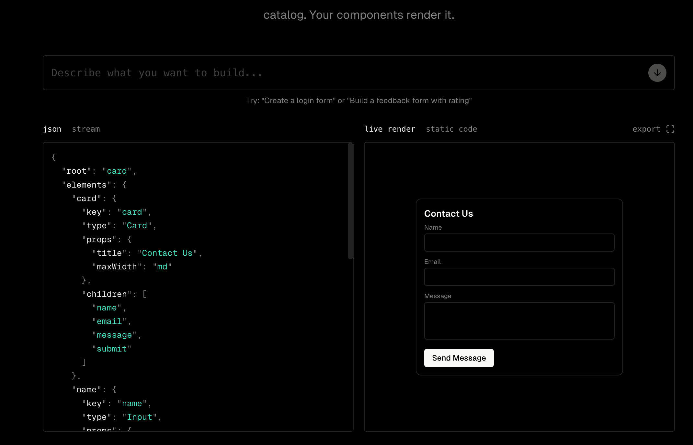

Define a component catalog. Users prompt. AI outputs JSON constrained to your catalog. Your components render it.

定义组件目录。用户提示。 AI 输出 JSON 受限于您的目录。你的组件渲染它。

https://json-render.dev/

**Comfy-Org/ComfyUI**  

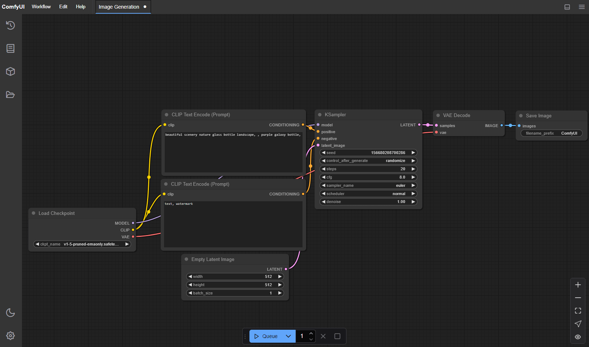

The most powerful and modular diffusion model GUI, api and backend with a graph/nodes interface.

ComfyUI 允许您使用基于图形/节点/流程图的界面设计和执行高级稳定扩散管道。适用于 Windows、Linux 和 macOS。

https://github.com/Comfy-Org/ComfyUI
https://www.comfy.org/

## 🎮 好玩有趣

**petpet**  

摸头杀生成器  - 万物皆可摸头

https://toolwa.com/petpet/

**Failory**  

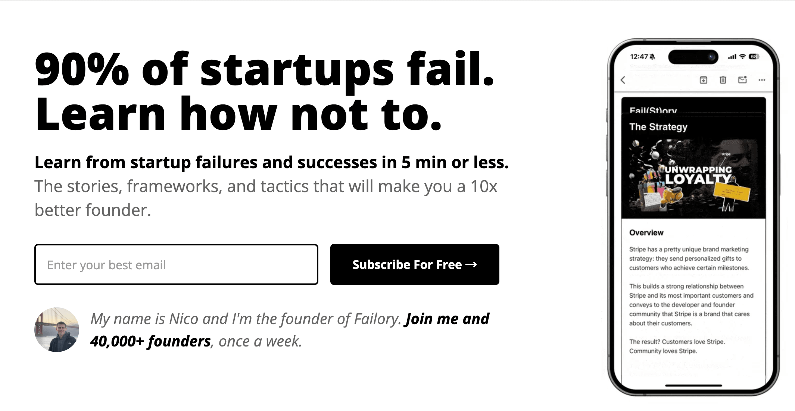

90% of Startups Fail — Learn How Not To.

一个宝藏网站专注那些错误和失败，在5分钟或更短的时间内从启动失败和成功中学习。这些故事、框架和策略将使您成为一名优秀十倍的创始人。

https://www.failory.com/

**Google Arts & Culture**  

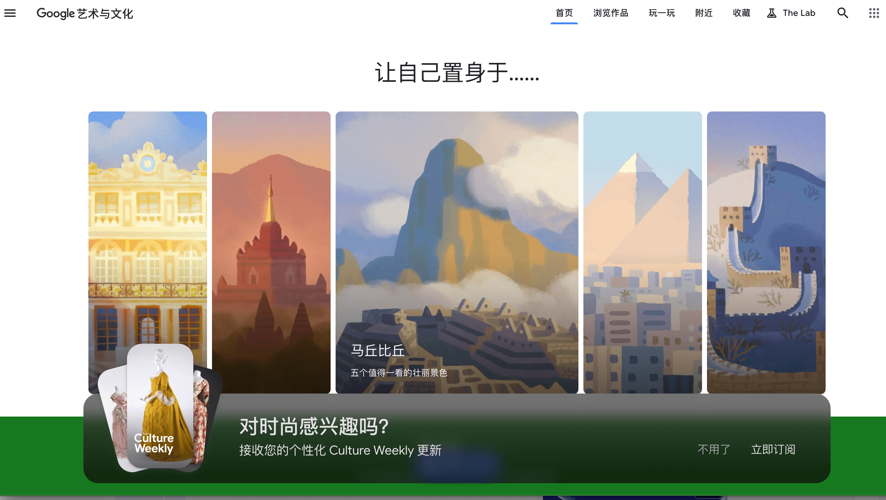

Google Arts & Culture is a non-commercial initiative. We work with cultural institutions and artists around the world. Together, our mission is to preserve and bring the world’s art and culture online so it’s accessible to anyone, anywhere.

Google 艺术与文化是一项非商业计划。我们与世界各地的文化机构和艺术家合作。我们共同的使命是保护世界艺术和文化并将其带到网上，以便任何人、任何地方都可以访问。

https://artsandculture.google.com/

**4DV.ai**  

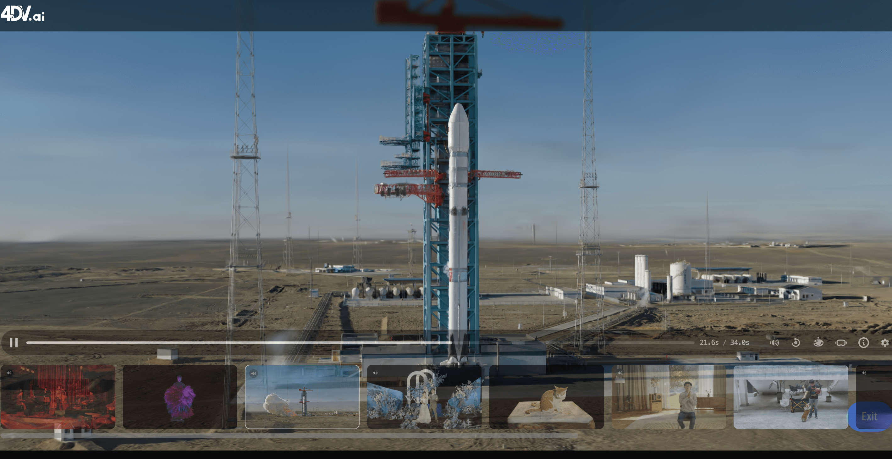

Building the future of visual media
这只是一个普通视频， 仅需拖动鼠标就可以转换成这样的3d 场景视频，这一切都是通过 AI 的推理能力，预测视频画面在三维场景下的行动轨迹，并自动化建模生成。

https://www.4dv.ai/

**maxwase/kami**  

Origami simulator driven by a physical hinge

https://github.com/maxwase/kami
https://maxwase.github.io/kami/

**linbingquan/water-margin**

水浒英雄传 - 小浣熊水浒卡 ( Water Margin )

https://github.com/linbingquan/water-margin
https://linbingquan.github.io/water-margin/

## 📝 日常

本期有水浒卡资源，正好手头还有免费的ChatGPT会员。想着使用gpt+grok生成高清水浒人物卡并增加人物动画。