## 📕 精选文章
* 📄[Flutter 在 Android 出现随机字体裁剪？](https://juejin.cn/post/7601384029611147279)
* 📄[聊聊2026年Android开发会是什么样](https://juejin.cn/post/7589903499599347766)
* 📄[Flutter 长截屏适配 Miui 系统，一点都不难](https://zhuanlan.zhihu.com/p/552030162)
* 📄[Claude Cowork 新功能来了！不需要代码，直接操作电脑文件](https://mp.weixin.qq.com/s/8MLI2yjRj6ZdAqXaycxq6w?mpshare=1&scene=1&srcid=0113DVVwuJpBb2GLv55qYKU6&sharer_shareinfo=f9971596b970d937d77b59a3a881638c&platform=mac#rd)

## 🤖 AI前沿

**openclaw/openclaw**

Clawdbot因为取名太像Claude而被迫重新取名为openclaw。没想到AI界也有因为怀疑碰瓷而被迫重命名的。

https://github.com/openclaw/openclaw

**usestrix/strix** 

Open-source AI hackers to find and fix your app’s vulnerabilities.

开源人工智能黑客可以查找并修复您的应用程序的漏洞。

https://github.com/usestrix/strix

**全网最简单的Claude Code+Skill安装教程☺️**  

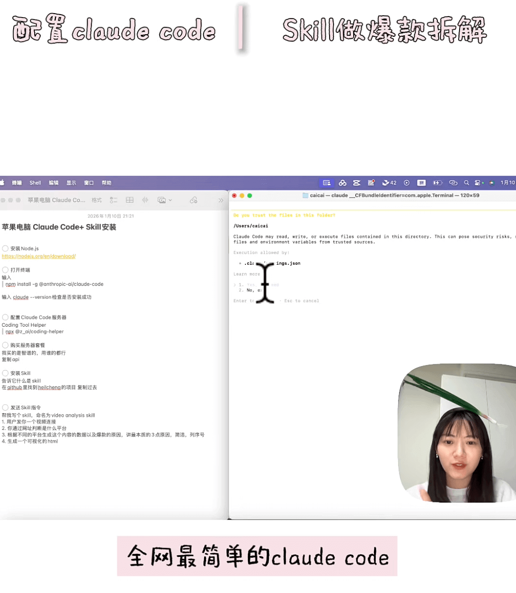

https://www.xiaohongshu.com/explore/69626e95000000002200beb2?note_flow_source=wechat&xsec_token=CBR81ikJF-kBVmItjQrw1DacBENy6c4X_tJaRoUHPpvsY=

**GitHub - yexia553/learn-agents-from-opencode**  

https://github.com/yexia553/learn-agents-from-opencode

## 🔨 实用工具

**putyy/res-downloader**  

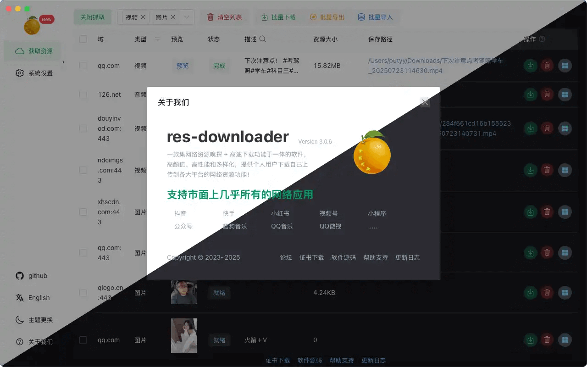

一款基于 Go + Wails 的跨平台资源下载工具，简洁易用，支持多种资源嗅探与下载。

aHR0cHM6Ly9naXRodWIuY29tL3B1dHl5L3Jlcy1kb3dubG9hZGVyCg==

**zrt-ai-lab/ViNote**  

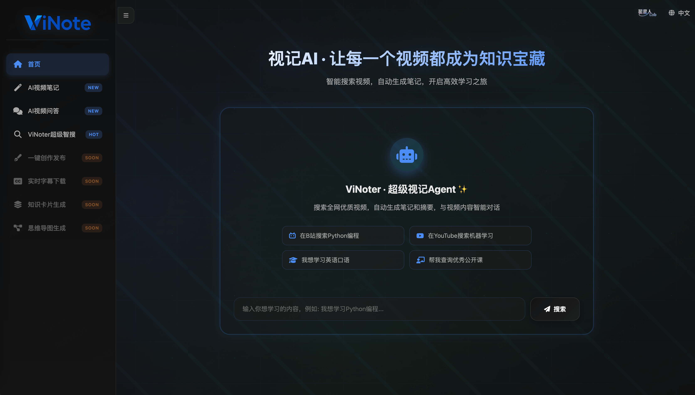

ViNote AI · Turn Every Video into Your Knowledge Asset
ViNoter · Super Video Agent
Video to Everything: Notes, Q&A, Articles, Subtitles, Cards, Mind Maps - All in One

ViNoter超级智能体是一个基于ANP协议的开源对话式AI工具，通过自然语言对话自动化视频处理全流程，包括跨平台搜索、转录、笔记生成和翻译。也能离线处理视频笔记，让你轻松获取视频价值！打造个人笔记助手！

https://github.com/zrt-ai-lab/ViNote

**memovai/memov**  

Give git-like & traceable memory to any coding agents and OpenClaw(Moltbot, Clawdbot). By https://memov.ai/

MemoV 是 AI 编程代理的记忆层，提供可追溯、Git 驱动的提示词、上下文和代码差异版本控制。它实现了 VibeGit - AI 编程会话的自动版本化，支持分支探索、回滚功能，且对标准 .git 仓库零污染。

https://github.com/memovai/memov

**hellodigua/ChatLab**  

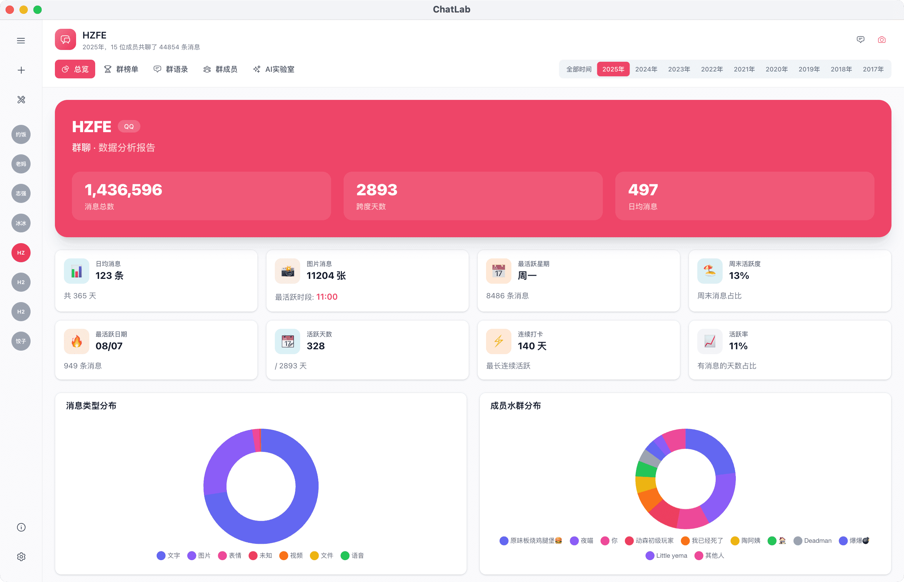

本地化的聊天记录分析工具，通过 SQL 和 AI Agent 回顾你的社交记忆。A Local-first chat analysis tool: Relive your social memories powered by SQL and AI Agents.

ChatLab 是一个免费、开源、本地化的，专注于分析聊天记录的应用。通过 AI Agent 和灵活的 SQL 引擎，你可以自由地拆解、查询甚至重构你的社交数据。

https://github.com/hellodigua/ChatLab

**nekocode/x-screenshot**  

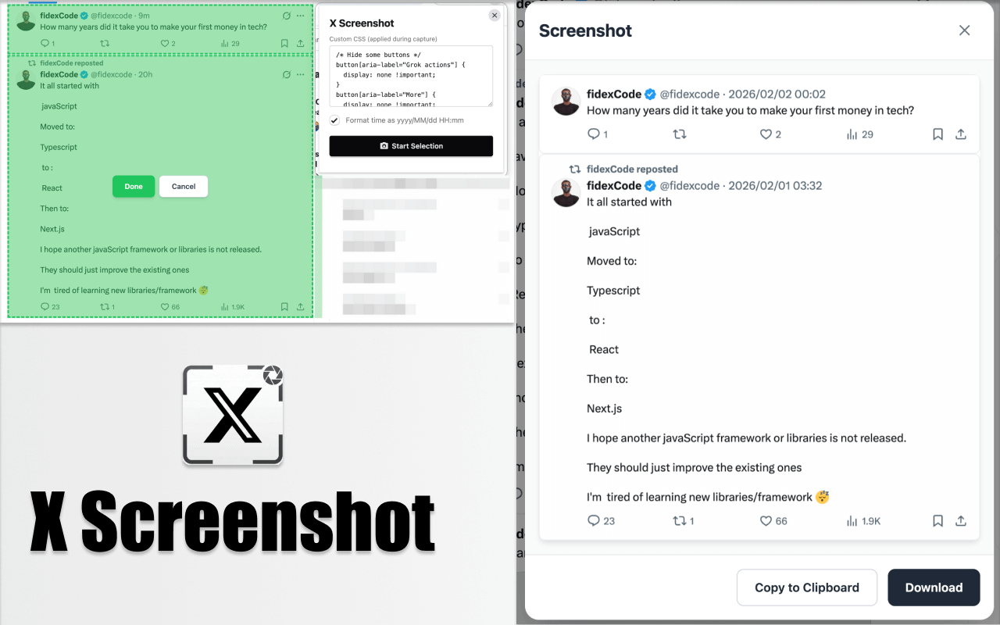

一个用于截取 X (Twitter) 推文的 Chrome 插件，支持自定义样式。

https://github.com/nekocode/x-screenshot/

**uTools - AI 时代的轻工具平台**  

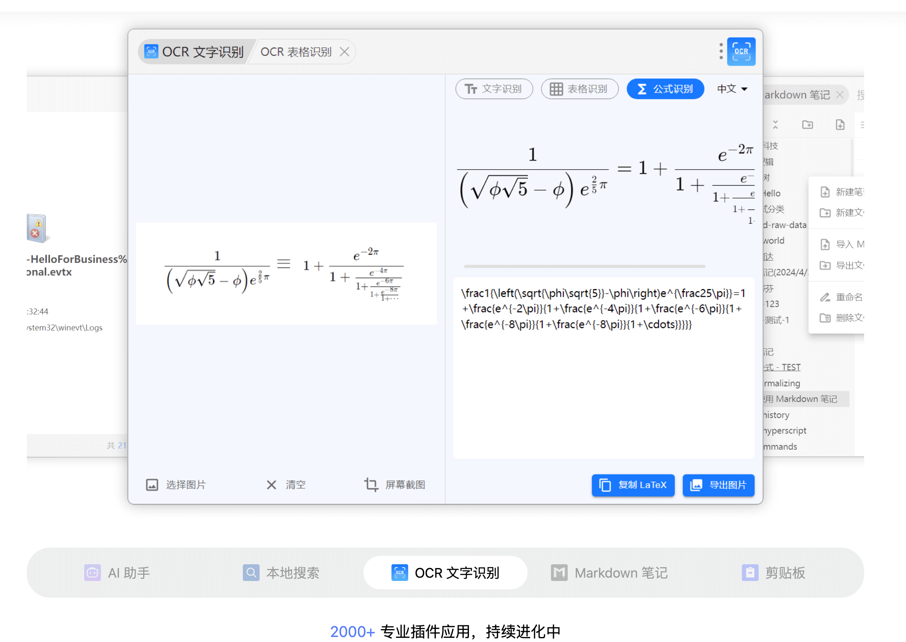

集成海量实用工具插件 + AI 制作插件应用，让效率飞跃

https://www.u-tools.cn/

**Memo AI | Cut Your Study Time in Half with AI**  

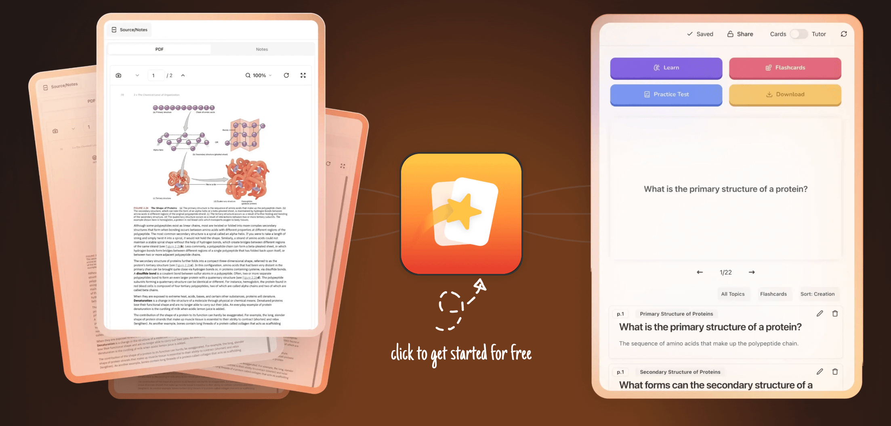

The ultimate AI study assistant that converts any PDF, slides or videos into flashcards, quizzes, and study guides using proven learning techniques.

终极人工智能学习助手，可使用经过验证的学习技术将任何 PDF、幻灯片或视频转换为抽认卡、测验和学习指南。

https://www.memo.cards/

## 📚 宝藏资源

**美团技术团队**  

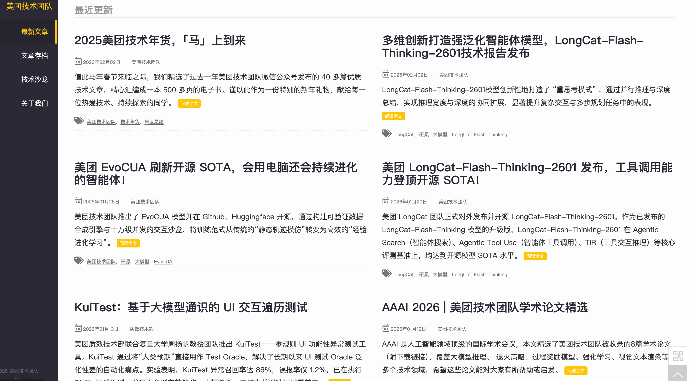

美团技术团队技术文章合集
一直觉得美团技术文章产出是最具干货的。

https://tech.meituan.com/

**samuelclay/NewsBlur**  

NewsBlur is a personal news reader that brings people together to talk about the world. A new sound of an old instrument.

NewsBlur是一款具有智能的个人新闻阅读器。它是一个RSS提要阅读器和社交新闻网络，可以显示原始站点，同时为您提供强大的过滤工​​具。

https://github.com/samuelclay/NewsBlur

**phodal/understand-prompt**  
https://github.com/phodal/understand-prompt

理解Prompt：基于编程、绘画、写作的 AI 探索与总结
一些关于描述提示词的知识总结，学习更好得输出更为高质量的提示词文案。

## 💡 优秀项目

**flutter/genui** 

 
A Flutter library to enable developers to easily add interactive generative UI to their applications.
Flutter 库使开发人员能够轻松地将交互式生成 UI 添加到他们的应用程序中。

https://github.com/flutter/genui

**liyufengrex/RPPG**  

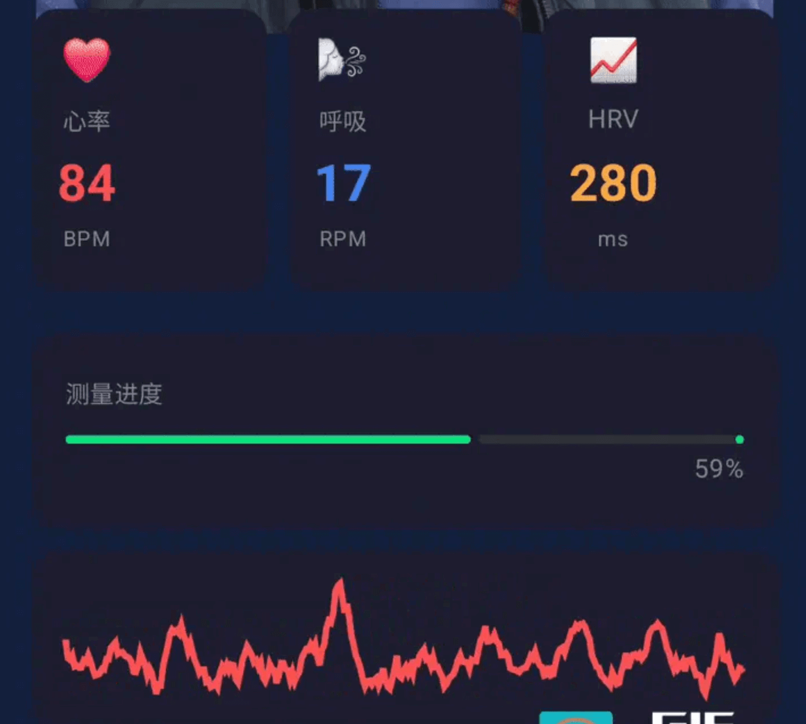

把手机变成听诊器！Android 摄像头 30 秒隔空测心率 —— 基于 MediaPipe + POS 算法的 rPPG 实战

涨知识了！刷脸技术不仅能做身份识别，结合面部PPG（光电容积脉搏波成像）算法，用普通刷脸摄像头就能非接触、无感知检测心率。

https://github.com/liyufengrex/RPPG

**OpenBMB/VoxCPM**

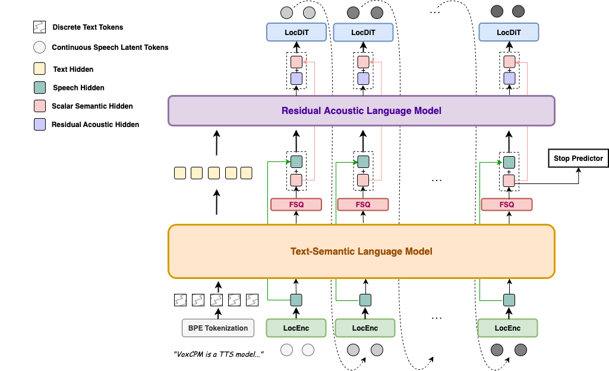

VoxCPM: Tokenizer-Free TTS for Context-Aware Speech Generation and True-to-Life Voice Cloning

VoxCPM 是一种新颖的无分词器的文本转语音 (TTS) 系统，它重新定义了语音合成中的真实感。通过在连续空间中对语音进行建模，它克服了离散标记化的局限性，并实现了两项旗舰功能：上下文感知语音生成和真实的零样本语音克隆。

https://github.com/OpenBMB/VoxCPM

**jtydhr88/ComfyUI-qwenmultiangle**  

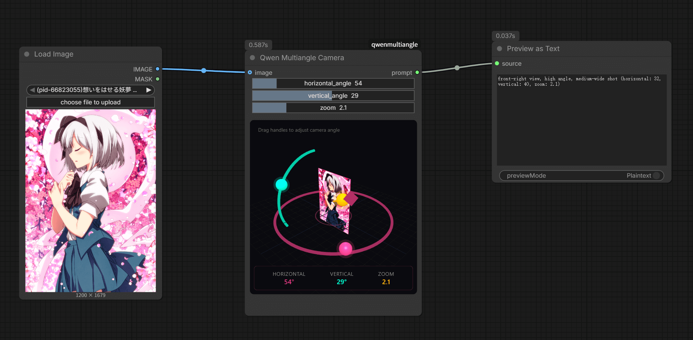

A ComfyUI custom node for 3D camera angle control. Provides an interactive Three.js viewport to adjust camera angles and outputs formatted prompt strings for multi-angle image generation.

https://github.com/jtydhr88/ComfyUI-qwenmultiangle
https://fal.ai/models/fal-ai/qwen-image-edit-2511-multiple-angles
https://huggingface.co/fal/Qwen-Image-Edit-2511-Multiple-Angles-LoRA

## 🎮 好玩有趣

**projectgenie**

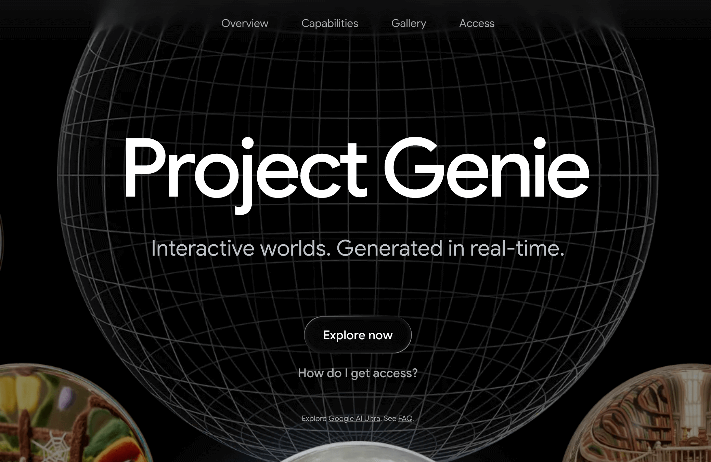

Interactive worlds. Generated in real-time.
互动世界。实时生成。

PS:可惜不是Google AI Ultra subscribers订阅者（需要花刀乐才行），而且还需要是美区账号才可体验。

https://labs.google/projectgenie
