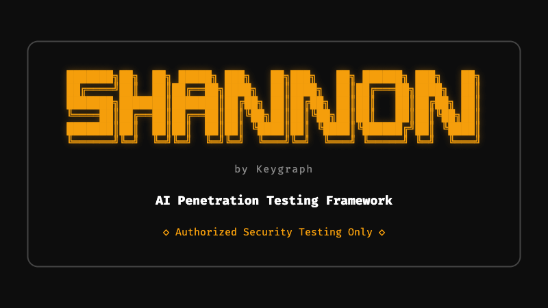
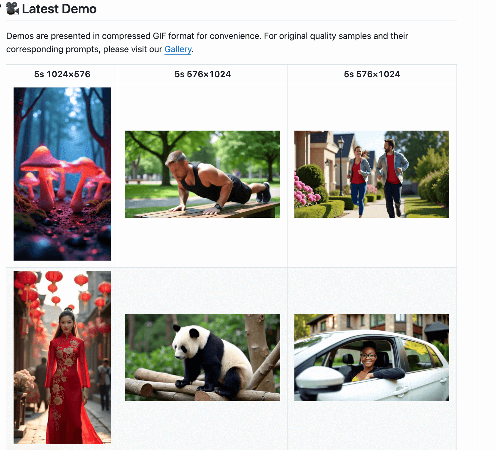
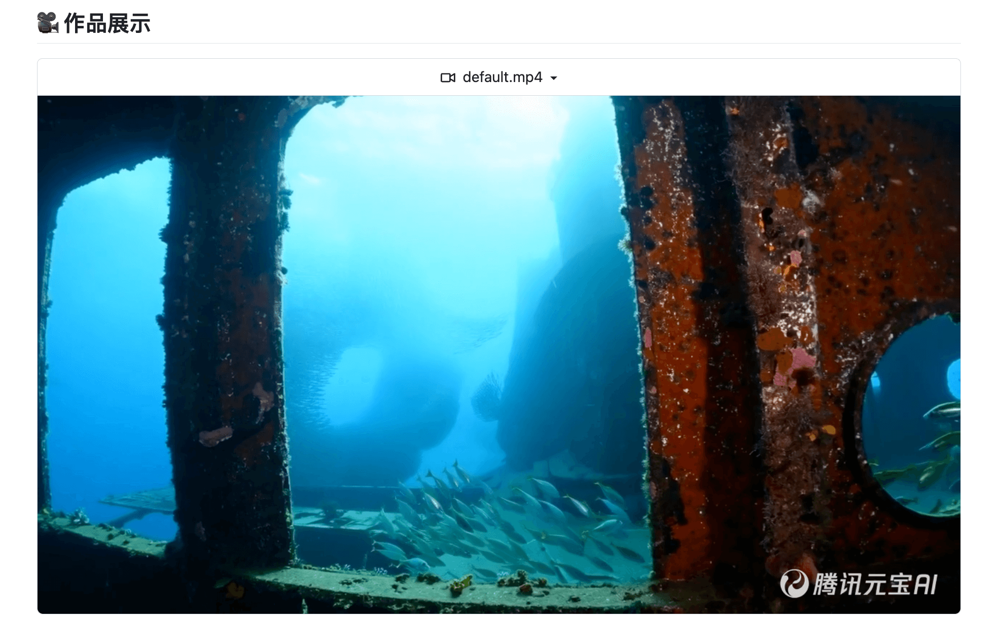
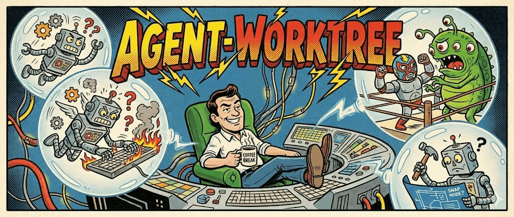
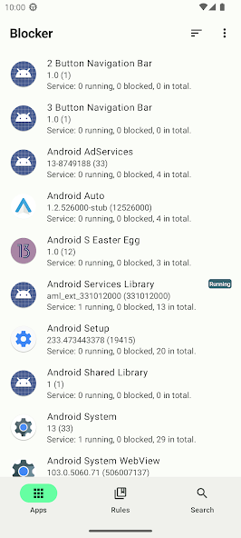
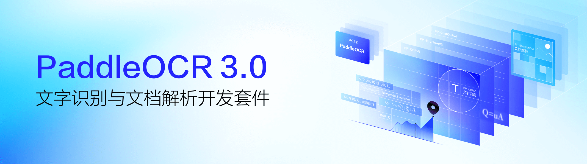
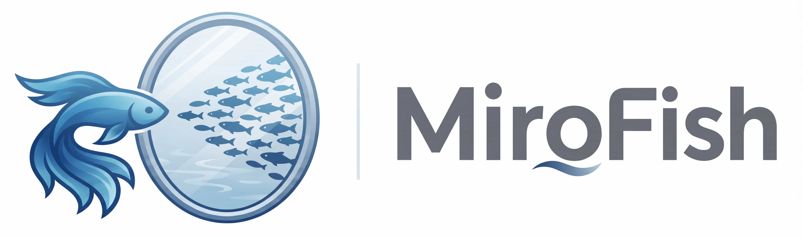
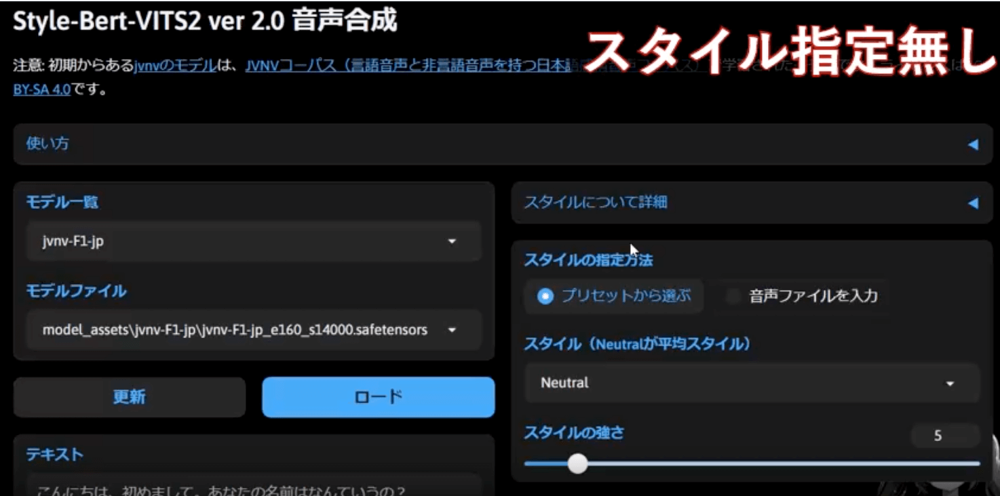
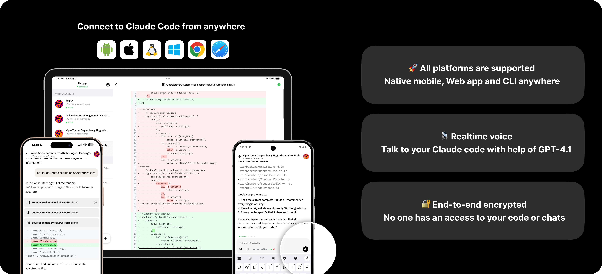
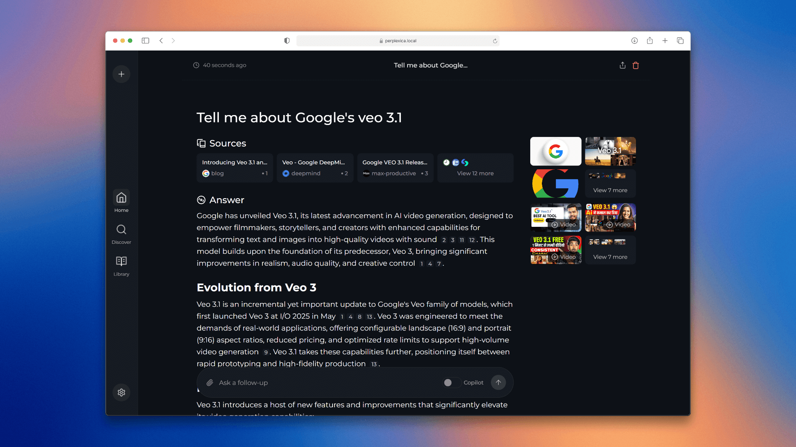

## 📕 精选文章
* 📄[港科大教授实测AI眼镜“作弊”：30分钟碾压95%的学生](https://juejin.cn/post/7592119218029428770)
* 📄[一文盘点市面上各种开源和闭源的AI视频项目](https://zhuanlan.zhihu.com/p/1922793796527175537)
* 📄[建议收藏！16个文生视频/图生视频AI开源大模型项目专题汇总](https://www.bilibili.com/read/cv34560554/?opus_fallback=1)
* 📄[跨平台开发的隐性成本](https://juejin.cn/post/7543098712580325403)
* 📄[花一天研究了 565 个 Skills，我的 Clawdbot 比 ChatGPT 更懂我！](https://juejin.cn/post/7600562816458850346)

## 🤖 AI前沿

**KeygraphHQ/shannon**  

Shannon 是一位人工智能渗透测试人员，可以提供实际的漏洞利用，而不仅仅是警报。

Fully autonomous AI hacker to find actual exploits in your web apps. Shannon has achieved a 96.15% success rate on the hint-free, source-aware XBOW Benchmark.

https://github.com/KeygraphHQ/shannon

**InternLM/MindSearch**

MindSearch 是一个开源的 AI 搜索引擎框架，具有与 Perplexity.ai Pro 相同的性能。您可以轻松部署它来构建您自己的搜索引擎，可以使用闭源 LLM（如 GPT、Claude）或开源 LLM（InternLM2.5 系列模型经过专门优化，能够在 MindSearch 框架中提供卓越的性能；其他开源模型没做过具体测试）。

https://github.com/InternLM/MindSearch

**hpcaitech/Open-Sora**

Open-Sora：全民高效视频制作

Open-Sora: Democratizing Efficient Video Production for All

https://github.com/hpcaitech/Open-Sora

**Tencent-Hunyuan** 

HunyuanVideo 项目的 PyTorch 模型定义、预训练权重和推理/采样代码。

HunyuanVideo: A Systematic Framework For Large Video Generation Model

https://github.com/Tencent-Hunyuan/HunyuanVideo

**HKUDS/nanobot**  

纳米机器人：超轻量级个人人工智能助理

nanobot: Ultra-Lightweight Personal AI Assistant

https://github.com/HKUDS/nanobot

## 🔨 实用工具

**nekocode/agent-worktree**  

为 AI 编程 agent 设计的 Git worktree 工作流工具。提供隔离的并行开发环境。

A Git worktree workflow tool for AI coding agents. Enables parallel development with isolated environments.

https://github.com/nekocode/agent-worktree

**lihenggui/blocker**  

Blocker是一款操作Android应用程序四大组件的程序。对于臃肿的应用来说，应用中的许多组件都是冗余的。Blocker提供了一个快捷的控制按钮来控制对应的组件，实现禁用无用功能，节约应用运行资源的功能。

Blocker is a component controller for Android applications that currently supports using PackageManager and Intent Firewall to manage the state of components. For bloated applications, many components within the application are redundant. 

https://github.com/lihenggui/blocker

## 📚 宝藏资源

**amazingcoderpro/rss-recomanded**  

记录那些值得推荐 RSS 订阅源，不定时持续更新

Record those recommended RSS feeds, irregularly and continuously updated

https://github.com/amazingcoderpro/rss-recomanded

## 💡 优秀项目

**PaddlePaddle/PaddleOCR**  

PaddleOCR 将文档和图像转换为结构化、AI友好的数据（如JSON和Markdown），精度达到行业领先水平——为全球从独立开发者，初创企业和大型企业的AI应用提供强力支撑。凭借60,000+星标和MinerU、RAGFlow、pathway、cherry-studio等头部项目的深度集成，PaddleOCR已成为AI时代开发者构建智能文档等应用的首选解决方案。

https://github.com/PaddlePaddle/PaddleOCR

**666ghj/MiroFish**  

 

MiroFish 是一款基于多智能体技术的新一代 AI 预测引擎。通过提取现实世界的种子信息（如突发新闻、政策草案、金融信号），自动构建出高保真的平行数字世界。在此空间内，成千上万个具备独立人格、长期记忆与行为逻辑的智能体进行自由交互与社会演化。你可透过「上帝视角」动态注入变量，精准推演未来走向——让未来在数字沙盘中预演，助决策在百战模拟后胜出。

https://github.com/666ghj/MiroFish

**litagin02/Style-Bert-VITS2**  

Style-Bert-VITS2：Bert-VITS2，具有更多可控的语音风格。

https://github.com/litagin02/Style-Bert-VITS2

**slopus/happy**  

Mobile and Web Client for Claude Code & Codex

Claude Code & Codex的移动客户端和web端

https://github.com/slopus/happy
https://happy.engineering/

**ItzCrazyKns/Perplexica**  

Perplexica is a privacy-focused AI answering engine that runs entirely on your own hardware. It combines knowledge from the vast internet with support for local LLMs (Ollama) and cloud providers (OpenAI, Claude, Groq), delivering accurate answers with cited sources while keeping your searches completely private.

https://github.com/ItzCrazyKns/Perplexica

## 📝 日常记录

AI外卖大战思考：AI太吃硬件和算力；内存硬盘还会继续涨；不要凡事都上AI，也得自己动动脑子；其次简单问题复杂化并不是好事。