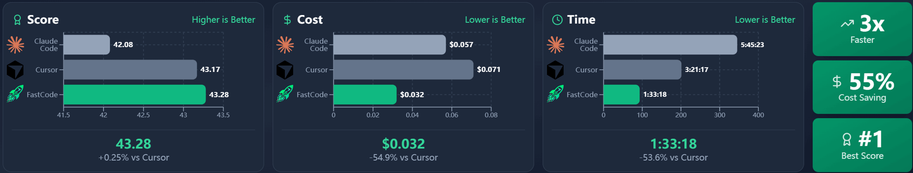
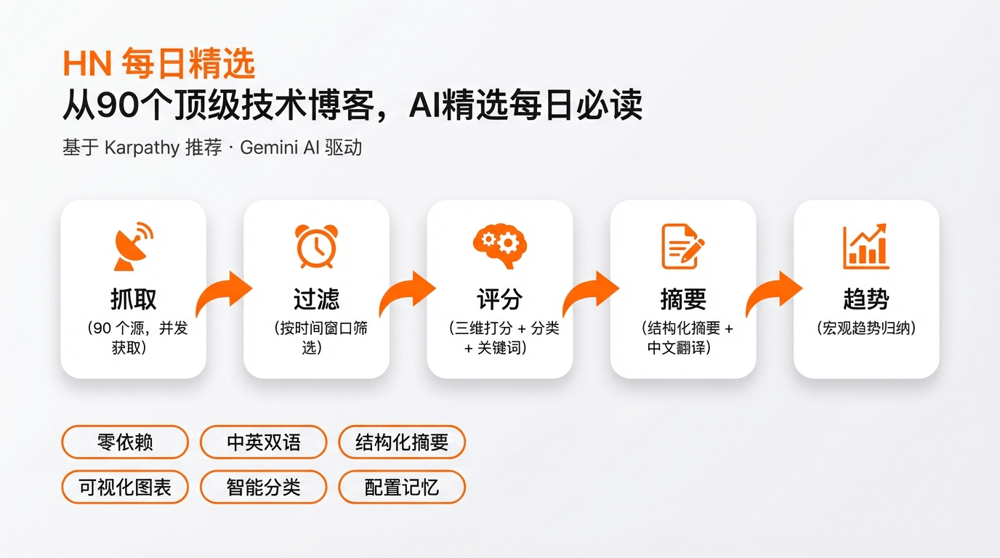
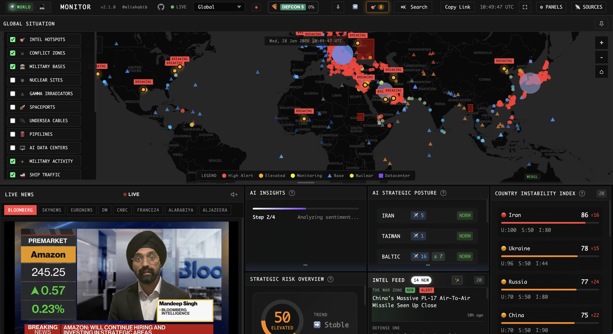
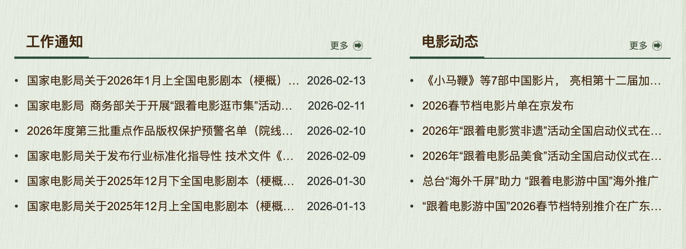

## 📕 精选文章

* 📄[我写了个 Claude Code Skill，再也不用手动切图](https://juejin.cn/post/7604507125856829467)
* 📄[AOSP15 Binder专题之应用程序app的Binder启动详细分析](https://juejin.cn/post/7605174711182868543)
* 📄[终于来了！Flutter 拥有了一个可用的液态玻璃解决方案！](https://juejin.cn/post/7582200865907589154)
https://zhuanlan.zhihu.com/p/1972258410557862481
* 📄[NVIDIA 词汇表：什么是向量数据库？](https://www.nvidia.cn/glossary/vector-database/)
* 📄[从检索到洞察：万字长文解构DeepSearch、DeepRe](https://www.toutiao.com/article/7587587234203779610/)
* 📄[Retrieval Augmented Generation (RAG) and Semantic Search for GPTs](https://help.openai.com/en/articles/8868588-retrieval-augmented-generation-rag-and-semantic-search-for-gpts)

## 🤖 AI前沿

**即梦Seedance 2.0来了！**

https://www.douyin.com/video/7606626880640372022

**黄仁勋对中美谁将赢得AI大战的5层AI蛋糕生动表述**

https://www.douyin.com/video/7605067921752214838

**HKUDS/FastCode**  

FastCode: Accelerating and Streamlining Your Code Understanding

FastCode 是一个用于全面代码理解和分析的代币高效框架：为大规模代码库和软件架构提供卓越的速度、卓越的准确性和成本效益。

https://github.com/HKUDS/FastCode

## 🔨 实用工具

**vigorX777/ai-daily-digest**  

从 Andrej Karpathy 推荐的 90 个 Hacker News 顶级技术博客中抓取最新文章，通过 Gemini AI 多维评分筛选，生成一份结构化的每日精选日报。

https://github.com/vigorX777/ai-daily-digest

**koala73/worldmonitor**  

实时全球情报仪表板 - 在统一的态势感知界面中进行人工智能驱动的新闻聚合、地缘政治监控和基础设施跟踪。

Real-time global intelligence dashboard — AI-powered news aggregation, geopolitical monitoring, and infrastructure tracking in a unified situational awareness interface.

https://github.com/koala73/worldmonitor

**searxng/searxng**  

SearXNG is a free internet metasearch engine which aggregates results from various search services and databases. Users are neither tracked nor profiled.

https://github.com/searxng/searxng

## 📚 宝藏资源

**国家电影局**  

可了解国内电影资讯

https://www.chinafilm.gov.cn

**NVIDIA 术语表**  

了解AI相关的行业术语

https://www.nvidia.cn/glossary/

## 💡 优秀项目

**ptghb/virtual-person**  

你的AI虚拟女友“小凡”：一个基于Live2D Cubism SDK和OpenAI API的智能对话助手项目，结合了Live2D虚拟形象、实时WebSocket通信和AI对话功能。

https://github.com/ptghb/virtual-person

**xietao778899-rgb/Open-AutoGLM-Hybrid**  

Open-AutoGLM混合方案 - 在手机上运行AI自动化，无需电脑

https://github.com/xietao778899-rgb/Open-AutoGLM-Hybrid

**facebookresearch/faiss** 

Faiss 是一个用于高效相似性搜索和密集向量聚类的库。
Faiss is a library for efficient similarity search and clustering of dense vectors. It contains algorithms that search in sets of vectors of any size, up to ones that possibly do not fit in RAM. It also contains supporting code for evaluation and parameter tuning. Faiss is written in C++ with complete wrappers for Python/numpy. Some of the most useful algorithms are implemented on the GPU. It is developed primarily at Meta's Fundamental AI Research group.

https://github.com/facebookresearch/faiss
https://faiss.ai/

## 📝 日常记录
2026马年：时间真快又是一年，马上就要过春节了。祝愿各位来年马上有财，一切顺利，平安喜乐~新年继续努力奋斗吧！