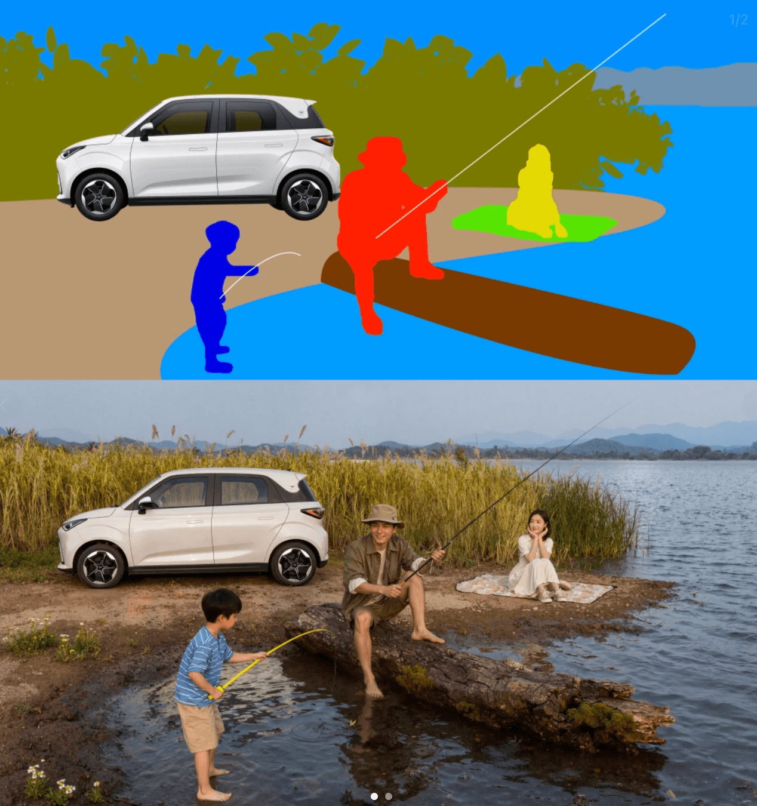
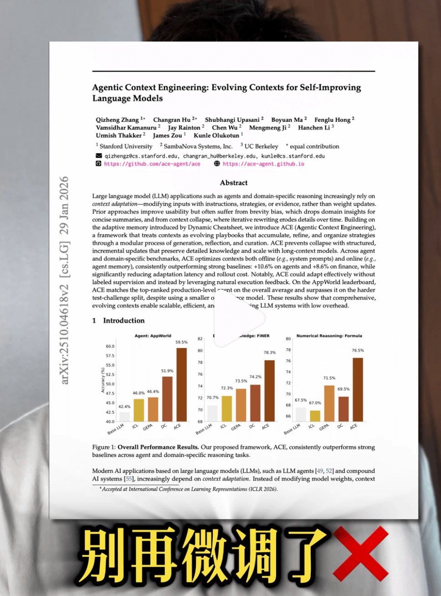
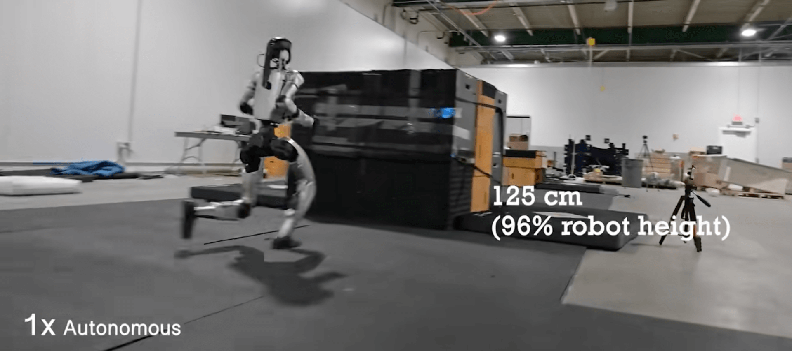
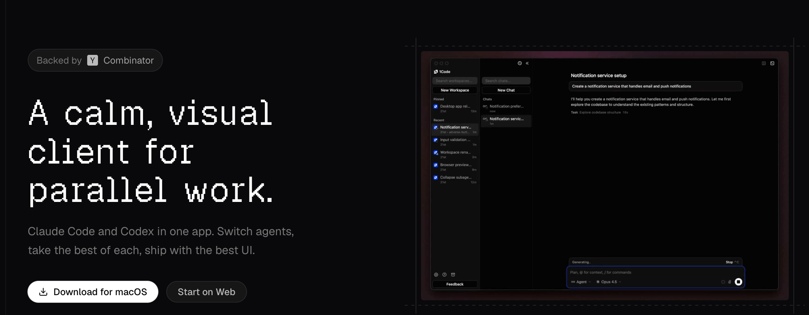
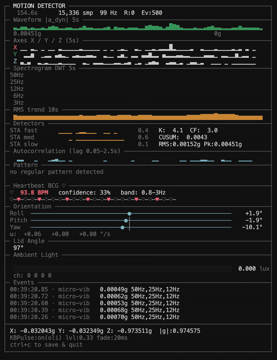
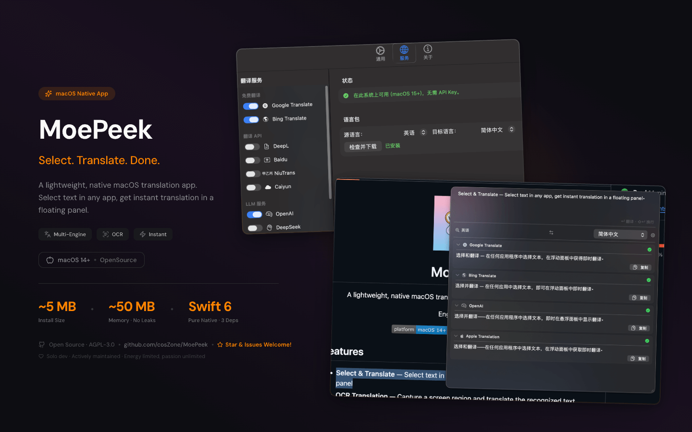
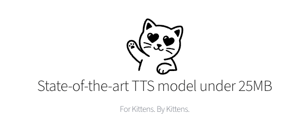
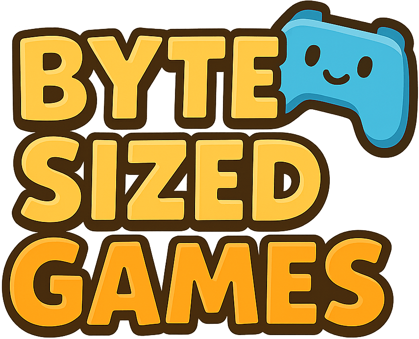

## 📕 精选文章
* 📄[Android 腾讯开源的 Shadow，凭什么成为插件化“终极方案”？](https://juejin.cn/post/7595088044577046574)
* 📄[公司项目水太深，AI Agent它把握不住！](https://juejin.cn/post/7570491473033019401)
* 📄[年薪 50W 的前端，到底比年薪 15W 的强在哪里？](https://juejin.cn/post/7591744411740372992)
* 📄[AGENTS.md 真的对 AI Coding 有用吗？](https://juejin.cn/post/7608214035263569974)
* 📄[Flutter 设计包解耦新进展，material_ui 和 cupertino_ui 发布预告](https://juejin.cn/post/7607261340567404563)
* 📄[丰田正在使用 Flutter 开发游戏引擎](https://juejin.cn/post/7607112994061549595)
* 📄[Flink ClickHouse Sink：生产级高可用写入方案](https://juejin.cn/post/7604701848150556672)

## 🤖 AI前沿

**用Gemini细化角色设计也太轻松啦！** 

http://xhslink.com/o/8UorKjpa2AX 

**用AI给草图加一点魔法 涂涂画画又一天**

http://xhslink.com/o/6v3HeYqGNfz 

**别再微调了，99%的项目不适合做微调**

本期提到的核心资源： 1️⃣ Stanford ACE论文（ICLR 2026） - "Agentic Context Engineering" - 论文搜索：arxiv "Agentic Context Engineering" Stanford 2️⃣ 不微调怎么做？三步走： - 第一步：建RAG知识库 - 第二步：做Context Engineering - 第三步：积累高质量数据 3️⃣ 什么时候才该微调？（极少数场景） - 端侧设备（模型<7B） - 分类任务差最后几个百分点准确率 - 大规模部署后的推理降本 - 模型迭代放缓 + 通用微调框架成熟之后 把数据底座建好，借船出海。

http://xhslink.com/o/1FiIRkLaiC1 

**Perceptive Humanoid Parkour: Chaining Dynamic Human Skills via Motion Matching**  

【论文】感知人形跑酷：通过动作匹配链接动态人类技能

https://arxiv.org/abs/2602.15827

**春晚同款人形机器人开启视觉跑酷模式！ 无需动作预设，无需固定场景，第一人称视觉感知，自主决策，实现多技能无缝衔接**

https://www.douyin.com/video/7608120824637295908

**clawdbot-ai/awesome-openclaw-skills-zh**  

OpenClaw 中文官方技能库 | 翻译自 Clawdbot 官方技能，按场景分类整理，支持中文自然语言调用

https://github.com/clawdbot-ai/awesome-openclaw-skills-zh

## 🔨 实用工具

**21st-dev/1code**  

开源编码代理客户端。在本地或云端运行 Claude Code、Codex 等。

Open-source coding agent client. Run Claude Code, Codex, and more - locally or in the cloud.

https://github.com/21st-dev/1code
https://1code.dev/

**olvvier/apple-silicon-accelerometer** 

通过 iokit hid (spu / AppleSPUHIDDevice) 读取 Apple Silicon MacBook Pro 上未记录的内部加速计 + 陀螺仪、盖子角度和环境光。

https://github.com/olvvier/apple-silicon-accelerometer

**cosZone/MoePeek**  

一款轻量级 macOS 划词翻译工具，纯 Swift 6 开发，设备端 Apple 翻译保护隐私，安装体积仅 5MB，后台运行内存稳定约 50MB

A lightweight macOS selection translator built with pure Swift 6, featuring on-device Apple Translate for privacy, only 5MB install size and stable ~50MB memory usage. 

https://github.com/cosZone/MoePeek

## 📚 宝藏资源

**YanjieZe/awesome-humanoid-robot-learning**  

基本信息该仓库收集了有关人形机器人学习的学术论文。它们主要根据所关注的任务进行分类。在此列表中优先考虑具有真实机器人实验的论文。

Basic Info. This repo collects academic papers about humanoid robot learning. They are mainly categorized by the tasks they focus on. The papers with real robot experiments are preferred in this list. The papers with open-sourced code are added with a star🌟.

https://github.com/YanjieZe/awesome-humanoid-robot-learning

## 💡 优秀项目

**wysaid/android-gpuimage-plus**  

用于图像/相机/视频滤镜的 C++ 和 Java 库。

Android Image & Camera Filters Based on OpenGL.

https://github.com/wysaid/android-gpuimage-plus

**KittenML/KittenTTS**  

Kitten TTS 是一个开源的真实文本转语音模型，只有 1500 万个参数，专为轻量级部署和高质量语音合成而设计。

Kitten TTS is an open-source realistic text-to-speech model with just 15 million parameters, designed for lightweight deployment and high-quality voice synthesis.

https://github.com/KittenML/KittenTTS

**kslr/xiaoai-plus**  

在小爱音箱上获得与豆包近乎一致的端侧实时语音对话体验

https://github.com/kslr/xiaoai-plus

## 🎮 好玩有趣

**ykob/byte-sized-games**  

Byte Sized Game 是一系列休闲迷你游戏，可让您在浏览器中快速享受乐趣。

Byte Sized Game is a collection of casual mini-games for quick fun in your browser.

https://ykob.github.io/byte-sized-games/
https://github.com/ykob/byte-sized-games

## 📝 日常记录

春节期间疯狂在用即梦玩视频生成，除去可能存在的隐私问题外可玩性还挺高。
2026年新春假期结束，又要开启新一年的打工仔旅程了！
今年开工有一种要去开学上课的奇妙感觉！
