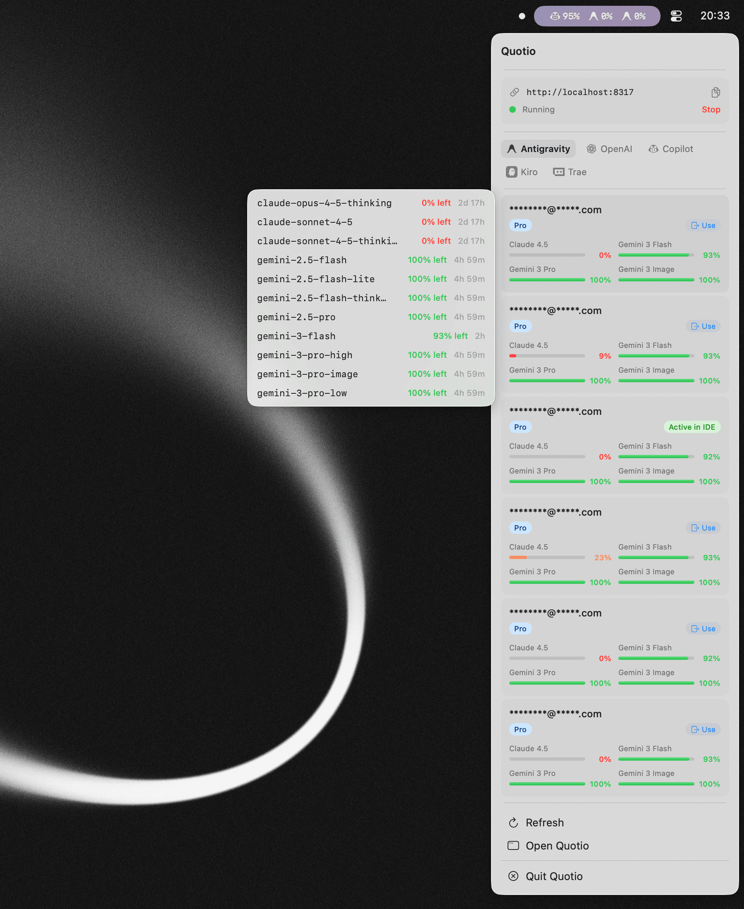
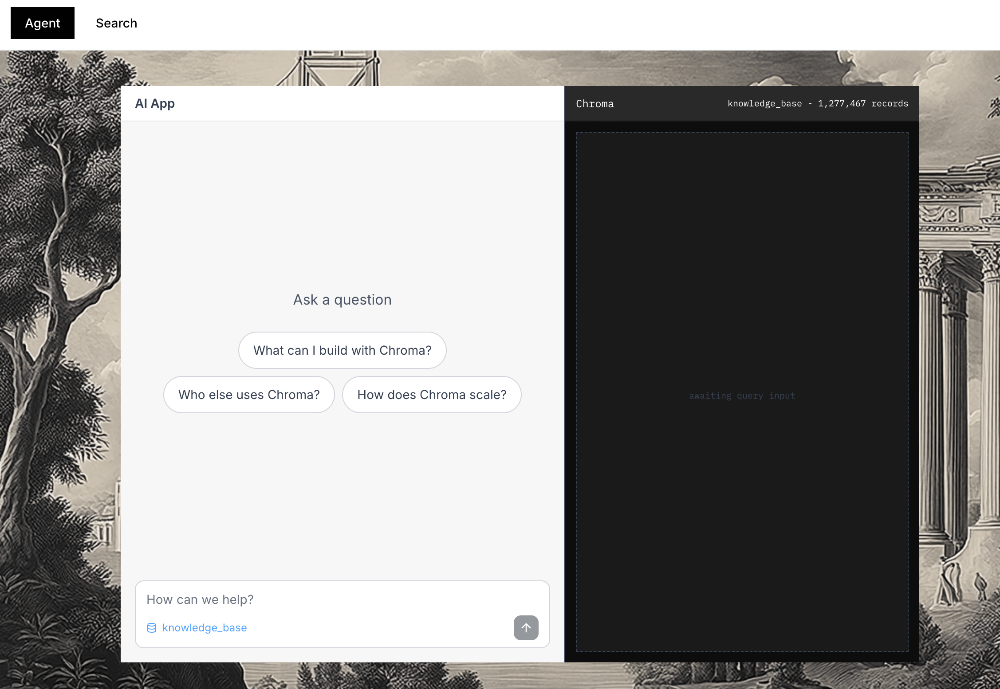
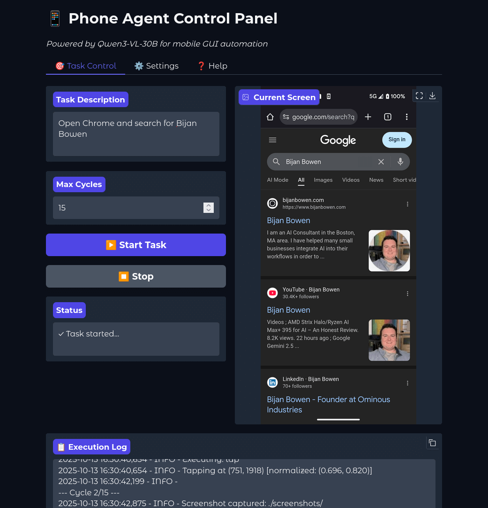
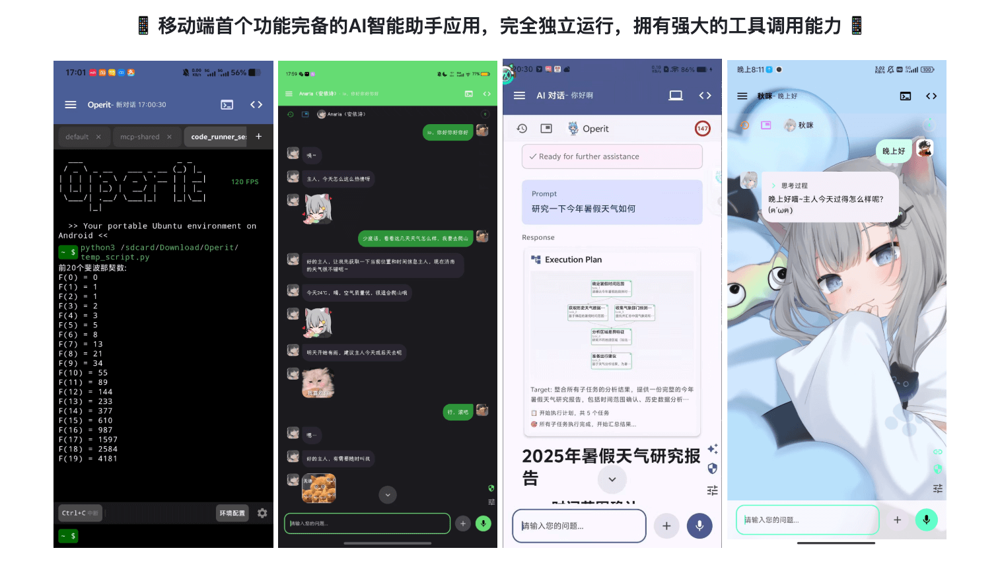
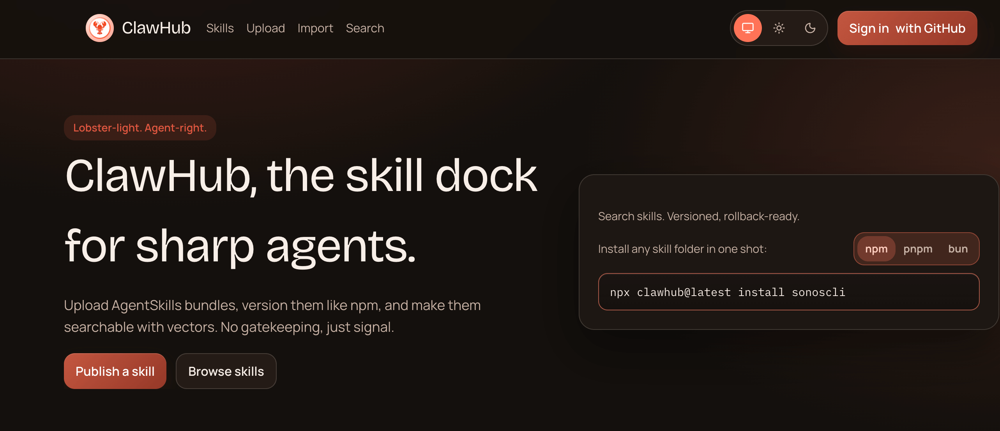
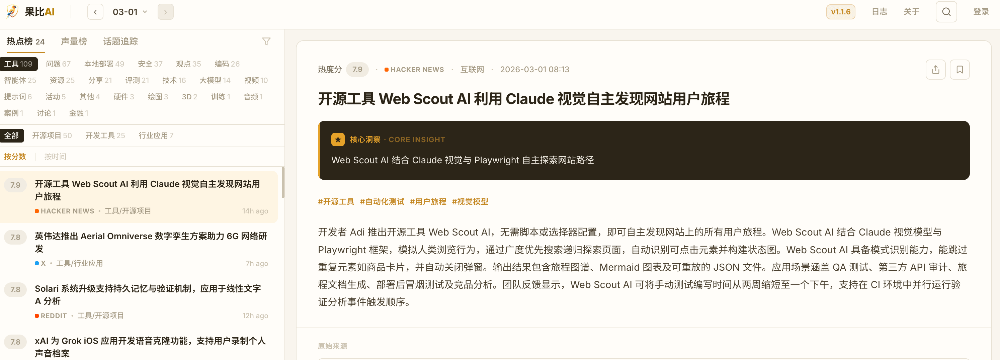
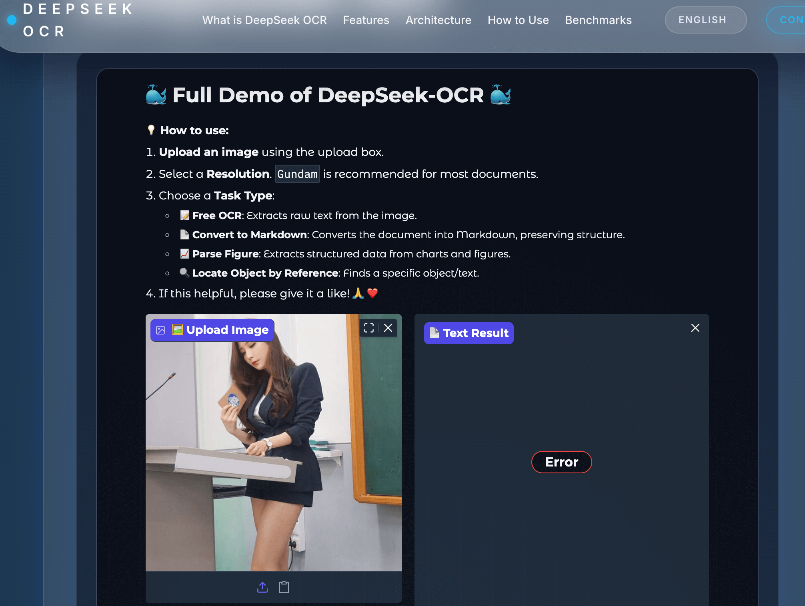
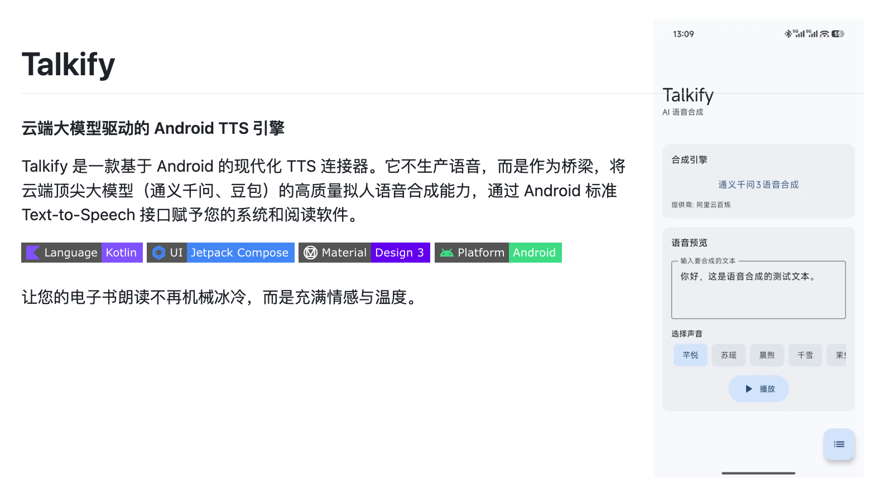
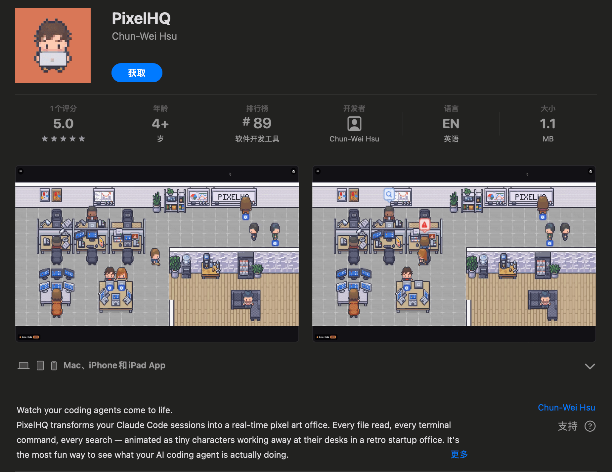

## 📕 精选文章
* 📄[如何配置SSH管理多个Git仓库和以及多个Github账号](https://juejin.cn/post/7247027696822517819)
* 📄[文字渲染更专业，阿里千问推出新一代图像生成基础模型 Qwen-Image-2.0](https://www.ithome.com/0/920/788.htm)
* 📄[从检索到洞察：万字长文解构DeepSearch、DeepResearch、Agentic RAG与Graph RAG的革命之路](https://juejin.cn/post/7587254134401761289)
* 📄[炸翻AI圈！Seedance 2.0 实测案例库｜100+Prompt，AI出片/短剧/电商玩法直接抄](https://mp.weixin.qq.com/s/mOaqZG0q_yQPCtrTtwFBpQ)

## 🤖 AI前沿

**AI洗牌世界的前夜，多数人却浑然不知**

https://www.xiaohongshu.com/discovery/item/698dd958000000001a02671a?source=webshare&xhsshare=pc_web&xsec_token=ABwuqOv5C9GDFzEaY8hdRAmg57GR_8_EVEX9SLJe1s0po=&xsec_source=pc_share

**nguyenphutrong/quotio**

Quotio 是一个用于管理 CLIProxyAPI 的本机 macOS 应用程序 - 为您的 AI 编码代理提供支持的本地代理服务器。它可以帮助您在一个地方管理多个 AI 帐户、跟踪配额并配置 CLI 工具。

Quotio is a native macOS application for managing CLIProxyAPI - a local proxy server that powers your AI coding agents. It helps you manage multiple AI accounts, track quotas, and configure CLI tools in one place.

https://github.com/nguyenphutrong/quotio

**crewAIInc/crewAI**

快速灵活的多代理自动化框架
Fast and Flexible Multi-Agent Automation Framework

https://github.com/crewAIInc/crewAI

**agno-agi/agno**

Agno 是代理软件的运行时。构建代理、团队和工作流程。将它们作为可扩展服务运行。在生产中监视和管理它们。

https://github.com/agno-agi/agno
https://docs.agno.com

**Chroma**  

Chroma 是一个人工智能开源搜索引擎。它内置了您开始使用所需的一切，并在您的计算机上运行。

https://www.trychroma.com/

## 🔨 实用工具

**OminousIndustries/PhoneDriver**  

基于 Python 的移动自动化代理，使用 Qwen3-VL 视觉语言模型通过视觉分析和 ADB 命令来理解 Android 设备并与之交互。
A Python-based mobile automation agent that uses Qwen3-VL vision-language models to understand and interact with Android devices through visual analysis and ADB commands.

https://github.com/OminousIndustries/PhoneDriver

**AAswordman/Operit**

📱 移动端首个功能完备的AI智能助手应用，完全独立运行，拥有强大的工具调用能力 📱

The first full-featured mobile AI assistant: not just chat, but real task execution, tooling, system operations, file management, and workflow automation.

https://operit.aaswordsman.org/
https://github.com/AAswordman/Operit

## 📚 宝藏资源

**anthropics/claude-agent-sdk-demos**  

Claude Code集成sdk的示例项目，可学习如何使用sdk能力做出功能，例如邮箱智能体，研究智能体等。
Claude Code SDK Demos

https://github.com/anthropics/claude-agent-sdk-demos

**ClawHub**  

上传 AgentSkills 包，像 npm 一样对它们进行版本控制，并使其可以使用向量进行搜索。没有看门，只有信号。
Upload AgentSkills bundles, version them like npm, and make them searchable with vectors. No gatekeeping, just signal.

龙虾能力仓库集，目前看有1w+上传的开源库。

https://clawhub.ai/

**果比AI**  

 

《AI日报》

https://guobi.ai/about

## 💡 优秀项目

**deepseek-ai/DeepSeek-OCR**

 

DeepSeek OCR 是一种基于两级转换器的文档人工智能，可将页面图像压缩为紧凑的视觉标记，然后使用高容量专家混合语言模型对其进行解码。第一阶段将窗口 SAM 视觉变换器与密集 CLIP-Large 编码器和 16× 卷积压缩器合并；第 2 阶段使用 DeepSeek-3B-MoE 解码器（每个标记约 570M 活动参数）以最小的损失重建文本、HTML 和图形注释。

DeepSeek OCR is a two-stage transformer-based document AI that compresses page images into compact vision tokens before decoding them with a high-capacity mixture-of-experts language model. Stage 1 merges a windowed SAM vision transformer with a dense CLIP-Large encoder and a 16× convolutional compressor; Stage 2 uses the DeepSeek-3B-MoE decoder (~570M active parameters per token) to reconstruct text, HTML, and figure annotations with minimal loss.

https://github.com/deepseek-ai/DeepSeek-OCR
https://deepseek-ocr.io/#overview

**LonePheasantWarrior/TalkifyTTS**

云端大模型驱动的 Android 语音合成应用（TTS引擎）。支持豆包、千问等模型。 Cloud-LLM Driven Android Text-to-Speech Application (TTS Engine). Supports models such as Doubao and Qianwen.

https://github.com/LonePheasantWarrior/TalkifyTTS

**Future-House/paper-qa**  

PaperQA2 是一个用于对 PDF、文本文件、Microsoft Office 文档和源代码文件进行高精度检索增强生成 (RAG) 的软件包，重点关注科学文献。请参阅我们最近的 2024 年论文，了解 PaperQA2 在问答、总结和矛盾检测等科学任务中超人表现的示例。

High accuracy RAG for answering questions from scientific documents with citations

https://github.com/Future-House/paper-qa

**meilisearch/meilisearch**  

快如闪电的搜索引擎，可轻松融入您的应用程序、网站和工作流程
A lightning-fast search engine API bringing AI-powered hybrid search to your sites and applications.

https://github.com/meilisearch/meilisearch

## 🎮 好玩有趣

**PixelHQ**  

这是一个基于你的 Claude Code 会话实时动画的像素艺术办公室。你的代理打字，在白板上思考，在任务完成时庆祝。

https://apps.apple.com/us/app/pixelhq/id6758467298
