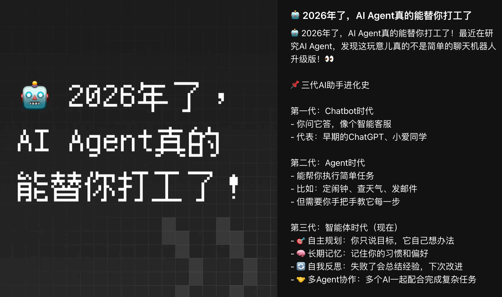
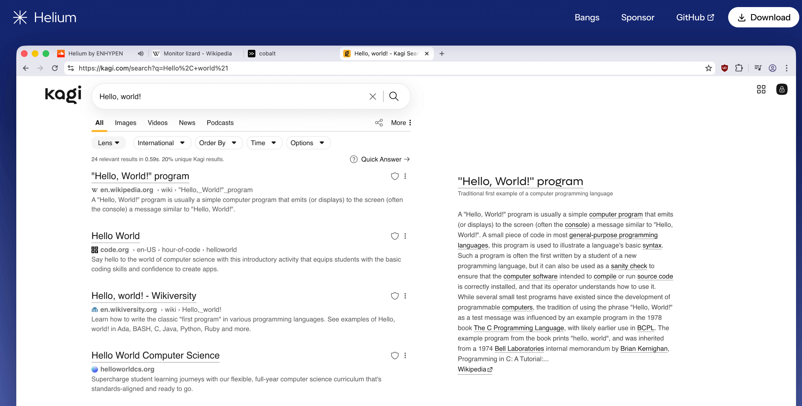
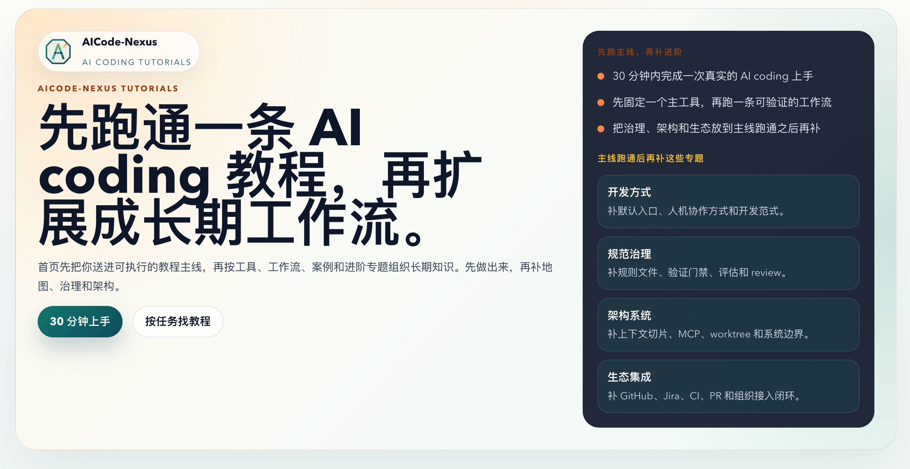
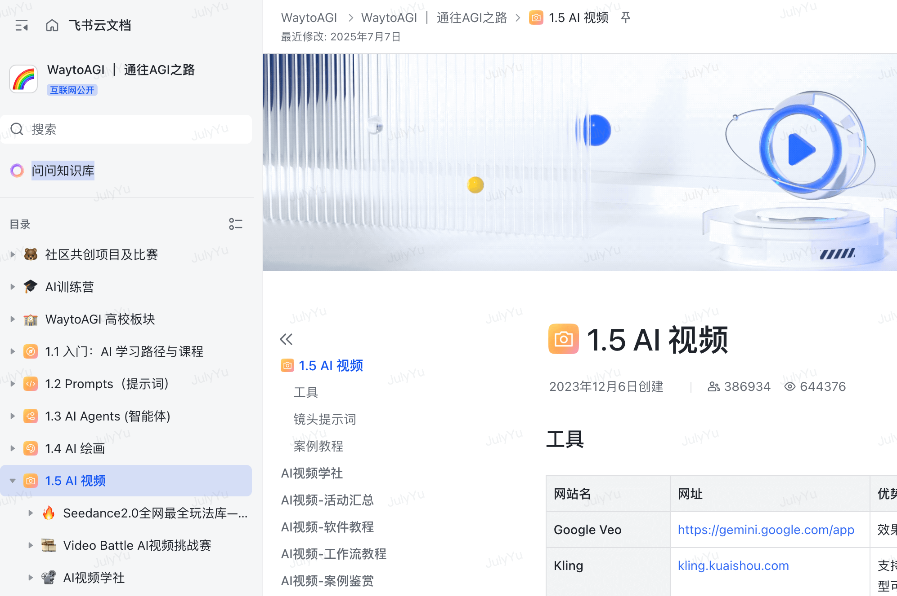
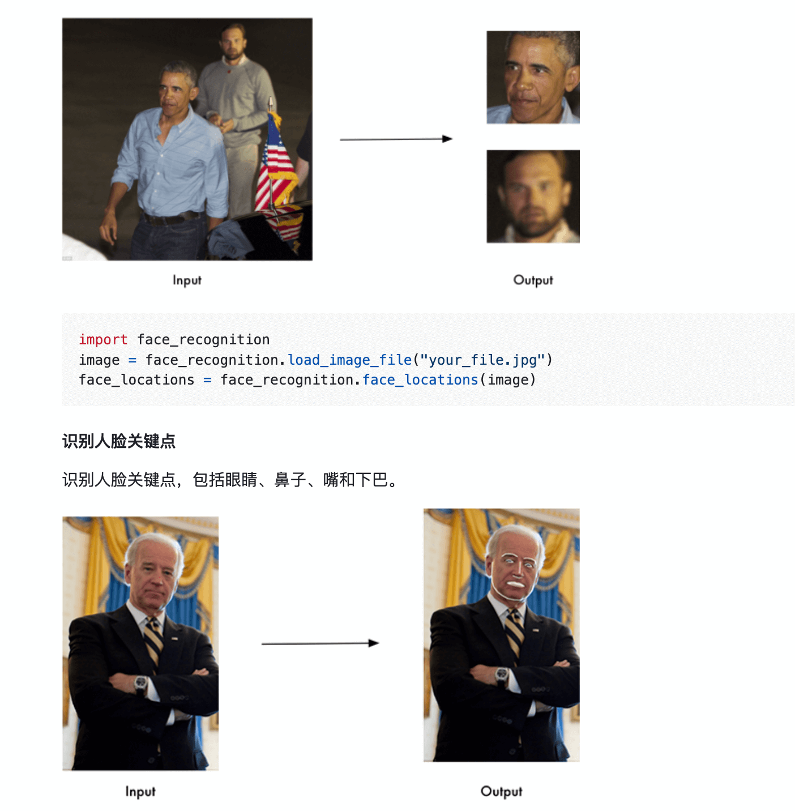
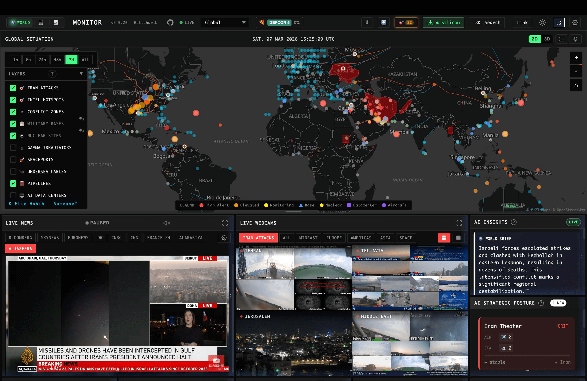
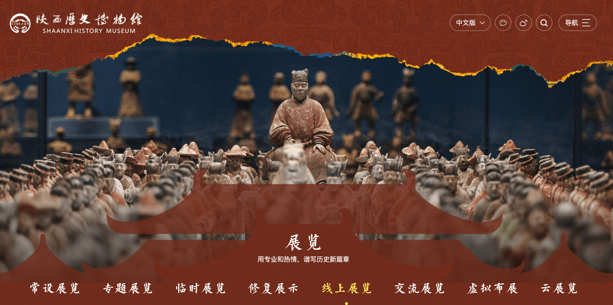
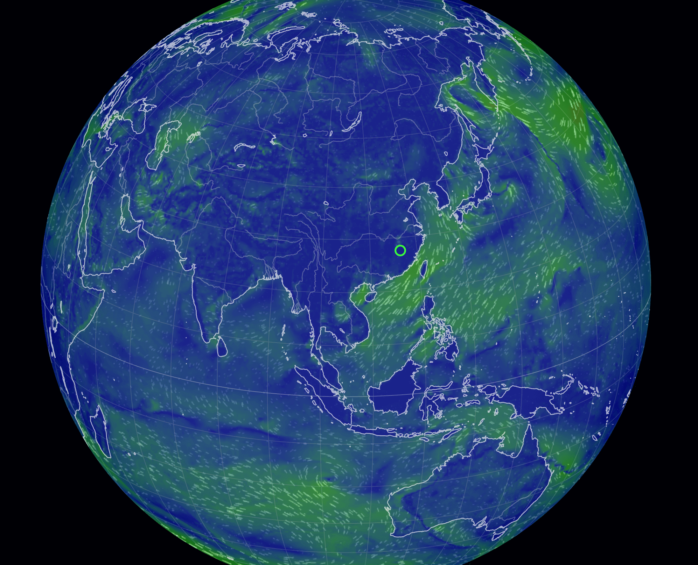

## 📕 精选文章

* 📄[嗯…微信小程序主包又双叒叕不够用了！！](https://juejin.cn/post/7614336660985970714)
* 📄[移动端开发稳了？AI 目前还无法取代客户端开发，小红书的论文告诉你数据](https://mp.weixin.qq.com/s/-AQ08DDFgiQzuXaa2tIqDQ)
* 📄[扣子 X OpenClaw高玩集结！全网超人气博主，直播带你养虾！](https://mp.weixin.qq.com/s/rOlITJ54hpF2XYFSTB4UOQ)
* 📄[什么 AI 写 Android 最好用？](https://juejin.cn/post/7614897667961143347)
* 📄[玩转龙虾🦞，openclaw 核心命令行收藏（持续更新）](https://juejin.cn/post/7613555403787911206)
* 📄[玩OpenClaw真能赚到钱？赛博🦞24小时打工养活你！改变人类历史的创业机会来临了！](https://mp.weixin.qq.com/s/BrPMrn57a91CgaxE5bthHg)
* 📄[AI 只会淘汰不用 AI 的程序员🥚作为程序员，你竟然还在手撸代码 ？？？ 如果没有公司给你提供账号，你真能玩转AI  - 掘金](https://juejin.cn/post/7585022810181222463)

## 🤖 AI前沿

**用OpenClaw搭了16个AI Agent，一个人运营13个自媒体**  

https://aicoding.juejin.cn/post/7607082524309061672

**🤖 2026年了，AI Agent真的能替你打工了**  

https://www.xiaohongshu.com/explore/69aad0f1000000001600b852

**🦞用 OpenClaw 让 Obsidian 笔记活过来！**  

https://sspai.com/post/106929

**knownsec/openclaw-security**  

本项目是团队内部总结的 OpenClaw 全生命周期的安全实践指南，覆盖从安装、配置、日常使用、日常维护，助你在享受 OpenClaw 强大能力的同时守住安全底线。

https://github.com/knownsec/openclaw-security

## 🔨 实用工具

**imputnet/helium**  

私密、快速、诚实的网络浏览器

Private, fast, and honest web browser
Best privacy and unbiased ad-blocking by default. Handy features like native !bangs and split view. No adware, no bloat, no noise. Made for people, by people. Fully open source.

https://github.com/imputnet/helium
https://helium.computer/

**词云，文字云，文字生图，AI在线免费生成**  

词云图通过视觉手段，如字体大小、颜色和旋转角度等，来突出显示关键词，
过滤掉大量的文本信息，让浏览者一眼就能领略文本的主旨。

https://www.wenziyun.cn/

## 📚 宝藏资源

**linux.do**

一个论坛网址

aHR0cHM6Ly9saW51eC5kby8=

**egoist/system-sound** 

play macos system sound

https://github.com/egoist/system-sound

**AICode-Nexus**

人工智能编码教程，先跑通一条 AI coding 教程，再扩展成长期工作流。

https://aicode-nexus.github.io/website/

**Acmesec/theAIMythbook**  

Ai迷思录（应用与安全指南）

https://github.com/Acmesec/theAIMythbook

**WaytoAGI|通往AGI之路**

AGI学习教程

https://waytoagi.feishu.cn/wiki/SPXQwl5TXiau0mkKb1zcqHxVnEm

## 💡 优秀项目

**ageitgey/face_recognition**  

本项目face_recognition是一个强大、简单、易上手的人脸识别开源项目，并且配备了完整的开发文档和应用案例，特别是兼容树莓派系统。

https://github.com/ageitgey/face_recognition

## 🎮 好玩有趣

**koala73/worldmonitor**  

实时全球情报仪表板 - 在统一的态势感知界面中进行人工智能驱动的新闻聚合、地缘监控和基础设施跟踪。

Real-time global intelligence dashboard — AI-powered news aggregation, geopolitical monitoring, and infrastructure tracking in a unified situational awareness interface

https://github.com/koala73/worldmonitor

**陕西历史博物馆**  

陕西历史博物馆

https://www.sxhm.com/online.html

**earth.nullschool**

可看风、气向、海洋的地球仪

Nullschool App

https://earth.nullschool.net/zh-cn

