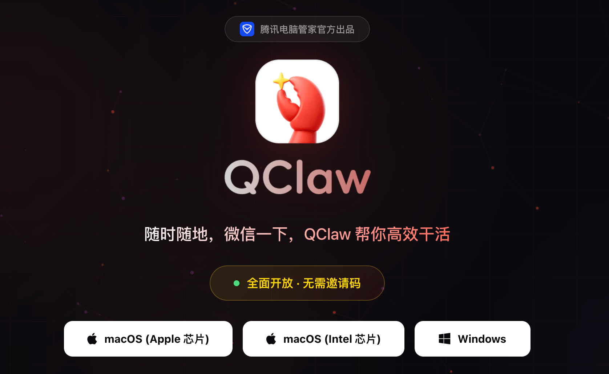
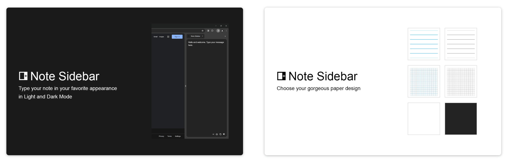
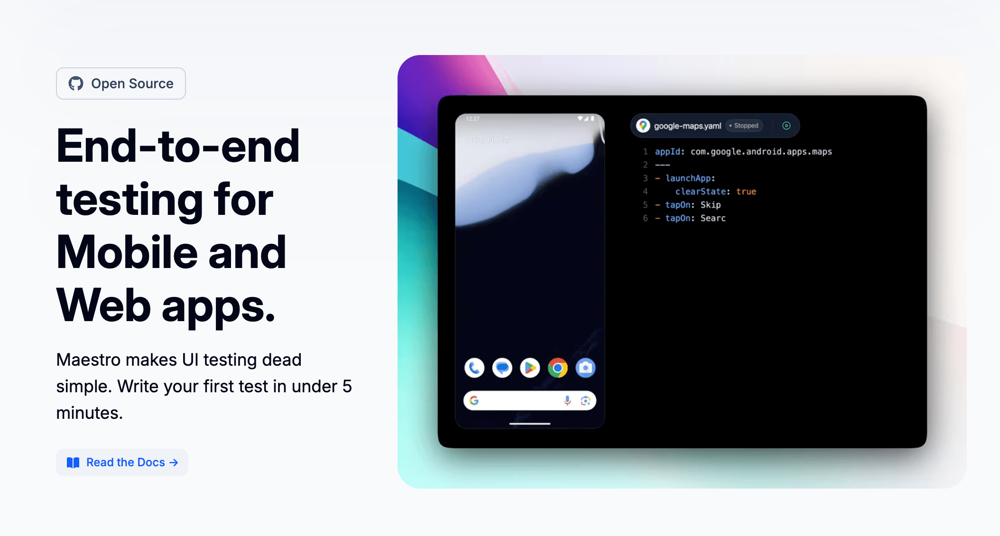
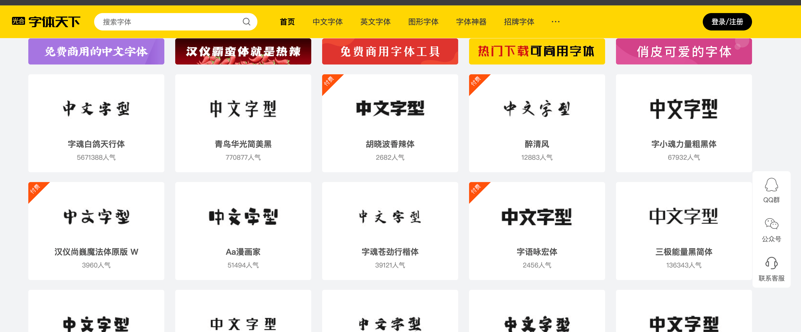
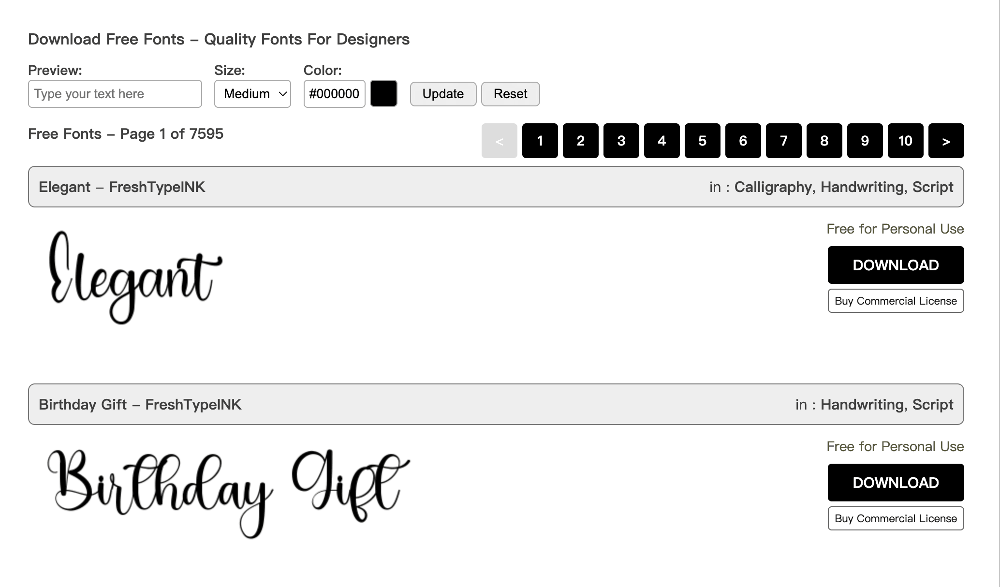
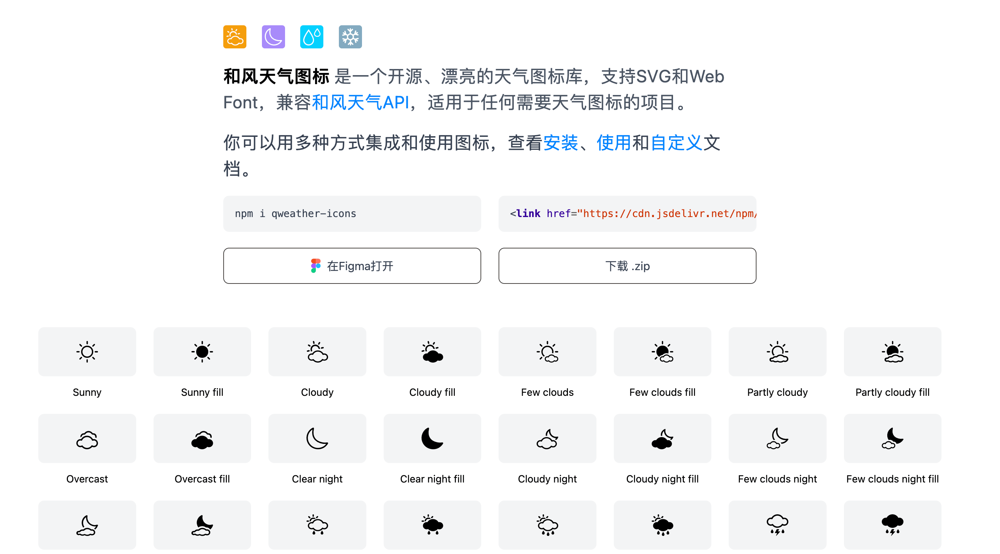
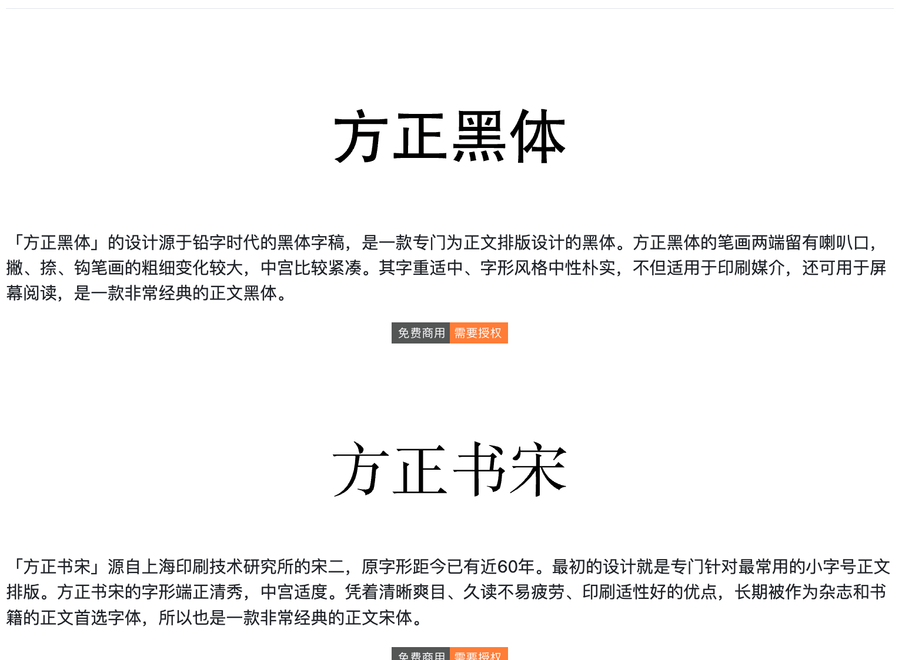
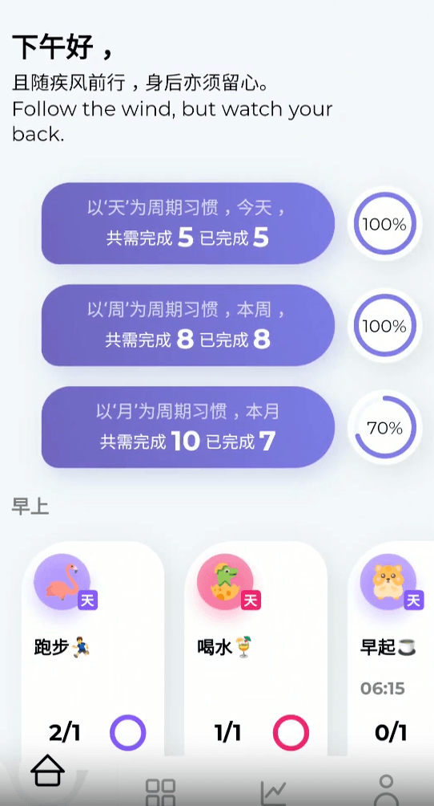
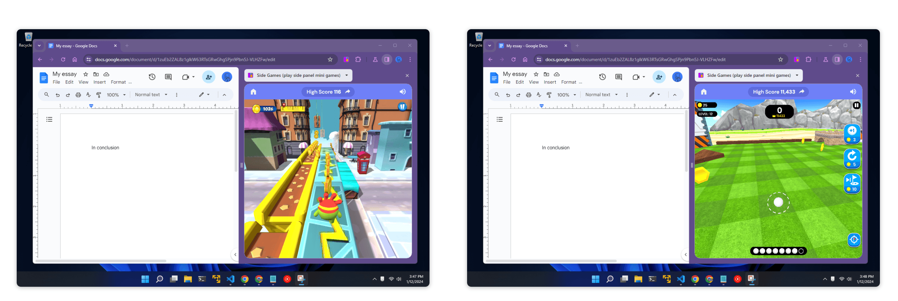
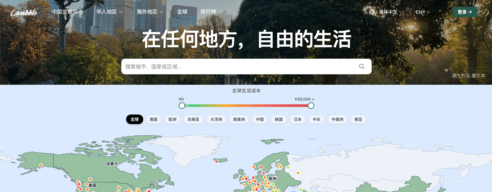

## 📕 精选文章

* 📄[融合安卓和 ChromeOS 体验：谷歌确认计划年内推出 Aluminium OS 桌面系统 ](https://m.ithome.com/html/926158.htm)
* 📄[Android 17 来了！新特性介绍与适配建议](https://juejin.cn/post/7612545160434188297)
* 📄[我用OpenClaw搭了11个AI Agent，它们学会了自我进化](https://juejin.cn/post/7611814182954516480)
* 📄[我用纯 C 写了一个可以直接跑在Android 手机上的 Agent，不需要 termux，我打开了潘多拉魔盒？](https://mp.weixin.qq.com/s/bvumVaxQgZAxqr_fcsVe3g)

## 🤖 AI前沿

**精選解讀｜當 AI 回到裝置端，下一波競爭可能不在雲端，而在你手上的硬體** 

手機、AI PC 與穿戴式裝置正在改寫競爭入口，真正拉開差距的，將不只是哪家模型更強，而是誰能把 AI 變成低延遲、低摩擦的日常能力

https://www.infoai.com.tw/blog/ai-shifts-to-devices-hardware-becomes-the-entry-point

**Xiaomi MiMo-V2-Pro 发布：面向 Agent 时代的旗舰基座**

Xiaomi MiMo-V2-Pro 专为现实世界中高强度的 Agent 工作场景而打造。它拥有超过 1T 的总参数量（42B 激活参数），采用创新的混合注意力架构，并支持 1M 超长上下文长度。在强大的模型基座上，我们在更为广泛的 Agent 场景中持续 Scaling 算力，进一步拓展了智能的动作空间，实现了从 Coding 到 Claw 的重要泛化。

https://mp.weixin.qq.com/s/MW7iUWM-i4cN1AKe21B-Cg

**Nvidia Hits New Records as AI Infrastructure Spend Accelerates**  

英伟达报告了另一个突破性的季度，但更大的故事是结构性的：人工智能需求正在从模型训练扩展到全栈部署，支出正在从实验转向永久性基础设施。

Nvidia reported another breakout quarter, but the bigger story is structural: AI demand is broadening from model training to full-stack deployment, and spending is moving from experimentation to permanent infrastructure.

https://www.aiunderstanding.org/news/nvidia-h200

**刚刚！Google突然宣布：Gemini正式进香港，免魔法使用**

https://aicoding.juejin.cn/post/7617697070363754542

**QClaw**  

微信远程办公 AI 助手 | 腾讯出品

https://qclaw.qq.com/

## 🔨 实用工具

**Note Sidebar**  

Note Sidebar 是一个轻量级且有用的插件，专为从 Web 浏览器的侧边栏做笔记而设计。 使用此浏览器扩展程序，您可以根据自己的喜好自定义便条纸，无论是您最喜欢的背景颜色、方格纸还是横格纸。

https://chromewebstore.google.com/detail/note-sidebar/emiochiflnnegkecnjndifbobmbepdne

**jon-makinen/cursor-local-remote**  

应用于Cursor类似Claude Code远程使用

Like Claude Code remote but for Cursor

https://github.com/jon-makinen/cursor-local-remote

**andforce/Andclaw**  

让 AI 像人类一样使用你的手机 —— 完全在设备上运行，无需 Root，无需电脑。

https://github.com/andforce/Andclaw

**PKU-YuanGroup/Helios**

该存储库是Helios的官方实现，Helios是一种突破性的视频生成模型，可以在单个H100 GPU上以19.5 FPS（在单个Ascend NPU上约为10 FPS）实现分钟级的高质量视频合成，而无需依赖传统的长视频防漂移策略或标准视频加速技术。

Helios: Real Real-Time Long Video Generation Model

https://github.com/PKU-YuanGroup/Helios

**Maestro**  

移动和 Web 应用程序端到端测试框架。

End-to-End UI Testing for Mobile and Web

https://maestro.dev/

## 📚 宝藏资源

**xiaoxiunique/awesome**  

IntelliJ-IDEA: 收集一些 Intellij IDEA 的一些技巧

https://github.com/xiaoxiunique/awesome-IntelliJ-IDEA

**字体天下**  

提供各类字体的免费下载和在线预览服务

https://www.fonts.net.cn/

**1001freefonts**

字体库资源站点

https://www.1001freefonts.com/

**qwd/Icons**  

和风天气开源图标字体库 Open source weather icons && fonts for QWeather

https://github.com/qwd/Icons

**KonghaYao/chinese-free-web-font-storage**  

 

中文网字计划 (Chinese Webfont Project) 是一个免费的中文 web 字体库，支持在线加载及查看字体信息。Explore our free CJK web font library that enables online loading and font information viewing.

https://github.com/KonghaYao/chinese-free-web-font-storage

**wordshub/free-font**  

大概是2020年最全的免费可商用字体，这里收录的商免字体都能找到明确的授权出处，可以放心使用，持续更新中...

https://github.com/wordshub/free-font

## 💡 优秀项目

**designDo/flutter-checkio**

How time flies.一款开源习惯打卡APP，流畅的动画体验，Bloc实现状态管理，主题(颜色)切换，字体切换，数据库管理等。

https://github.com/designDo/flutter-checkio

## 🎮 好玩有趣

**Side Games**  

侧边游戏 - 在侧边栏玩迷你游戏

play mini games in the side panel

https://chromewebstore.google.com/detail/side-games-play-side-pane/gcnahbcdhgjobeahhdogjhhmnlopcjaj

**Livabble**  

在任何地方，自由的生活
Livabble 是一本关于宜居城市的实用指南，适合那些可以在任何地方工作的人——数字游民、远程员工、创始人、间隔年的学生和计划搬家的家庭。

2026 Livable Cities in World Ranking - The Complete Guide for Digital Nomads, Relocation, and Retirement

https://livabble.com/

## 📝 日常记录

在龙虾🦞遍地的时候，反过来思考你真的需要一只吗？你可用它来做些什么或是解决什么问题？
目前看来我好像还没想好具体应用场景（授权最高权限去做任何事）。但不能否认这是AI趋势，智能体需要高权限场景施展拳脚。