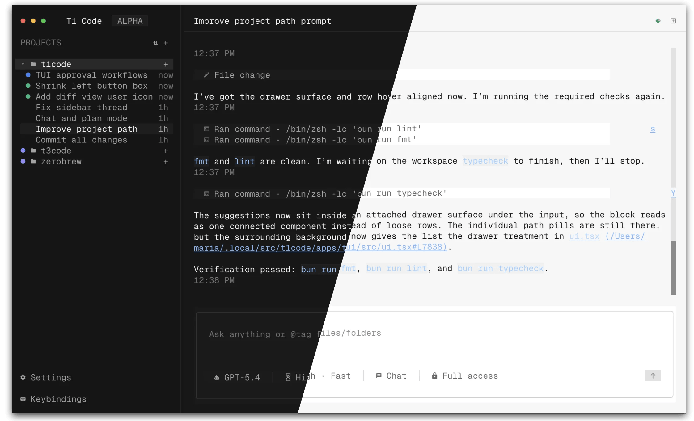
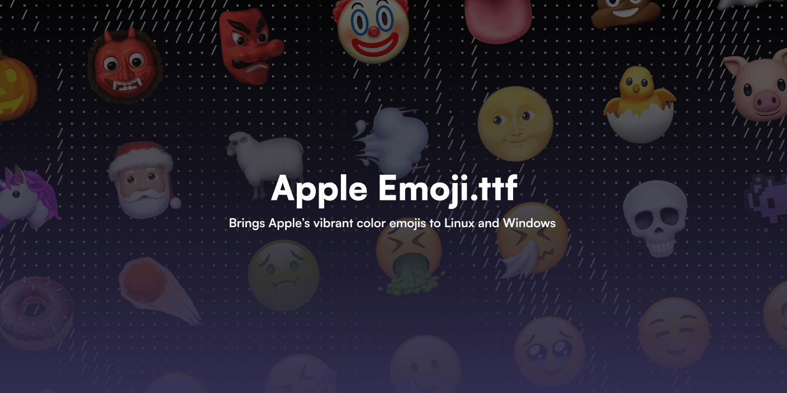
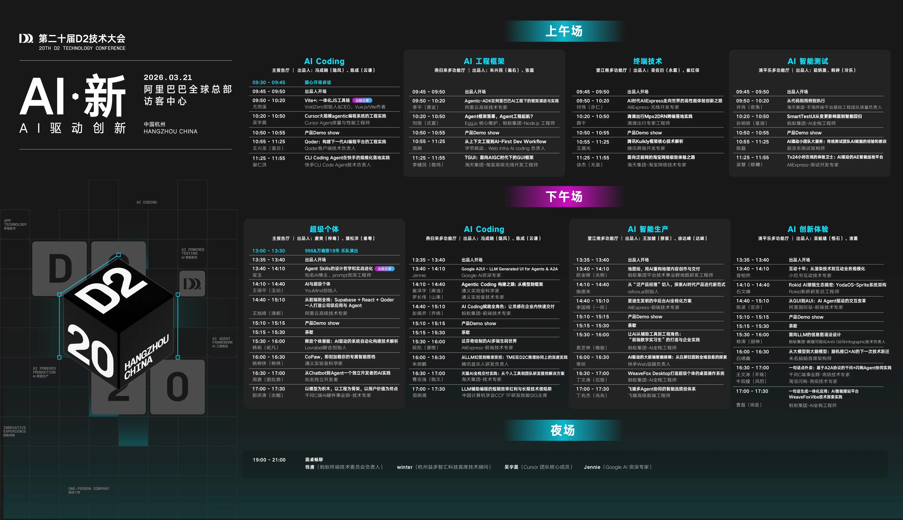
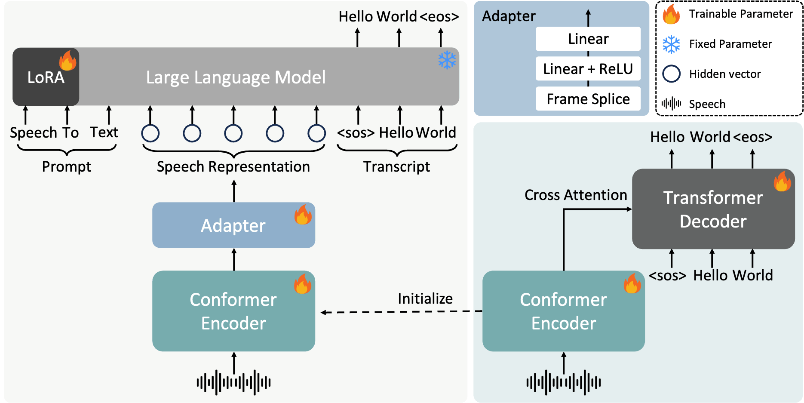
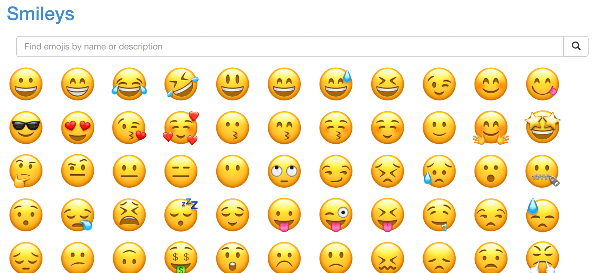
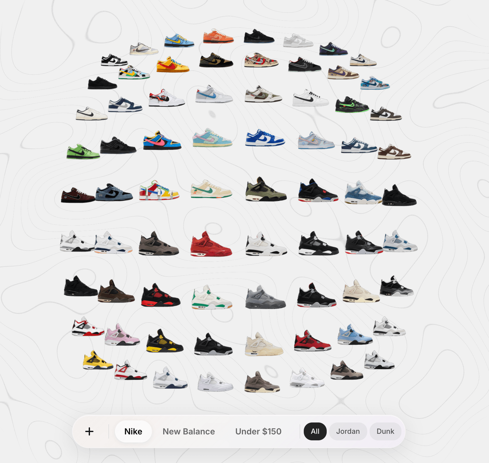

## 📕 精选文章

* 📄[聊聊2026年Android开发会是什么样](https://juejin.cn/post/7589903499599347766)
* 📄[全面封禁 Cursor！又一家大厂出手了](https://juejin.cn/post/7584110439933100078)
* 📄[GitHub 创始人资助的开源浏览器「GitHub 热点速览」](https://juejin.cn/post/7389145163857985587)
* 📄[拒绝“感觉有效”：用数据证明 AI Coding 的真实团队价值](https://mp.weixin.qq.com/s/8bmDf4GJH5zHjscW-_SX6g)
* 📄[《树莓派不吃灰》025：以树莓派为网关，将追剧刷课神器Plex服务配置到公网](https://v2fy.com/p/2024-01-05-15-57-07-plex/)
* 📄[暴涨47.3k Stars！字节开源Harness项目DeerFlow 2.0，让智能体几乎能完成任何复杂任务](https://zhuanlan.zhihu.com/p/2020566695719256852)
* 📄[Android 17 新适配要求，各大权限进一步收紧，适配难度提升](https://juejin.cn/post/7621551215504228395)

## 🤖 AI前沿

**mvanhorn/last30days-skill**  

AI 代理技能可研究 Reddit、X、YouTube、HN、Polymarket 和网络上的任何主题，然后综合得出有依据的摘要。

AI agent skill that researches any topic across Reddit, X, YouTube, HN, Polymarket, and the web - then synthesizes a grounded summary

https://github.com/mvanhorn/last30days-skill

**Anthropic 产品经理：PRD 已死，原型万岁**

Anthropic Claude Code 产品负责人 Cat Wu 发了篇博客，聊了聊他们团队的产品经理现在到底怎么干活的。

https://mp.weixin.qq.com/s/S2x7pJ2RqLk9tQdqxpzQNQ

**Harness Engineering 在硅谷彻底火了。**

最近在海外 AI 圈子里，有一个词被频繁提起，叫 Harness Engineering。

https://mp.weixin.qq.com/s/PE6E7Wos8Yi2e9t4k_Sqhg

## 🔨 实用工具

**epiral/bb-browser**  

你的浏览器就是 API

Your browser is the API. CLI + MCP server for AI agents to control Chrome with your login state.

https://github.com/epiral/bb-browser
https://github.com/epiral/bb-sites

**joewongjc/type4me**  

MacOS语音输入法，实时识别、大模型文本优化、全本地存储

https://github.com/joewongjc/type4me

**nextcloud/ios**  

📱 Nextcloud iOS App

https://github.com/nextcloud/ios
https://apps.apple.com/us/app/nextcloud/id1125420102

**maria-rcks/t1code**  

T3Code, but in your terminal

https://github.com/maria-rcks/t1code

**ente-io/ente**  

Ente 是一项提供完全开源、端到端加密平台的服务，您可以将数据存储在云端，而无需信任服务提供商。

Fully open source end-to-end encrypted photos, authenticators and more.

https://github.com/ente-io/ente

## 📚 宝藏资源

**Cloxl/xhshow**  

5bCP57qi5LmmeHPnuq/nrpcg5bCP57qi5LmmeC1zIHgtcy1jb21tb24geHNjIOetieWtl+autSDnuq/nrpfpgIblkJEK

https://github.com/Cloxl/xhshow

**coolclaws/deerflow-book**  

DeerFlow 源码解析 - ByteDance 开源 Super Agent Harness 深度解析

https://github.com/coolclaws/deerflow-book

**samuelngs/apple-emoji-ttf**

Brings Apple's vibrant color emojis to Linux, Windows, and the Web

https://github.com/samuelngs/apple-emoji-ttf

**d2forum/20th**  

第20届D2终端技术大会「AI·新」

https://github.com/d2forum/20th

## 💡 优秀项目

**FireRedTeam/FireRedASR**  

FireRedASR：开源工业级自动语音识别模型

Open-source industrial-grade ASR models supporting Mandarin, Chinese dialects and English, achieving a new SOTA on public Mandarin ASR benchmarks, while also offering outstanding singing lyrics recognition capability.

https://github.com/FireRedTeam/FireRedASR

**bytedance/deer-flow**  

DeerFlow（Deep Exploration and Efficient Research Flow）是一个开源的 super agent harness。它把 sub-agents、memory 和 sandbox 组织在一起，再配合可扩展的 skills，让 agent 可以完成几乎任何事情。

 An open-source long-horizon SuperAgent harness that researches, codes, and creates. With the help of sandboxes, memories, tools, skill, subagents and message gateway, it handles different levels of tasks that could take minutes to hours.

https://github.com/bytedance/deer-flow

**zhdsmy/apple-emoji:**  

Apple Color Emoji for Linux / Windows

https://github.com/zhdsmy/apple-emoji/

**LadybirdBrowser/ladybird**  

开源浏览器

Ladybird 是一款真正独立的网络浏览器，使用基于网络标准的新颖引擎。

Ladybird is a truly independent web browser, using a novel engine based on web standards.

https://github.com/LadybirdBrowser/ladybird

## 🎮 好玩有趣

**Shoe Finder**  

3D鞋子浏览体验,通过流畅的动画、过滤和缩放控件，在交互式网格中探索运动鞋系列。

https://shoe-finder-wine.vercel.app/

## 📝 日常记录

上周忙得没来得及更新周刊，这期是不能落下了~
最近在思考AI盛行时代，如何保证Ta不出错和硬编码一样输出理想结果？
