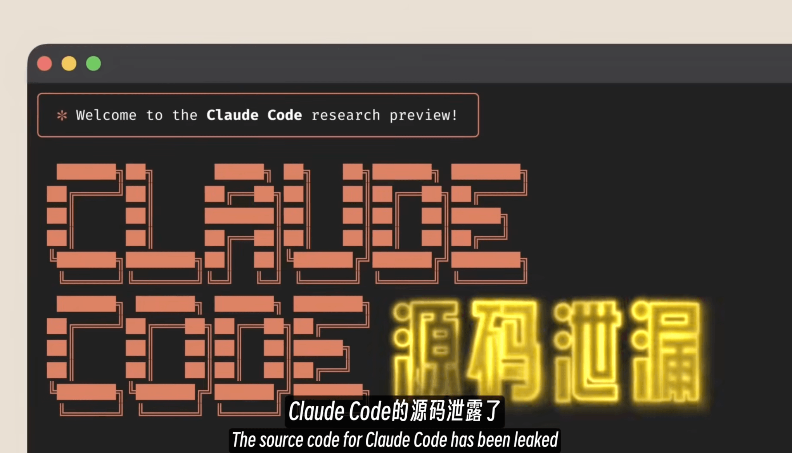
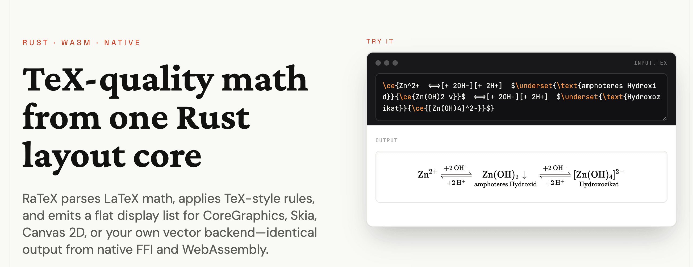
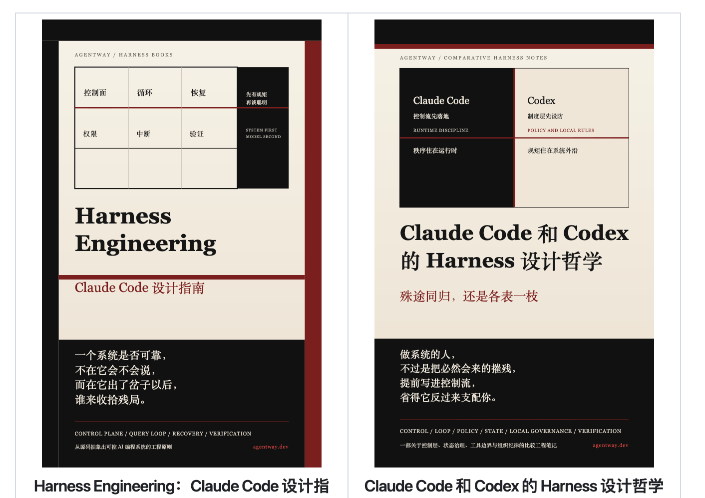
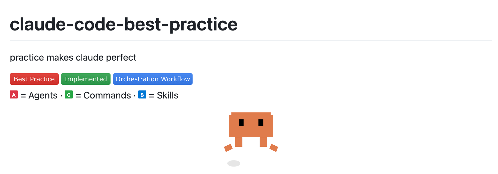
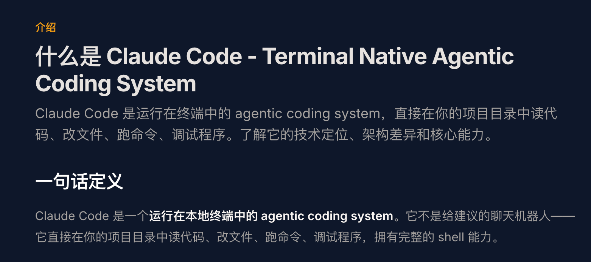
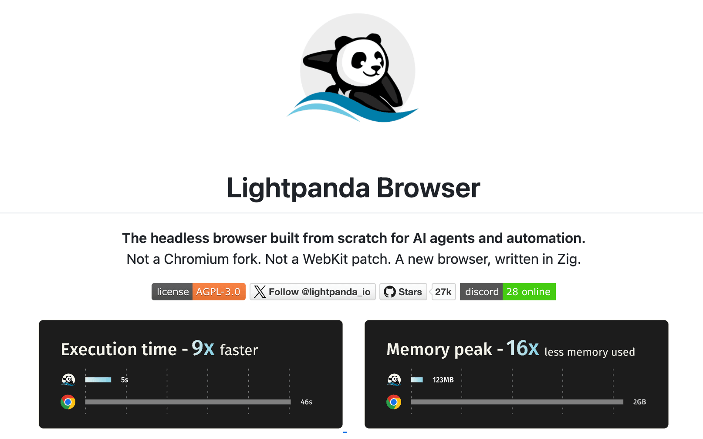

## 📕 精选文章
* 📄[从 MVVM 到 MVI：为什么说 MVVM 的 UI 状态像“网”，而 MVI 像“一条线”？](https://juejin.cn/post/7618226713329090610)
* 📄[ArkUI-X 6.0 跨平台框架能否取代 Flutter？](https://juejin.cn/post/7592170706026446883)
* 📄[Web Access：一个Skill，拉满Agent联网和浏览器能力](https://mp.weixin.qq.com/s/rps5YVB6TchT9npAaIWKCw)

## 🤖 AI前沿

**51万行源码泄露！Claude Code 里面到底藏了什么？**  

https://www.youtube.com/watch?v=nnfyJbFxiZo

**黄仁勋要发Token当工资！硅谷兴起刷量大赛，一人一周烧掉33个维基百科** 

Token 这个 AI 处理的最小文本单位，正在从技术术语变成硅谷的新型货币。

https://juejin.cn/post/7620071802712539187

## 🔨 实用工具

**erweixin/RaTeX**  

纯 Rust 实现的 KaTeX 兼容数学渲染引擎 — 无 JavaScript、无 WebView、无 DOM。

KaTeX-compatible LaTeX math renderer in pure Rust. No JavaScript, no WebView, no DOM. One Rust core → iOS,          Android, Flutter, Web, PNG. C ABI · WASM · Server-side PNG. ~99% KaTeX syntax coverage.

https://github.com/erweixin/RaTeX

https://erweixin.github.io/RaTeX/

**WindySha/ManifestEditor**  

此工具用于修改AndroidManifest二进制文件。比如，更改Manifest文件中的app包名，版本号，更改或新增app入口Application的类名，更改或新增debuggable的属性，增加usesPermission标签，增加meta-data标签等。 同时，为了更方便使用，提供了直接修改Apk包中的Manifest文件，并对修改后的Apk进行签名的功能。

This is a tool used to modify Android Manifest binary file.

https://github.com/WindySha/ManifestEditor

## 📚 宝藏资源

**学习 Claude Code | Claude Code源码学习专题**  

https://www.xuanyuancode.com/learn-claude-code

**财经M平方**  

想要预测未来，必定先了解历史与现在

https://sc.macromicro.me/time_line?id=26&stat=2

**AI郵報**  

AI 郵報 — AI 新知、工具教學、科技快訊一次掌握，第一手消息別錯過！

https://www.aiposthub.com/

**wquguru/harness-books**  

一个会写代码的模型进了终端、仓库、权限系统和团队流程，系统凭什么还能保持边界、连续性和后果控制。

Two books on harness engineering. They pursue the same engineering question: once a code-writing model is placed inside terminals, repositories, permission systems, and team workflows, what keeps the overall system bounded, continuous, and accountable for consequences?

https://github.com/wquguru/harness-books

**VoltAgent/awesome-design-md**  

DESIGN.md 文件的精选集合，灵感来自以开发人员为中心的网站。

Collection of DESIGN.md files that capture design systems from popular websites. Drop one into your project and let coding agents build matching UI.

https://github.com/VoltAgent/awesome-design-md

**ChinaSiro/claude-code-sourcemap**  

本仓库为非官方整理版，基于公开 npm 发布包与 source map 分析还原，仅供研究使用。 不代表官方原始内部开发仓库结构。 一切基于L站"飘然与我同"的情报提供

This repository is unofficial and is reconstructed from the public npm package and source map analysis, for research purposes only. It does not represent the original internal development repository structure.

https://github.com/ChinaSiro/claude-code-sourcemap

**pengchengneo/Claude-Code**  
 
可运行的Claude Code源码

https://github.com/pengchengneo/Claude-Code

**Rito-w/claude-code-best-practice-zh**  

Claude Code 最佳实践 - 中文翻译版

https://github.com/Rito-w/claude-code-best-practice-zh

**tvytlx/claude-code-deep-dive**  

Claude Code 源码深度研究报告

https://github.com/tvytlx/claude-code-deep-dive

## 💡 优秀项目

**claude-code-best/claude-code**  

Claude Code 大部分功能及工程化能力复现 (问就是老佛爷已经付过钱了)。

原汁原昧 Claude Code 可运行,可构建, 可调试版; Typescript 类型全修复; 企业级可靠性; 安全无毒, lock 文件保真, 可直接 bun i; bun run dev 启动

Which Claude do you like? The open source one is the best.

https://github.com/claude-code-best/claude-code

**openai/codex-plugin-cc**  

使用 Claude Code 内部的 Codex 进行代码审查或将任务委托给 Codex。
Use Codex from Claude Code to review code or delegate tasks.

https://github.com/openai/codex-plugin-cc

**lightpanda-io/browser**  

Lightpanda：专为人工智能和自动化设计的无头浏览器

Lightpanda: the headless browser designed for AI and automation

https://github.com/lightpanda-io/browser

**eze-is/web-access**

Claude Code 原本有 WebSearch、WebFetch，但缺少调度策略和浏览器自动化能力。这个 skill 补上的是：联网策略 + CDP 浏览器操作 + 站点经验积累。

https://github.com/eze-is/web-access

**shipany-ai/open-agent-sdk**  

Open Agent SDK 是受@anthropic-ai/claude-agent-sdk 启发的开源 Agent SDK。构建能够理解代码库、编辑文件、运行命令、搜索网络以及执行复杂的多步骤工作流程的自主 AI 代理。

Agent-SDK without CLI dependencies, as an alternative to claude-agent-sdk, completely open source

Open Agent SDK is an open-source Agent SDK inspired by @anthropic-ai/claude-agent-sdk. Build autonomous AI agents that can understand codebases, edit files, run commands, search the web, and execute complex multi-step workflows.

https://github.com/shipany-ai/open-agent-sdk

**claude-code-best/claude-code**  

原汁原昧 Claude Code 可运行版; Bun 可编译执行版; Typescript 类型全修复;企业级可靠性; 安全无毒, lock 文件保真, 可直接 bun i; bun run dev 启动

https://github.com/claude-code-best/claude-code

