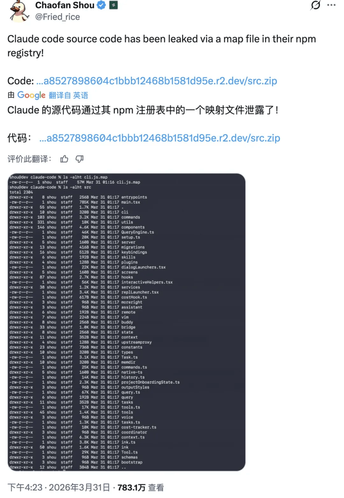
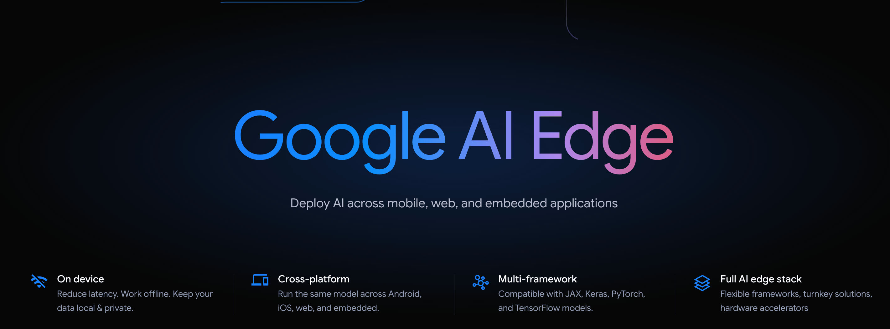
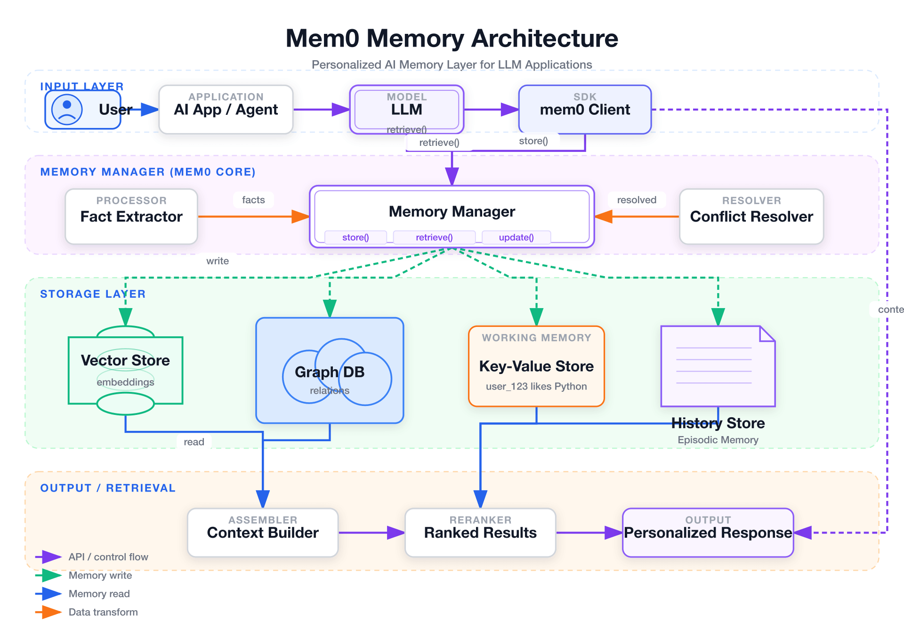
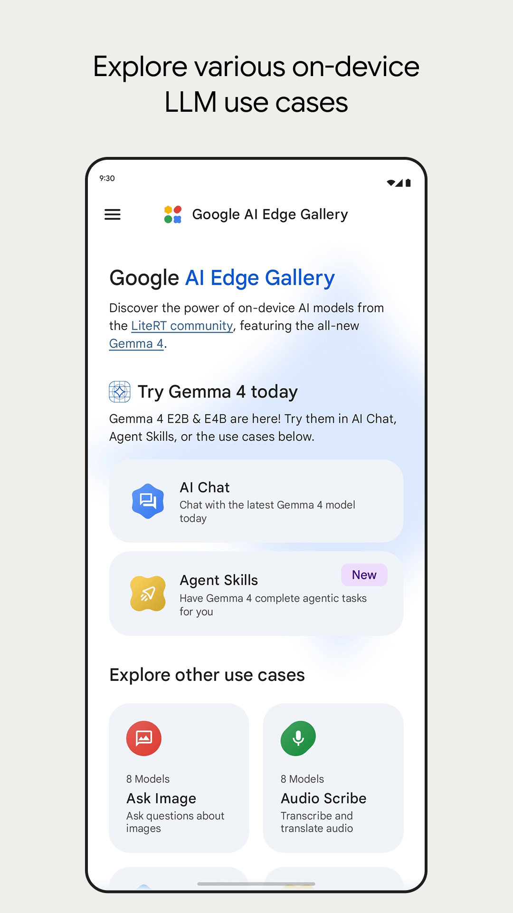

## 📕 精选文章

* 📄[为什么 Google 不再推荐 SharedPreferences？答案其实只有一个：锁](https://juejin.cn/post/7616257286160023561)

* 📄[在 AI 公司做技术管理的一点体验](https://mp.weixin.qq.com/s/XhOW28Vp7t4x3Pe9OezqRQ)

* 📄[Claude Code 的 skills 源码解析](https://juejin.cn/post/7625838952655912994)

* 📄[Claude在得物App数仓的深度集成与效能演进](https://juejin.cn/post/7621043229425451060)

* 📄[一场泄露看懂 Claude Code：Harness 是让 Agent 干活靠谱的关键](https://01.me/2026/04/blog-claude-code/)

* 📄[让TypeScript 再次伟大：愚人节前夜Claude Code意外开源与OpenClaw小龙虾打造 AI 原生开发新纪元](https://juejin.cn/post/7623024602586103860)

* 📄[一场泄露看懂 Claude Code：Harness 是让 Agent 干活靠谱的关键](https://mp.weixin.qq.com/s/nq7neN-g0Dx9fC7sHZvYng)

## 🤖 AI前沿

**Claude Code源码泄露7小时，51万代码被扒光，是失误还是阳谋？**

https://mp.weixin.qq.com/s/8f-JqC7OI57gEuW_wBLaNw

**外网疯传的视频！AI吹哨人揭秘被掩盖的真相：我们正被AI公司集体误导！**

https://mp.weixin.qq.com/s/NpvCH4jZHne00cJtf7-jnw

**Google AI Edge |Google AI for Developers**  

跨移动、Web 和嵌入式应用程序部署 AI

Deploy AI across mobile, web, and embedded applications

https://ai.google.dev/edge
https://play.google.com/store/apps/details?id=com.google.ai.edge.gallery

## 🔨 实用工具

**yizhiyanhua-ai/fireworks-tech-graph**  

不用手画图了。用中文描述你的系统，几秒钟得到可直接发布的 SVG + PNG 技术图。

Claude Code skill for generating production-quality SVG+PNG technical diagrams. Supports 8 diagram types, 5 visual styles, and deep AI/Agent domain knowledge.

https://github.com/yizhiyanhua-ai/fireworks-tech-graph

**MobAI App.**  

AI自动化测试平台

https://github.com/MobAI-App

## 📚 宝藏资源

**shareAI-lab/learn-claude-code**  

一个面向实现者的教学仓库：从零开始，手搓一个高完成度的 coding agent harness。

这里教的不是“如何逐行模仿某个官方仓库”，而是“如何抓住真正决定 agent 能力的核心机制”，用清晰、渐进、可自己实现的方式，把一个类似 Claude Code 的系统从 0 做到能用、好用、可扩展。

Bash is all you need -  A nano claude code–like 「agent harness」, built from 0 to 1

https://github.com/shareAI-lab/learn-claude-code

**NousResearch/hermes-agent**  

由 Nous Research 构建的自我改进的人工智能代理。它是唯一具有内置学习循环的代理——它从经验中创造技能，在使用过程中改进这些技能，推动自己坚持知识，搜索自己过去的对话，并在整个会话中建立一个关于你是谁的深化模型。在 5 美元的 VPS、GPU 集群或无服务器基础设施上运行它，闲置时几乎不需要任何成本。它与您的笔记本电脑无关——当它在云虚拟机上工作时，可以通过 Telegram 与它交谈。

The agent that grows with you

https://github.com/NousResearch/hermes-agent
https://hermes-agent.nousresearch.com/

**ice-a/share_code**  

分享一些轮子

https://github.com/ice-a/share_code

## 💡 优秀项目

**transistorsoft/flutter_background_fetch**  

Background Fetch 是一个非常简单的插件，大约每 15 分钟就会在后台唤醒一个应用程序，提供较短的后台运行时间。每当发生后台获取事件时，该插件就会执行您提供的callbackFn。

Periodic callbacks in the background for both IOS and Android.  Includes Android Headless mechanism

https://github.com/transistorsoft/flutter_background_fetch

**google-ai-edge/gallery**  

AI Edge Gallery 是在移动设备上运行世界上最强大的开源大型语言模型 (LLM) 的首选目的地。直接在您的硬件上体验高性能生成式人工智能——完全离线、私密且快如闪电。

Explore, Experience, and Evaluate the Future of On-Device Generative AI with Google AI Edge.

A gallery that showcases on-device ML/GenAI use cases and allows people to try and use models locally.

https://github.com/google-ai-edge/gallery

https://play.google.com/store/apps/details?id=com.google.ai.edge.gallery

## 🎮 好玩有趣

**YixiaJack/feng-ge-skill**  

让峰哥用他的直白和底层洞察，帮你看透社会、读懂人性。
不是复读语录，是用他看世界的方式帮你分析问题

峰哥亡命天涯视角 Claude Code Skill

https://github.com/YixiaJack/feng-ge-skill

**tmstack/awesome-persona-skills**  

同事.skill、老板.skill、前任.skill、自己.skill、永生.skill、女娲.skill……

https://github.com/tmstack/awesome-persona-skills
