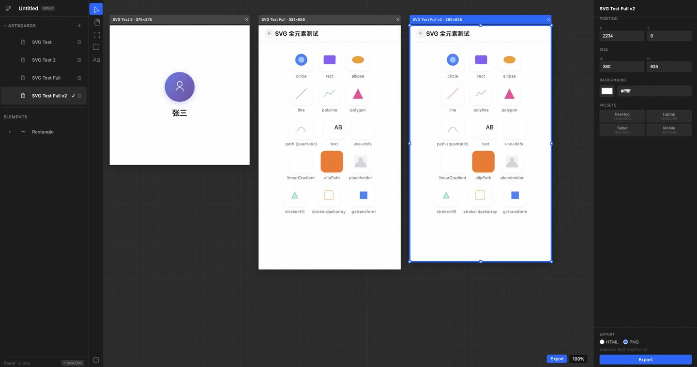
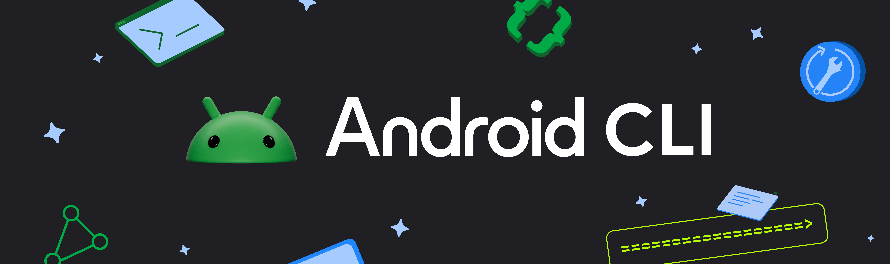
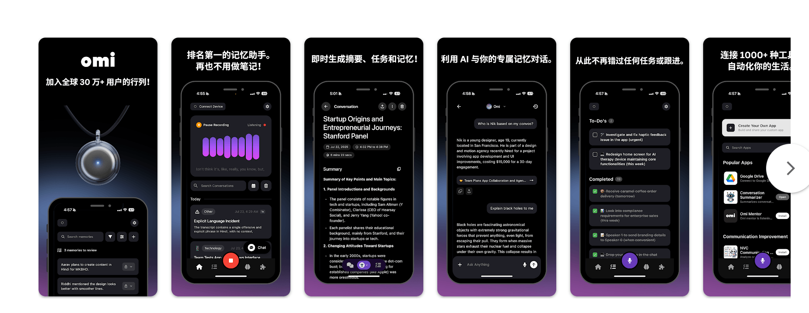
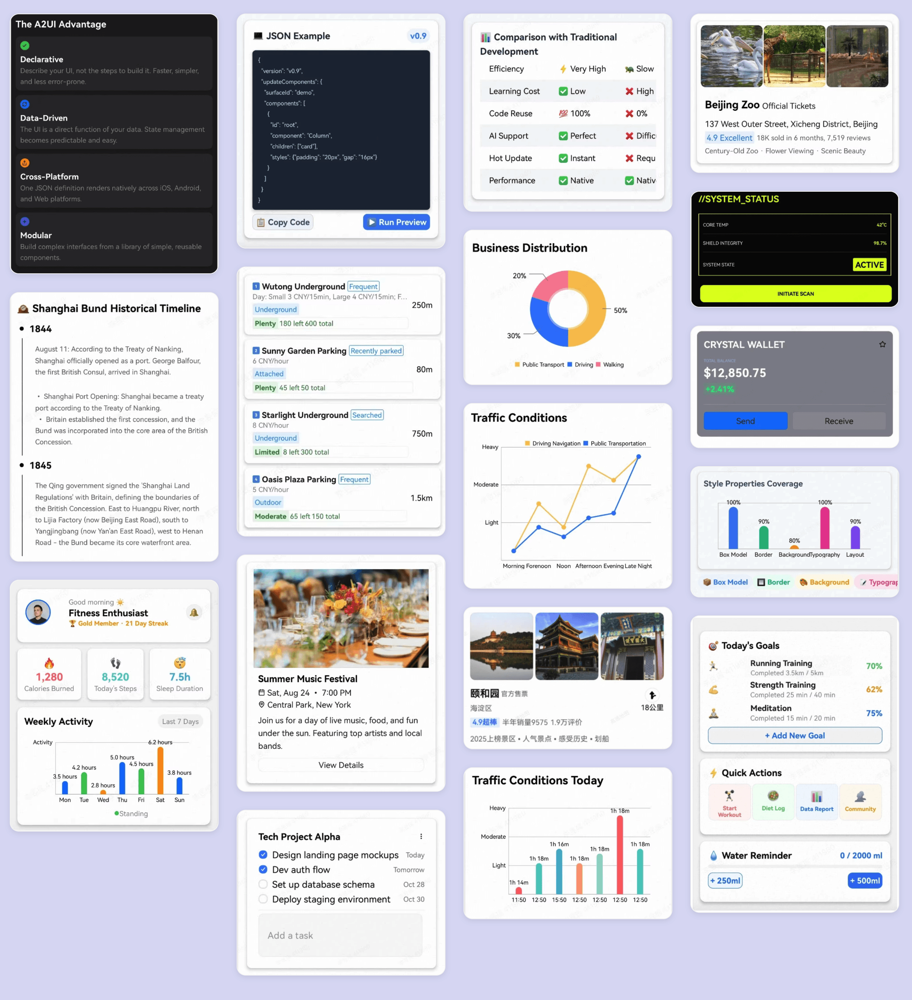
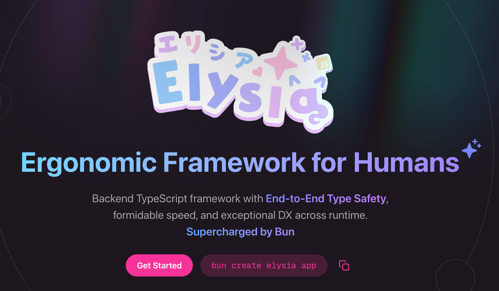
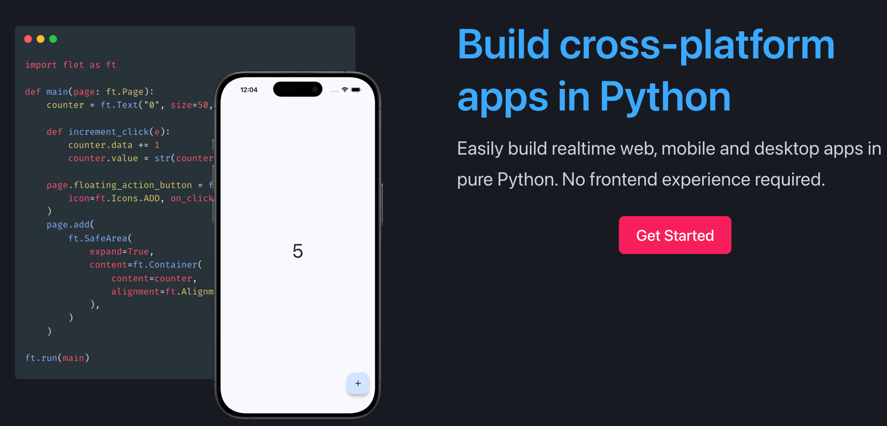
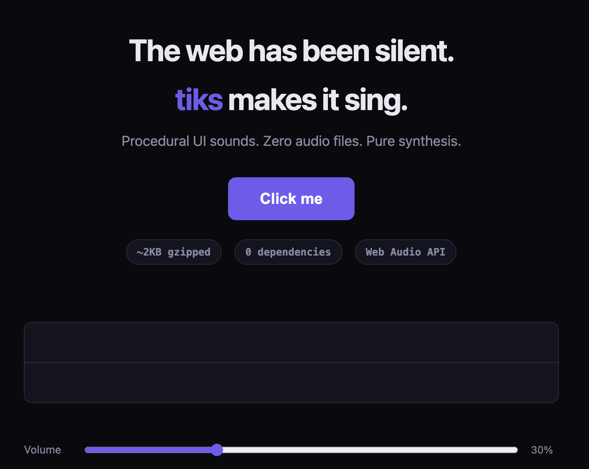
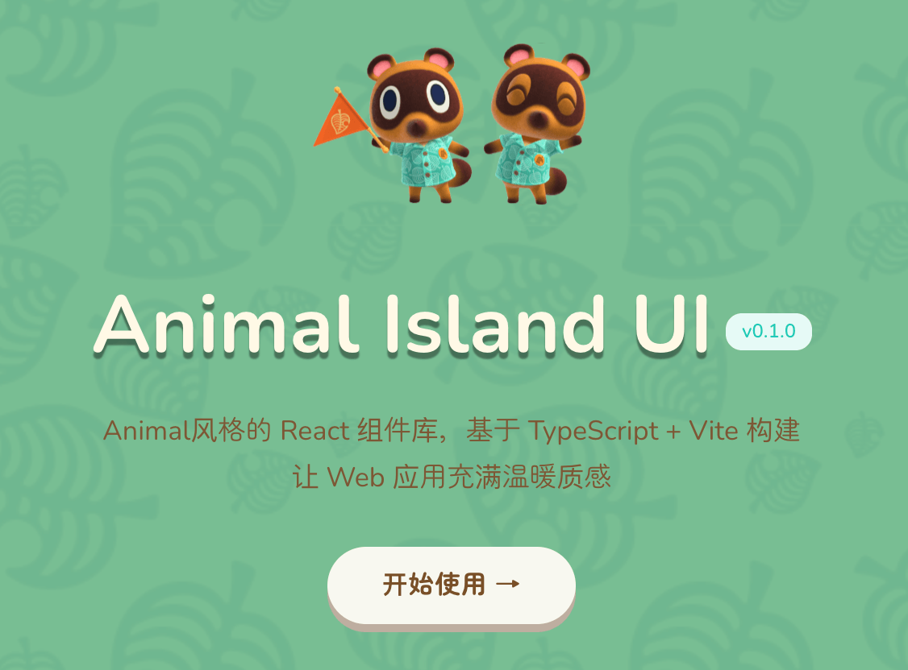

## 📕 精选文章

* 📄[为什么中转渠道的顶级模型会不好用？](https://juejin.cn/post/7619522038567616546)
* 📄[浅谈Getx删库跑库了](https://juejin.cn/post/7628489262722400294)
* 📄[Android Developers Blog: Boosting Android Performance: Introducing AutoFDO for the Kernel](https://android-developers.googleblog.com/2026/03/BoostingAndroid%20PerformanceIntroducingAutoFDO.html)
* 📄[你的代理归我了：AI 大模型恶意中间人攻击，钱包都被转走了](https://juejin.cn/post/7627257089388118025)

## 🤖 AI前沿

**heygen-com/hyperframes**  

Hyperframes 是一个开源视频渲染框架，可让您创建、预览和渲染基于 HTML 的视频合成，并为 AI 代理提供一流的支持。
Write HTML. Render video. Built for agents.

https://github.com/heygen-com/hyperframes

**eisneim/HIHarness**  

人工，智能Agent运行时，任意编排Context，完全忽略KV Cache😂，全靠人工管理上下文和工具调用，SKILL激活等

https://github.com/eisneim/HIHarness

**eisneim/VibeDesignLocalMCP**  

纯本地版的Agent设计MCP，UI设计参考了Paper.design
本地优先的 UI 设计工具，复刻 Paper 的核心体验。基于真实 HTML/CSS 渲染，通过 MCP 协议让 AI Agent（如 Claude Code）可以直接读写画布。

https://github.com/eisneim/VibeDesignLocalMCP

**Android Developers Blog: Android CLI and skills: Build Android apps 3x faster using any agent**  

使用 Android CLI 随时随地构建高质量 Android 应用

https://android-developers.googleblog.com/2026/04/build-android-apps-3x-faster-using-any-agent.html

## 🔨 实用工具

**Kozea/CairoSVG**  

CairoSVG 是一个基于 Cairo 的 SVG 转换器。它可以将 SVG 文件导出为 PDF、EPS、PS 和 PNG 文件。

Convert your vector images

https://github.com/Kozea/CairoSVG
https://www.courtbouillon.org/cairosvg/

**guofei9987/sdr2hdr**  

高亮图片生成器：给 PNG 或 JPEG 图片嵌入内置 ICC 配置文件。

https://github.com/guofei9987/sdr2hdr

**BasedHardware/omi**  

Omi 捕获您的屏幕和对话，实时转录，生成摘要和操作项，并为您提供人工智能聊天，记住您所看到和听到的一切。适用于台式机、手机和可穿戴设备。完全开源。

AI that sees your screen, listens to your conversations and tells you what to do

https://github.com/BasedHardware/omi

## 💡 优秀项目

**acoder-ai-infra/AGenUI**  

AGenUI 是一个跨平台 SDK，用于渲染 AI 生成的 UI。它基于 Google 的 A2UI v0.9 开放协议构建，可将从大型语言模型流式传输的结构化 JSON 实时转换为 iOS、Android 和 HarmonyOS 上的高性能本机组件。

Native Renderer for A2UI

https://github.com/acoder-ai-infra/AGenUI

**OpenMOSS/MOSS-TTS-Nano**

https://github.com/OpenMOSS/MOSS-TTS-Nano

**elysiajs/elysia**  

Elysia 是一个 TypeScript 后端框架，具有多种运行时支持，但针对 Bun 进行了优化。

Elysia is a TypeScript backend framework with multiple runtime support but optimized for Bun.

https://github.com/elysiajs/elysia

**hang666/JustTrustMePro**  

JustTrustMePro 是一个 Xposed 模块，允许 Android 应用程序绕过 SSL 证书验证。该工具对于安全研究人员、执行应用程序分析的开发人员以及在开发环境中调试。

An xposed module that disables SSL certificate checking for the purposes of auditing an app with cert pinning, but better

https://github.com/hang666/JustTrustMePro

**flet-dev/flet**  

使用纯 Python 轻松构建实时 Web、移动和桌面应用程序。无需前端经验。

Flet enables developers to easily build realtime web, mobile and desktop apps in Python. No frontend experience required.

https://flet.dev/
https://github.com/flet-dev/flet

## 🎮 好玩有趣

**rexa-developer/tiks**  

Web交互效果音：每个声音都是在运行时通过振荡器、噪声缓冲器和增益包络生成的。没有发送任何音频文件。

Procedural UI sounds for the web. Zero audio files. Pure synthesis.

https://rexa-developer.github.io/tiks/
https://github.com/rexa-developer/tiks

**guokaigdg/animal-island-ui**

Animal风格的 React 组件库，基于 TypeScript + Vite 构建
让 Web 应用充满温暖质感

https://github.com/guokaigdg/animal-island-ui

## 📝 日常记录

上周末收到通知72、75周刊被ban。虽然没有明确指出违反什么规则，但阅读原文中发现有出现应该是会触发不好的特殊词汇（有点扯但不得不遵守规则）。以后发布文章只能多加小心谨慎些了。没想到WX环境如此严苛！