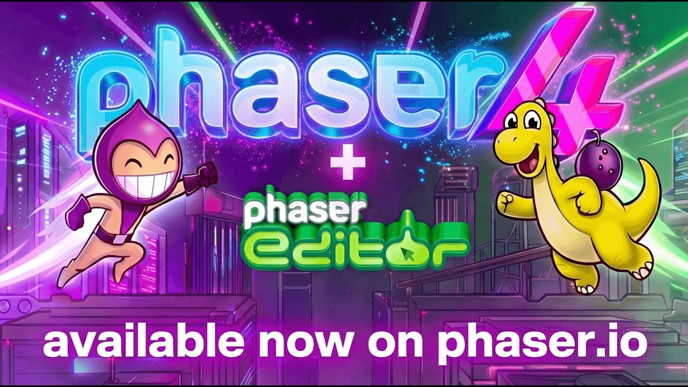
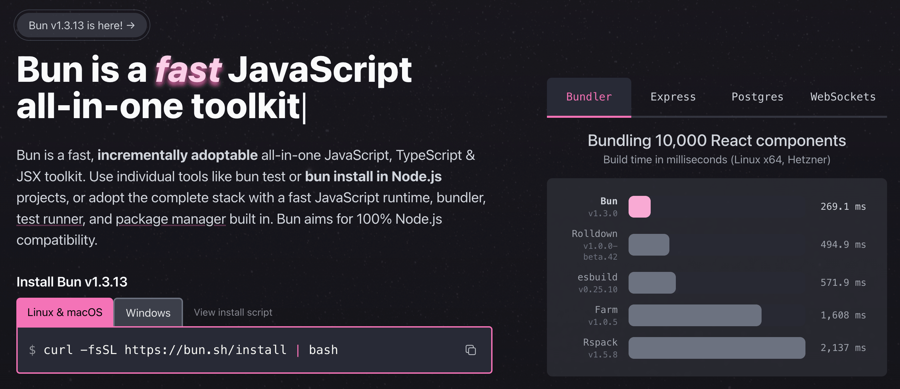

## 📕 精选文章

* 📄[Flutter 3.41.7 ，小版本但 iOS 大修复，看完只想说：这是人能写出来的 bug ？](https://juejin.cn/post/7630020855679057935)
* 📄[Claude Code 源码分析 — Tool/MCP/Skill 可扩展工具系统](https://juejin.cn/post/7631034166373793818)
* 📄[Android 17 来了！](https://juejin.cn/post/7612545160434188297)
* 📄[公司项目水太深，AI Agent它把握不住！](https://juejin.cn/post/7570491473033019401)

## 🤖 AI前沿

**What Is GPT Image 2? Everything We Know About OpenAI**  

最新GPT Image2来袭！是否是AI界的又一次伟大！

https://www.mindstudio.ai/blog/what-is-gpt-image-2

## 🔨 实用工具

**voidborne-d/humanize-chinese**  

免费本地 AI 文本去痕迹工具 
Chinese AI text detection & humanization. N-gram perplexity analysis, 20+ detection patterns, academic AIGC reduction (知网/维普/万方), 7 style transforms. Zero dependencies, runs locally.

https://github.com/voidborne-d/humanize-chinese

**blader/humanizer**  

文案书写去AI味，英文版
Claude Code skill that removes signs of AI-generated writing from text

https://github.com/blader/humanizer

## 📚 宝藏资源

**MarkShawn2020/DeepLearning.ai-Courses-ClaudeCode**  

Vibe Genius 团队整理的 DeepLearning.AI 官方课程 'Claude Code: A Highly Agentic Coding Assistant' 学习笔记，由 Andrew Ng 和 Anthropic 的 Elie Schoppik 主讲

https://github.com/MarkShawn2020/DeepLearning.ai-Courses-ClaudeCode

**UUxIYXp5Q29kZXIvY29kZXgtb2F1dGgtYXV0b21hdGlvbi1leHRlbnNpb24=**  

Chrome扩展：支持OpenAI OAuth注册(自动开通plus账号)、验证码获取、CPA/sub/cpdex2api回调验证与自动恢复

aHR0cHM6Ly9naXRodWIuY29tL1FMSGF6eUNvZGVyL2NvZGV4LW9hdXRoLWF1dG9tYXRpb24tZXh0ZW5zaW9u

**LING71671/Open-ClaudeCode**

https://github.com/LING71671/Open-ClaudeCode

**oboard/claude-code-rev**

https://github.com/oboard/claude-code-rev

**waiterxiaoyy/Deep-Dive-Claude-Code**  

🔍 Source code leak? Production code? 13 chapters breaking down Claude Code's production-grade architecture layer by layer — the most visual + agent simulator + source code analysis

https://github.com/waiterxiaoyy/Deep-Dive-Claude-Code/
https://deep-dive-claude-code.vercel.app/

**huifer/claude-code-book**  

本文档系列是对 Claude Code CLI 的全面技术分析，涵盖从基础架构到高级特性的所有技术细节。无论你是想了解 CLI 工具的设计理念，还是深入研究 LLM 驱动的开发工具实现，这里都能找到你需要的答案。

Open-source repo transforming Claude Code into structured books and AI-ready context for developers.

https://github.com/huifer/claude-code-book

## 💡 优秀项目

**phaserjs/phaser** 

Phaser 是一个快速、免费且有趣的开源 HTML5 游戏框架，可跨桌面和移动 Web 浏览器提供 WebGL 和 Canvas 渲染，并且已经积极开发了 10 多年。

Phaser is a fun, free and fast 2D game framework for making HTML5 games for desktop and mobile web browsers, supporting Canvas and WebGL rendering.

https://github.com/phaserjs/phaser
https://phaser.io/

**pixijs/pixijs-skills**  

PixiJS v8 的 AI 技能，这是适用于 WebGL、WebGPU 和 Canvas 的快速 2D 渲染库。

Official AI skills for PixiJS. These skills teach AI coding agents how to correctly use PixiJS

https://github.com/pixijs/pixijs-skills

**Bun**

A fast all-in-one JavaScript runtime

https://bun.com/

## 📝 日常记录

最近听说GPT Image2很强，AI生图能力又一次升级。
亲自尝试过后发现好像是有所提升，但还是躲不掉AI生图的中文字出现错乱的问题（还是有一定概率出现错字）。
所以那些营销号所说留给平面设计师的时间不多（这个职业已经名存实亡），听听还是挺可笑。
个人还是觉得AI只是你可使用的提效工具而不是替代你本人的机器人。
虽然在未来某个时间点或许它能强大到某种程度但肯定不是现在，别过度焦虑！