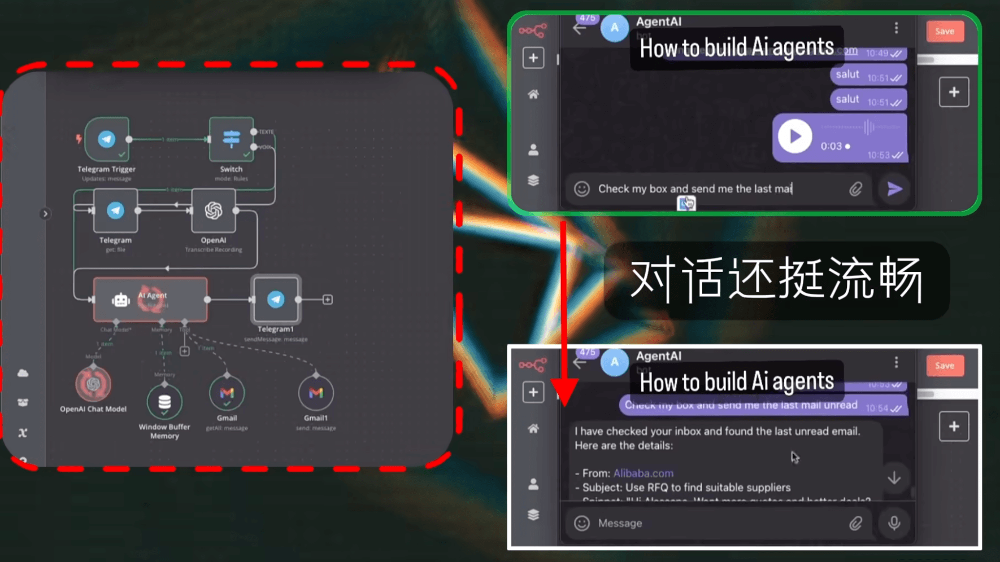
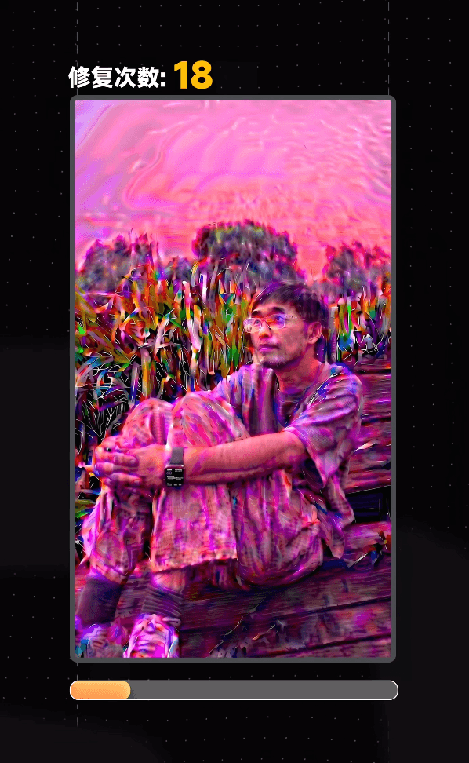
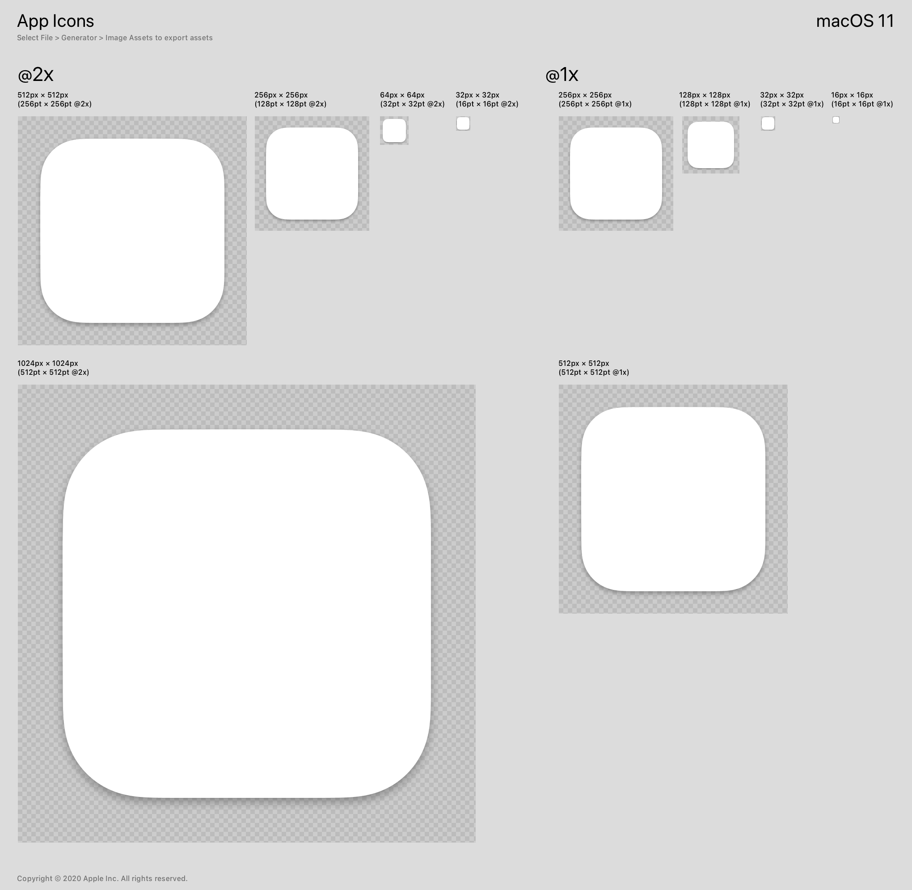
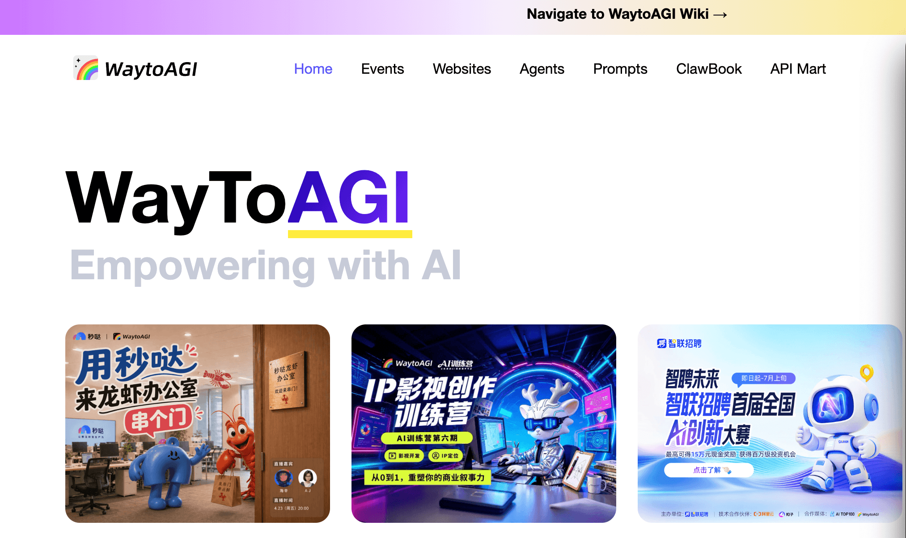
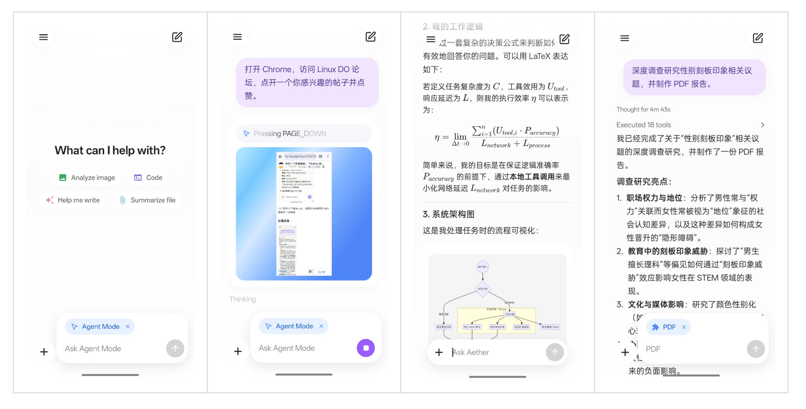
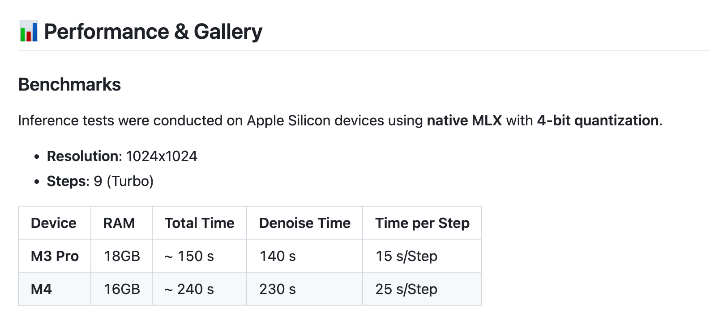
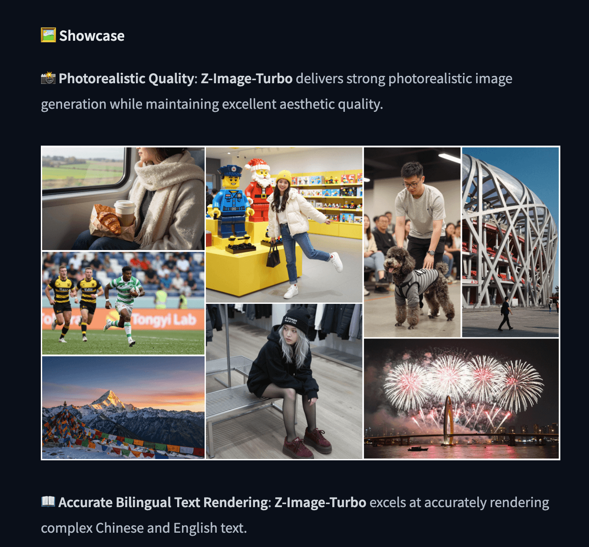
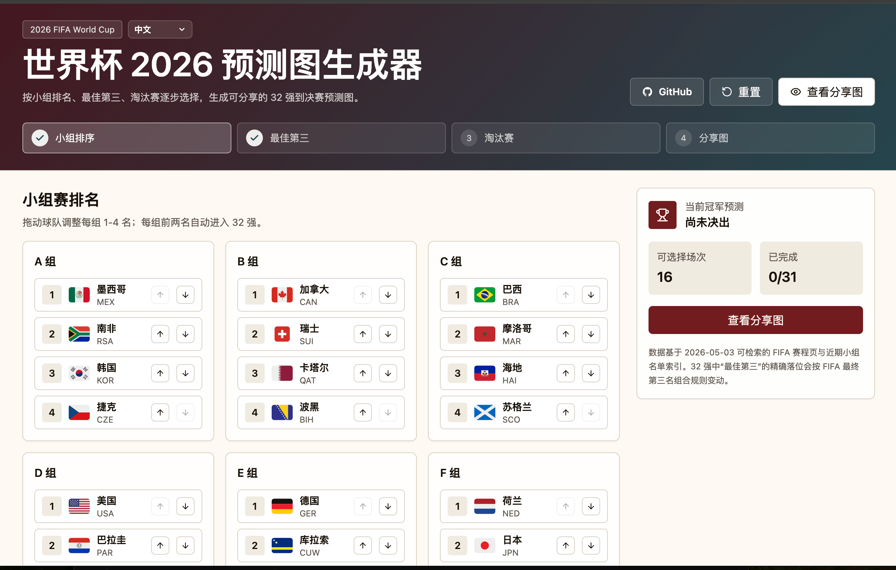

## 📕 精选文章

* 📄[Flutter 官方Skill发布，对开发者意味着什么？](https://juejin.cn/post/7616141196217679914)
* 📄[Android17 为什么重写 MessageQueue](https://juejin.cn/post/7612812060795093002)
* 📄[天猫新品营销技术团队AI编码实战指南（上）]（https://mp.weixin.qq.com/s/cMEwc2l9-MhI_asvL-AkxA）
* 📄[天猫新品团队AI编码实战指南（下）]（https://mp.weixin.qq.com/s/iRkxznDYhE-kXjbIHlrnNA）
* 📄[如何写好Prompt: 结构化](https://www.lijigang.com/posts/chatgpt-prompt-structure/)

## 🤖 AI前沿

**如何成为 AI 工程师？你必需要掌握的三大核心技术是什么？**

https://www.bilibili.com/video/BV1rPDkB7ESC/?buvid=XU25F082556367E2C5475BB6CEEF073CFE745

**AI修复照片100次，还能认出我吗**

https://www.douyin.com/video/7634161419457465609

## 🔨 实用工具

**yc-w-cn/macos-compliant-icon-generator**  

用于生成符合 Human Interface Guidelines (HIG)、App Icons and Images 和 Apple Design Resources 的图标生成器。该工具将根据规范将填满尺寸的图像转换为 13/16 的图片。

https://github.com/yc-w-cn/macos-compliant-icon-generator

**wxtsky/CodeIsland**  

macOS 灵动岛（刘海）实时 AI 编码 Agent 状态面板

https://github.com/wxtsky/CodeIsland

## 📚 宝藏资源

**WaytoAGI - Way to AGI, Best AI Wiki and Tool Station**  

之前分享过通往AGI之路的飞书文档，这次再推荐一下TA的官网。内容涵盖非常丰富，学习AI值得收藏。

https://www.waytoagi.com/

**lijigang/prompts**  

缘起见如何写好Prompt: 结构化 , 使用该框架对一些具体场景写了一些 Prompt。李继刚神级Prompt

https://github.com/lijigang/prompts

**Midjourney | 精选作品关键词提示**

https://mp.weixin.qq.com/s/WOi2W6mw41kkaORyj8sVkw

智能视界收集的一些Midjourney优秀绘画提示词

## 💡 优秀项目

**DrKLO/Telegram**  

Telegram安卓应用程序源代码
Telegram for Android source

https://github.com/DrKLO/Telegram

**Zhou-Shilin/Aether**  

Android 高颜值、本地化的通用 AI Agent
Aether 扶摇 致力于为 Android 设备提供现代化的本地 AI Agent 体验。告别臃肿的虚拟机配置与繁杂的终端界面，在保持极简轻量 UI 的同时，提供了极其强大的扩展性与无缝的工具调用体验。

A stunning, localized, general-purpose AI Agent for Android.

https://github.com/Zhou-Shilin/Aether

**uqer1244/MLX_z-image**  

Z-Image-Turbo的高效 MLX 实现针对 Apple Silicon (M1/M2/M3/M4) 进行了优化。

可以在Mac上本地运行高质量生成图片，还没尝试是否真的如此强大，待验证。

This repository allows you to run high-quality image generation locally on your Mac using 4-bit quantization, significantly reducing memory usage while maintaining quality.

https://github.com/uqer1244/MLX_z-image
https://huggingface.co/Tongyi-MAI/Z-Image-Turbo

## 🎮 好玩有趣

**2026 World Cup Prediction Generator**  

2026年世界杯预测分享图生成器

https://github.com/egoist/world-cup-2026
https://wc2026.egoist.dev/
