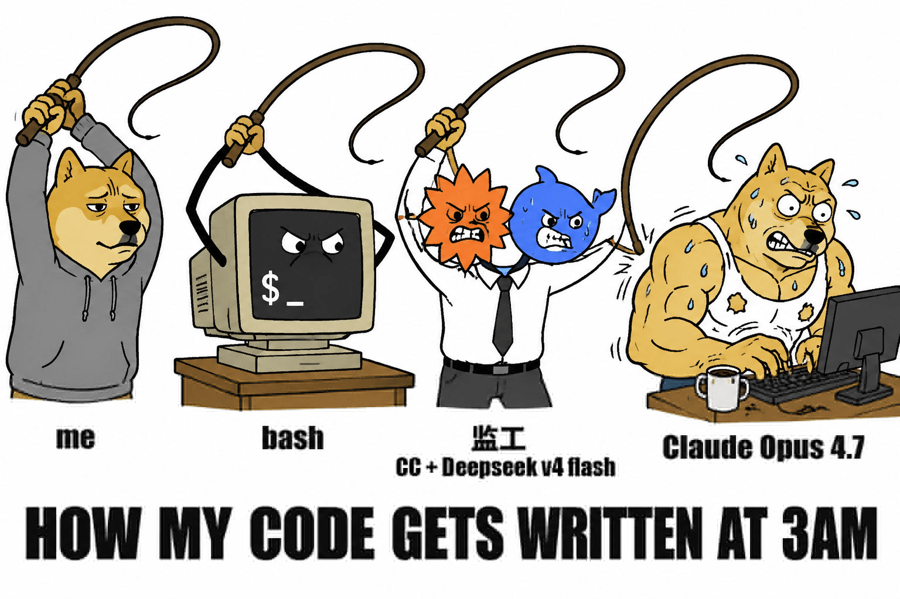

## 📕 精选文章

* 📄[AI手工测试用例的实践进阶之路](https://juejin.cn/post/7633710359380852736)
* 📄[转发-中央网信办部署开展“清朗·整治AI应用乱象”专项行动](https://juejin.cn/post/7634414730473422857)
* 📄[35岁程序员的春天来了35岁程序员的春天来了](https://juejin.cn/post/7614036943890907142)
* 📄[状态管理大乱斗#07 | Signals 源码评析 - 暗流涌动](https://juejin.cn/post/7637412411973074944)
* 📄[有点东西！16GB Mac 都能跑的 OpenAI 开源模型？](https://juejin.cn/post/7637045892451614747)
* 📄[实用性Max，新Flutter&Dart Agent Skills深度解读](https://juejin.cn/post/7637046499474538559)

## 🔨 实用工具

**wildminder/awesome-ai-voice**  

开源文本转语音 (TTS)、语音克隆和音乐生成模型的精选列表。型号按发布日期排序（最新的在前）。

List of open-source TTS, voice cloning, and music generation models

https://github.com/wildminder/awesome-ai-voice

**gtanner/qrcode-terminal**  

在终端显示二维码的工具方法库

QRCodes in your terminal, cause thats hot.

https://github.com/gtanner/qrcode-terminal

**eisneim/two-agent-coding-orchestrator**  

核心理念：Claude Code 能力很强，但有两个致命弱点 — (1) 配额不稳（424 错误）会自动重试但不保证恢复，(2) 上下文会满。通过 tmux 做进程隔离 + 两个 Claude 分工，让监工通过文件协议和脚本驱动工人，配合心跳看门狗，实现睡一觉醒来代码写好了。

三层结构：bash心跳 -> 让一个 Claude Code 实例（监工）监督另一个 Claude Code 实例（工人）在 tmux 里无人值守地完成大型开发任务。

https://github.com/eisneim/two-agent-coding-orchestrator

## 📚 宝藏资源

**Anduin2017/HowToCook**  

程序员在家做饭方法指南。Programmer's guide about how to cook at home (Simplified Chinese only).

谁能想到多年前的做菜项目作者还有在迭代更新，目前菜系更加丰富。功能也有所优化升级，还推出了图像化菜谱以及ai mcp等。

https://github.com/Anduin2017/HowToCook

