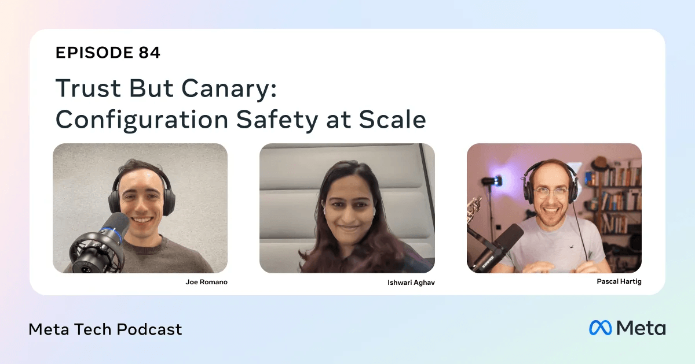
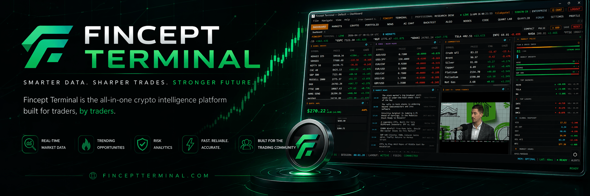
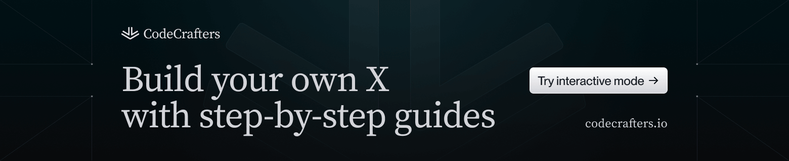
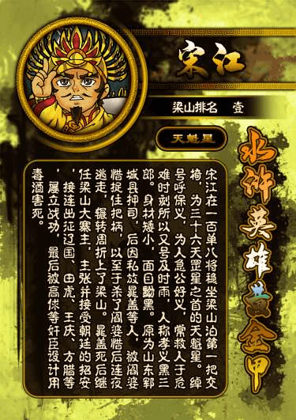
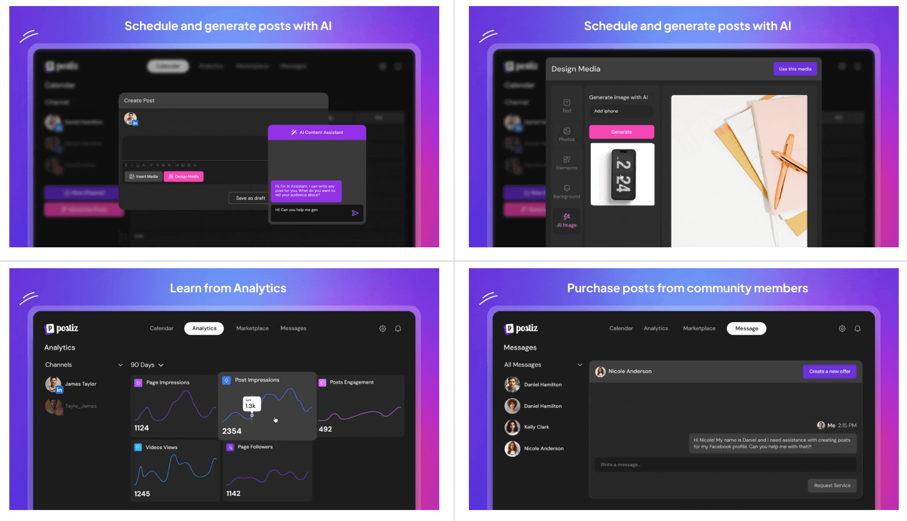
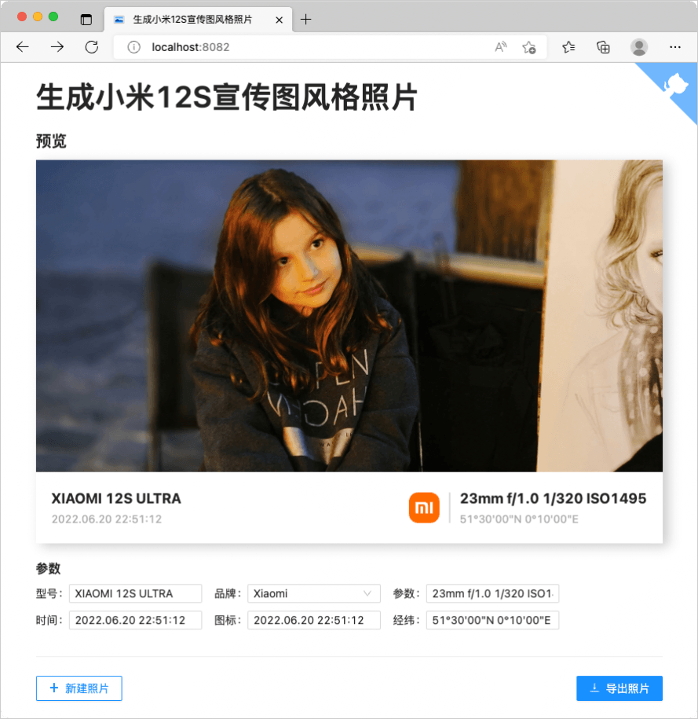
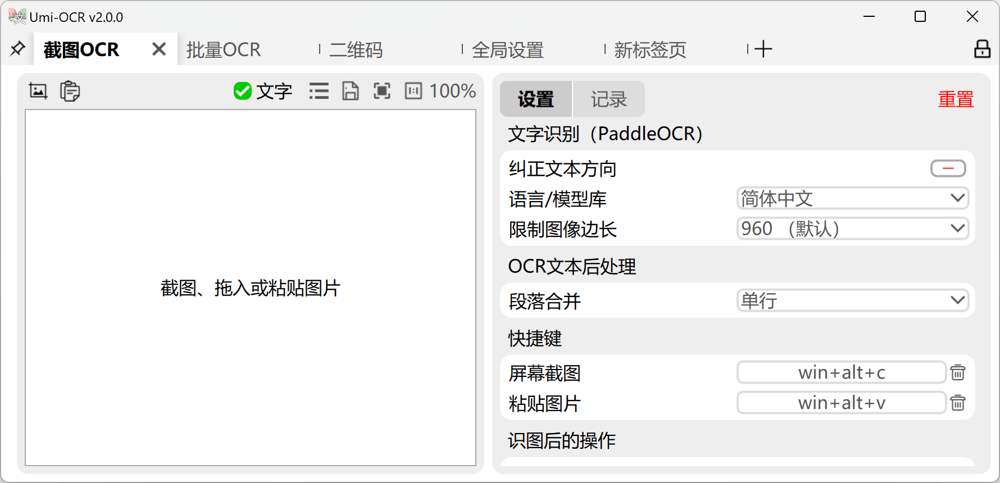
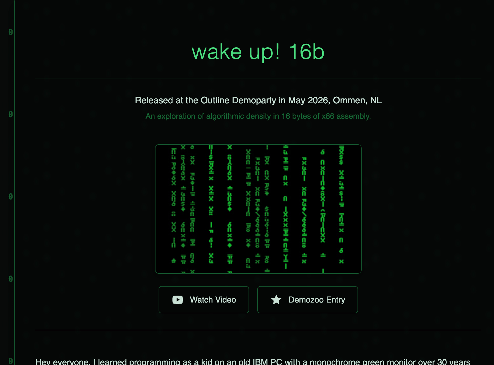
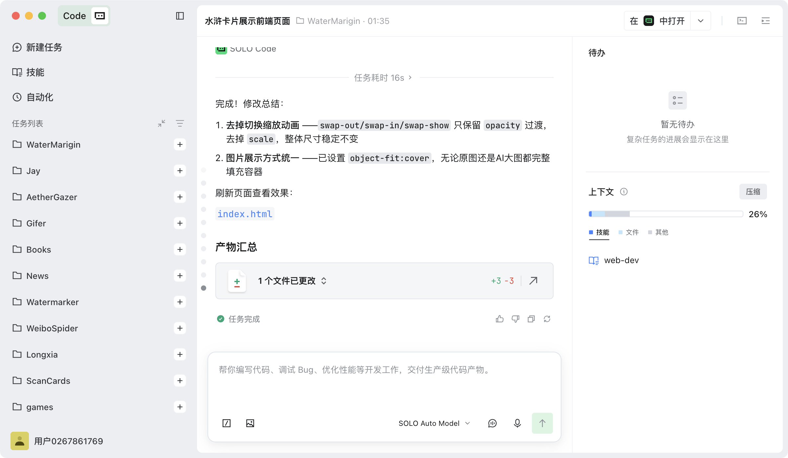

## 📕 精选文章

* 📄[一份 AGENTS.md，让 AI 代码规范率从 60% 飙升到 95%一份](https://juejin.cn/post/7639561816260886571)
* 📄[How to Fix Slow Page Loads Caused by Third-Party Scripts](https://dev.to/alanwest/how-to-fix-slow-page-loads-caused-by-third-party-scripts-4b66)
* 📄[禁止截屏和录屏功能实现](https://a1265137718.gitbooks.io/andriodroad/content/di-er-shi-liu-zhang-kai-fa-wen-ti-ji-jin/jin-zhi-jie-ping-he-lu-ping-gong-neng-shi-xian.html)
* 📄[Android 截图时隐藏（穿透）特定的内容 - LibXZR 的小本本](https://blog.xzr.moe/archives/136/)
* 📄[谷歌CEO承认Coding落后了](https://mp.weixin.qq.com/s/1f0Psk1jhfFSZqqMWQytnQ)

## 🤖 AI前沿

**Trust But Canary: Configuration Safety at Scale**  

https://engineering.fb.com/2026/04/08/security/trust-but-canary-configuration-safety-at-scale-meta-tech-podcast/

**Fincept-Corporation/FinceptTerminal**  

人工智能金融经济分析平台。

FinceptTerminal is a modern finance application offering advanced market analytics, investment research, and economic data tools, designed for interactive exploration and data-driven decision-making in a user-friendly environment.

https://github.com/Fincept-Corporation/FinceptTerminal

## 🔨 实用工具

**atuinsh/atuin**

Atuin 使用 SQLite 数据库取代了你现有的 shell 历史，并为你的命令记录了额外的内容。此外，它还通过 Atuin 服务器，在机器之间提供可选的、完全加密的历史记录同步功能。

Atuin replaces your existing shell history with a SQLite database, and records additional context for your commands. Additionally, it provides optional and fully encrypted synchronisation of your history between machines, via an Atuin server.

https://github.com/atuinsh/atuin

**CarGuo/gif-toolkit**

把"扒下网页里的视频 / GIF → 压到平台限额 → 拿 Markdown 链接"做成几次点击。
https://github.com/CarGuo/gif-toolkit

**sindresorhus/awesome**

https://github.com/sindresorhus/awesome

## 📚 宝藏资源

**codecrafters-io/build-your-own-x**

该存储库是精心编写的分步指南的汇编，用于从头开始重新创建我们最喜欢的技术。

This repository is a compilation of well-written, step-by-step guides for re-creating our favorite technologies from scratch.

https://github.com/codecrafters-io/build-your-own-x

**XiaomingX/awesome-ai-memory**

这是一个专注于大语言模型 (LLM) 长期记忆 (Long-term Memory) 实现的精选列表。涵盖了从上层聚合记忆层、Agent 记忆工具到基础存储设施的完整生态。

https://github.com/XiaomingX/awesome-ai-memory

**tonyshow/MyMarsh**  

水浒传卡片素材-黄金甲系列

https://github.com/tonyshow/MyMarsh

**我的安卓进阶之路**

https://a1265137718.gitbooks.io/andriodroad/content/

## 💡 优秀项目

**gitroomhq/postiz-app**  

终极代理社交媒体调度工具

📨 The ultimate agentic social media scheduling tool 🤖

https://github.com/gitroomhq/postiz-app

**lecepin/gen-brand-photo-pictrue**  

模仿小米12S的示例照片风格，生成莱卡水印照片。同时支持识别佳能、尼康、苹果、华为、小米、DJI等水印。可自动识别，也可自定义处理。

https://github.com/lecepin/gen-brand-photo-pictrue

**hiroi-sora/Umi-OCR**

免费，开源，可批量的离线OCR软件

https://github.com/hiroi-sora/Umi-OCR

## 🎮 好玩有趣

**wake up! 16b**  

Released at the Outline Demoparty in May 2026, Ommen, NL

https://hellmood.111mb.de/wake_up_16b_writeup.html

**ruvnet/RuView**  

π RuView 将商用 WiFi 信号转化为实时空间智能、生命体征监测和存在检测 - 所有这些都无需视频像素。

π RuView turns commodity WiFi signals into real-time spatial intelligence, vital sign monitoring, and presence detection — all without a single pixel of video.

看到这个库有种眼熟，看了下历史周刊确实有记录过换了个项目名又来了！https://github.com/ruvnet/wifi-densepose 这老哥有点搞笑，还是当个有意思的项目看看好了。

https://github.com/ruvnet/RuView
https://cognitum.one/ruview

## 📝 日常记录

* Trae SOLO + xiaomi Mimo 一天狂跑好几个项目。现在的想法落地真的是想做就做，根本不需要考虑成本问题（Token不限量前提下）一个下午功夫就完成好几个小型项目落地工作，有种只需要动动嘴皮子指挥当老板的错觉。另外说Trae SOLO确实方便，随时随地都能查看执行进度，唯一缺点现在还不能在线调试看最终结果。

