## 📕 精选文章

* 📄[经典，Flutter iOS 又修复了一个构建问题，还是很抽象](https://juejin.cn/post/7637433660883714090)
* 📄[我把 MacBook 的 Touch Bar，改造成了 AI "摸鱼状态灯"](https://juejin.cn/post/7644819441336696884)
* 📄[火爆了，一个Skill搞定AI热点自动化：RSS 聚合 + AI 筛选 + 公众号 + 邮件全流程](https://juejin.cn/post/7621769753745997851)
* 📄[我写了 50 个 Claude Code Skill 才发现，前 30 个都白写了](https://juejin.cn/post/7643764221012410411)
* 📄[Flutter版本选择指南：3.44惊艳发布](https://juejin.cn/post/7643818760441266182)

## 🤖 AI前沿

**用Gemini做摄影集的交互展示！**  

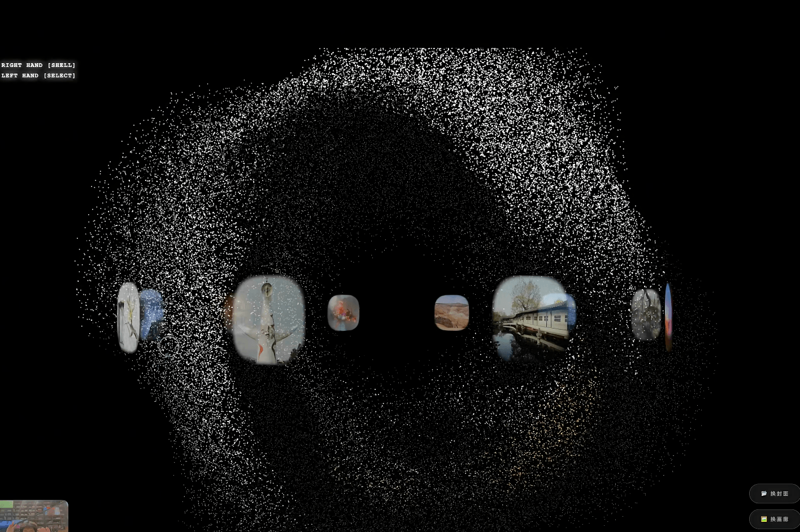

摄像头检测两只手的动作 左手控制旋转与确认作品 右手负责进入页面内部。

https://www.xiaohongshu.com/explore/6941632d000000001d03b14e

**OpenClaw玩了一个月，推荐7个龙虾顶级用法**  

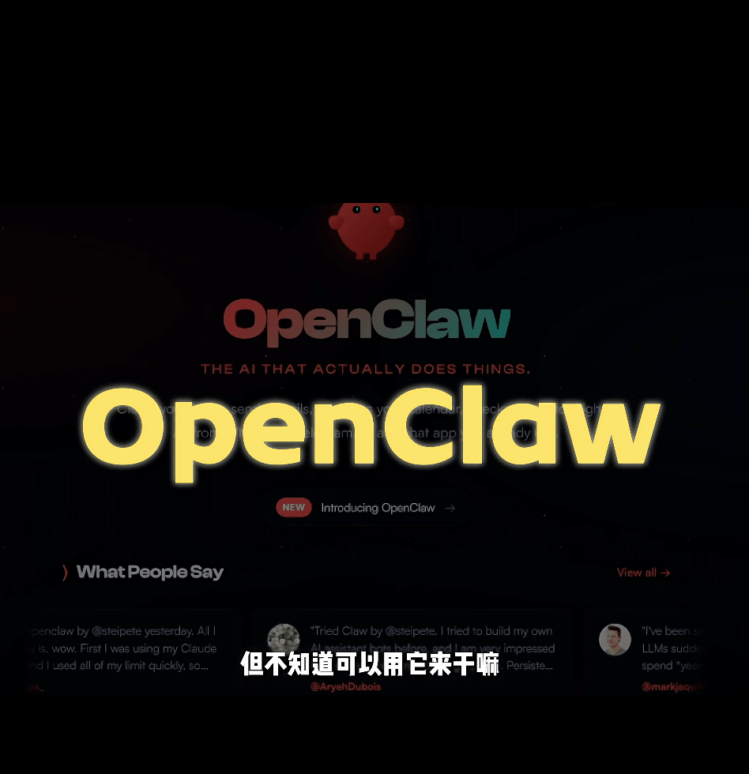

深度养虾一个月以后，7个超好用的龙虾玩法！

https://www.xiaohongshu.com/explore/69ba2d48000000001a032884

## 📚 宝藏资源

**hesamsheikh/awesome-openclaw-usecases**  

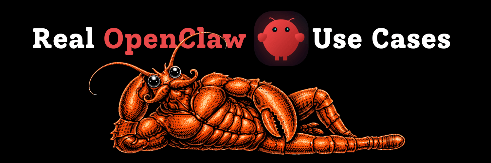

了解人们如何在日常生活中真正使用 OpenClaw（以前称为 ClawdBot、MoltBot）。

A community collection of OpenClaw use cases for making life easier.

https://github.com/hesamsheikh/awesome-openclaw-usecases

**M5Stack Cardputer Adv Version (ESP32-S3)**  

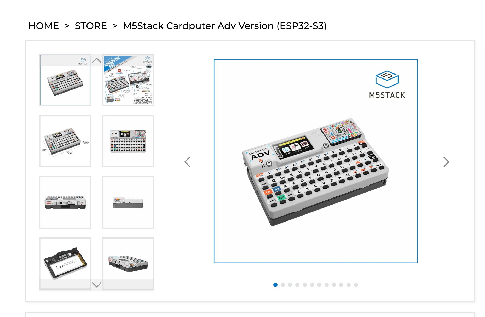

https://shop.m5stack.com/products/m5stack-cardputer-adv-version-esp32-s3?srsltid=AfmBOorYfWJDyHKGGqImH4O-TxXuNBZEp54TfEQgBvxqh1nksX8Sd-oq

**make2explore/M5Stack-Cardputer**  

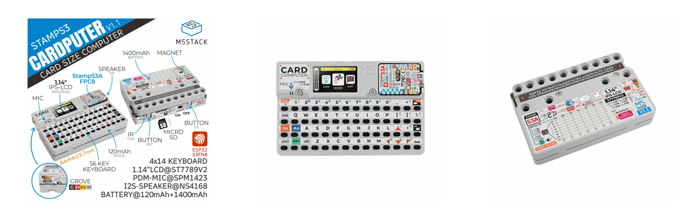

设备概述和 Cardputer 入门

Device overview and Getting Started with Cardputer

https://github.com/make2explore/M5Stack-Cardputer

**Ben James**  

一个有趣的博主主页-Ben James

https://climate.benjames.io/

## 💡 优秀项目

** DanOps-1/Gpt-Agreement-Payment**  

ChatGPT Plus/Team/Pro 订阅协议端到端重放工具集 · hCaptcha 视觉求解器 · 反机制实证研究 / End-to-end protocol replay toolkit for ChatGPT Plus/Team/Pro subscription with from-scratch hCaptcha solver and empirical anti-fraud research

https://github.com/DanOps-1/Gpt-Agreement-Payment

**harry0703/MoneyPrinterTurbo**  

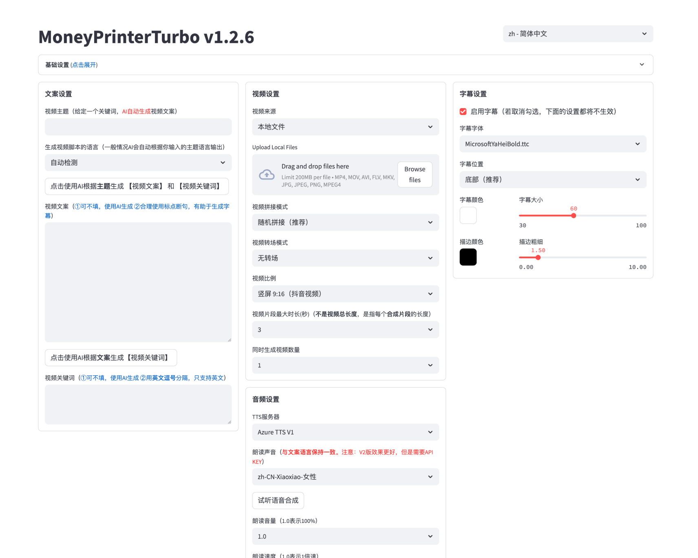

利用AI大模型，一键生成高清短视频 Generate short videos with one click using AI LLM.

https://github.com/harry0703/MoneyPrinterTurbo

## 🎮 好玩有趣

**angziii/PawPause**  

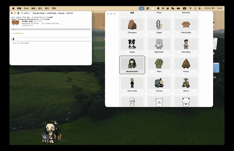

可自定义形象的 Agent 桌面宠物 | A local-first pixel companion for breaks, focus, hydration, and agent activity nudges.. For Claude Code, Codex, Hermes and Opencode

https://github.com/angziii/PawPause

**Draw a Fish**  

可以在线养鱼的电子鱼缸

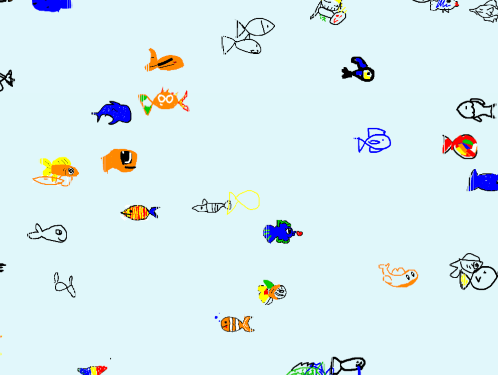

https://drawafish.com/

**🔥全网都在养龙虾❌你的龙虾却在露宿街头**  

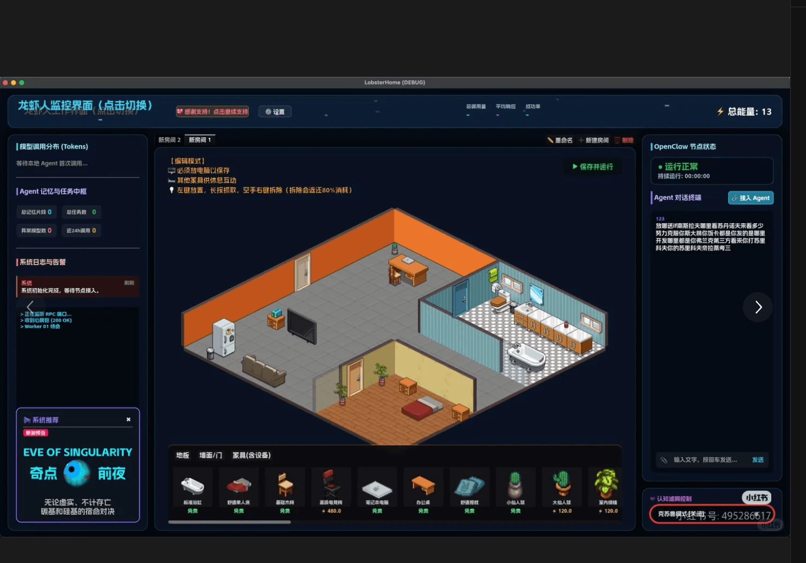

别再用枯燥的命令行养龙虾了！为 OpenClaw 手搓了一款赛博风可视化「龙虾人公寓」

https://www.xiaohongshu.com/explore/69c483ad0000000023025aa0

**USB-Clawd and a Mini Fax Machine - by Ben James**  

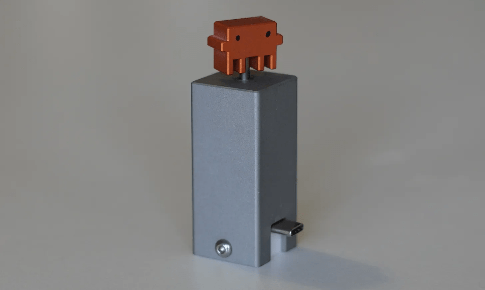
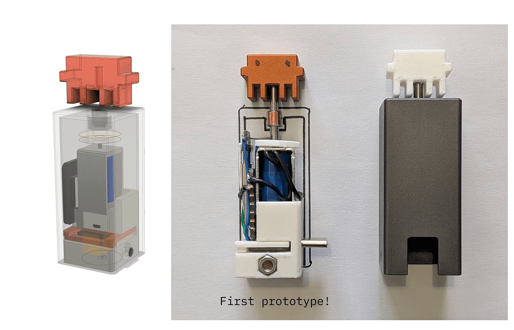

一个 USB-Clawd，当 Claude Code 需要任何输入时，它会上下跳跃。

I made a USB-Clawd who jumps up and down when Claude Code needs any input.

https://benbyfax.substack.com/p/clawd-minifax

