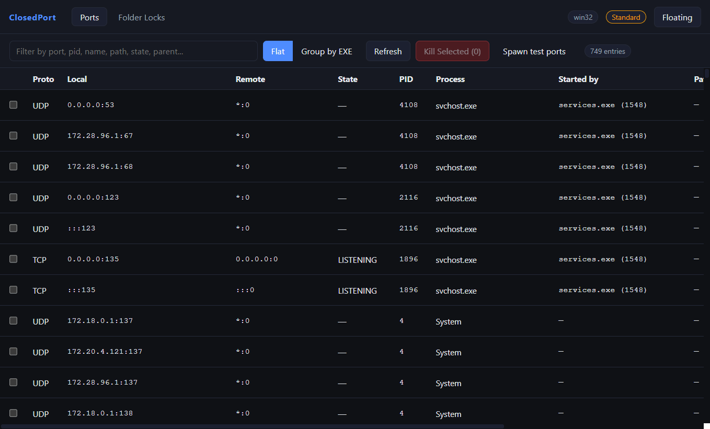
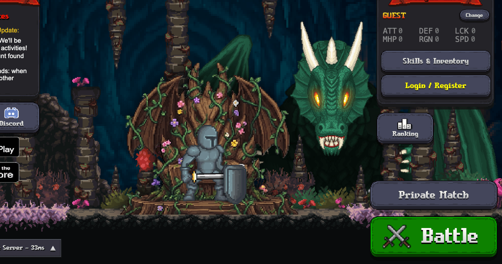
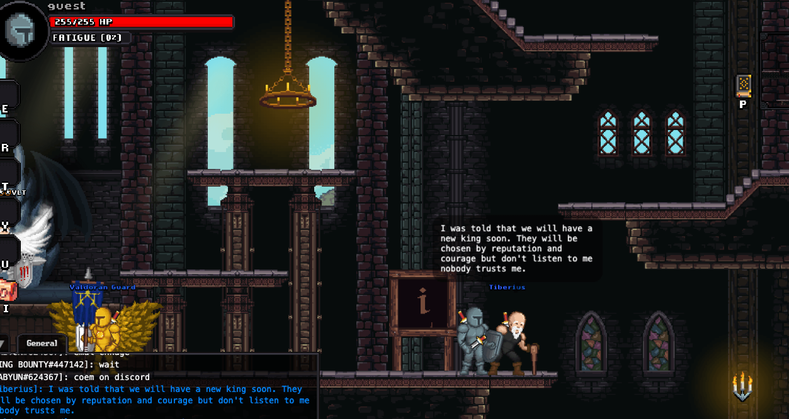

## 📕 精选文章

* 📄[嘘🤫全平台 App 发版 10 分钟收工，老板以为我还在忙发版](https://juejin.cn/post/7619280983692787721)
* 📄[基于Spine动画的AVATAR换装系统优化](https://blog.51cto.com/u_15941225/6005976)
* 📄[Spine换装系统（随缘施工中）](https://zhuanlan.zhihu.com/p/649582173)
* 📄[Flutter Liquid Glass 🪟魔法指南：让你的界面闪耀光彩](https://juejin.cn/post/7553823229522575369)

## 🤖 AI前沿

**flutter/skills**  

Agent skills for Flutter, maintained by the Flutter team. A collection of skills providing tailored instructions for happy path Flutter app development workflows. By giving the agent actual domain expertise and repeatable workflows, you drastically reduce mistakes and ensure agents reliably complete the task following best practices.

https://github.com/flutter/skills

## 🔨 实用工具

**ParthJadhav/app-store-screenshots**

一项 AI 编码代理技能，可为 App Store 和 Google Play 营销屏幕截图构建可用于生产的 Next.js 编辑器。它为您提供了连接的画布、真实的设备框架、检查器控件、持久项目状态以及商店就绪尺寸的一键导出包。

end to end app store screenshot creation using AI

https://github.com/ParthJadhav/app-store-screenshots

**CarGuo/ClosedPort**

跨平台桌面端口 & 文件占用查看 / Kill 工具

Cross-platform desktop tool to inspect listening ports & file locks. See which EXE owns a port, who started it (parent process), group by application, and one-click kill to free the port. Ships with an always-on-top mini panel. Windows / macOS / Linux. Electron + React.

https://github.com/CarGuo/ClosedPort

## 📚 宝藏资源

**刹那**  

刹那的个人博客

https://fice.pro/

## 💡 优秀项目

**aiqinxuancai/MintImage**

输入一句提示词，让 AI 为你生成图片。兼容所有 OpenAI 格式的图像 API。

https://github.com/aiqinxuancai/MintImage

**rohitg00/agentmemory**  

让你的编码代理记住一切。不再重复解释。 Built on iii engine

#1 Persistent memory for AI coding agents based on real-world benchmarks

https://github.com/rohitg00/agentmemory

**Justin-sky/Nice-TS**  

基于puerts的Unity游戏框架，集成fairygui，protobufjs并采用addressables管理资源

https://github.com/Justin-sky/Nice-TS

## 🎮 好玩有趣

**ShinyColorsDB**  

建立 Idolm@ster SHINYCOLORS 完整数据库的项目

A Project to Build A Complete Database of The Idolm@ster SHINYCOLORS

https://github.com/ShinyColorsDB

**Acolyte Fight! • Made with Easel**  

About Acolyte Fight  is a multiplayer skillshot arena made by raysplaceinspace using Easel

https://acolyte.easel.games/Episodes/e3x.IG-wRNc

**GoBattle.io: Epic 2D MMO RPG | Free Online Multiplayer Game**

https://gobattle.io/#!

