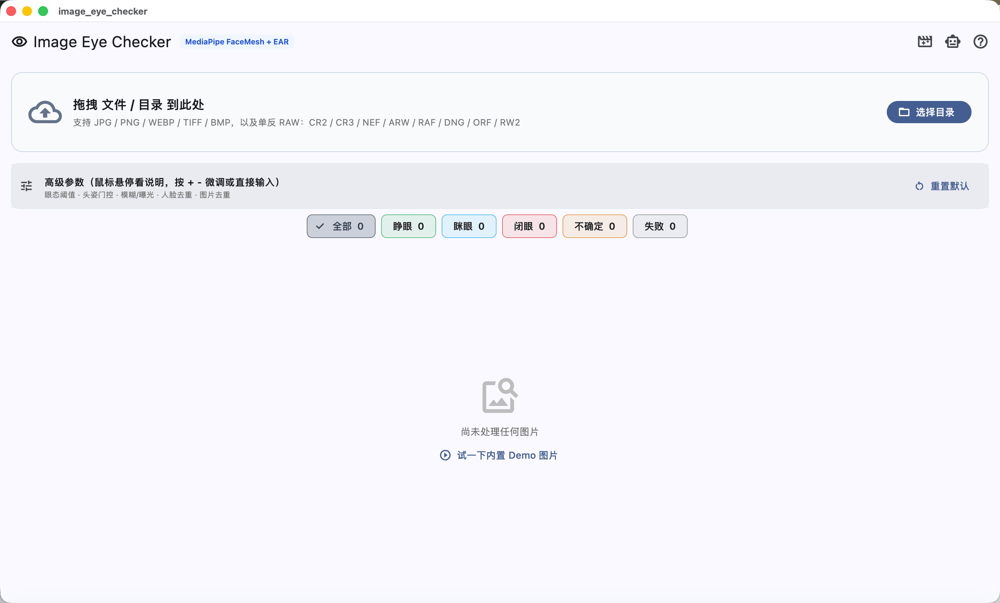
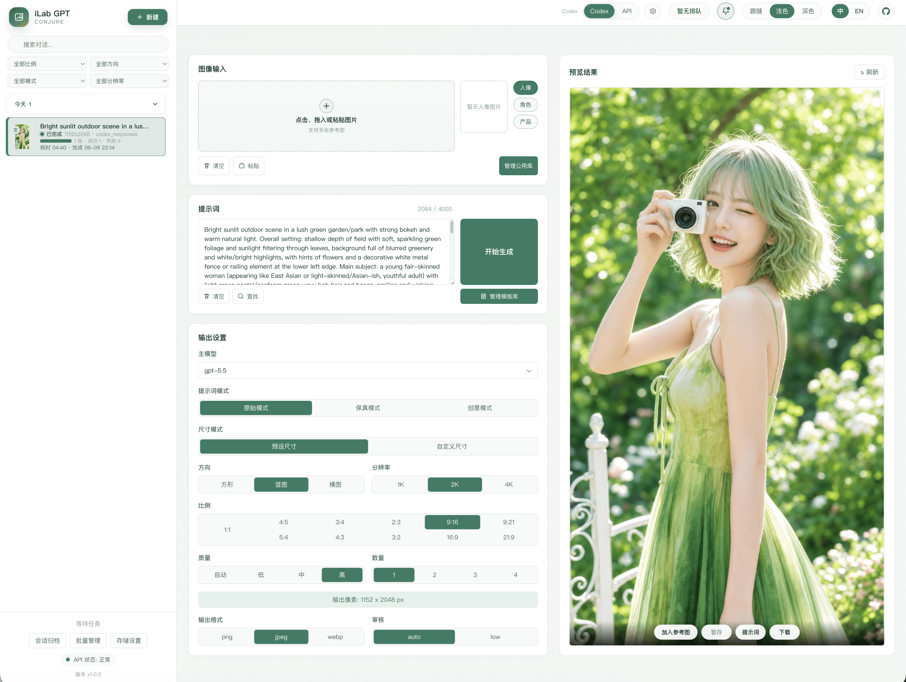
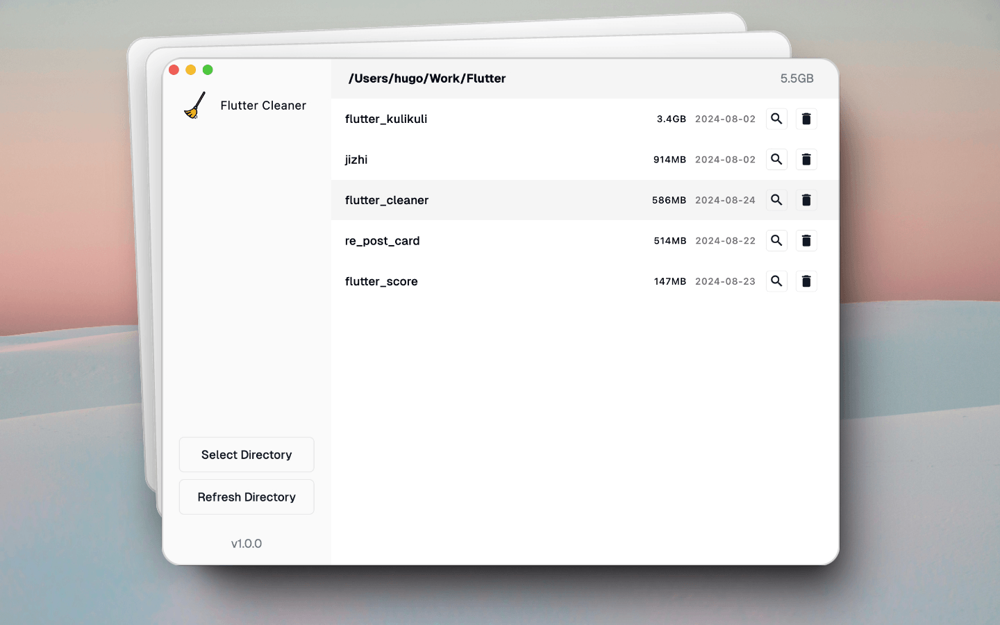
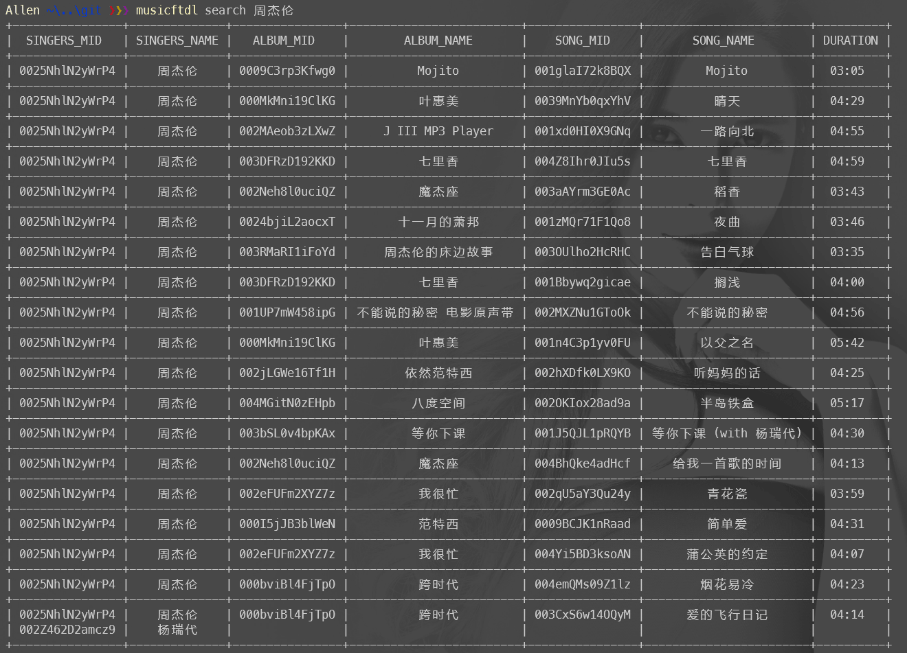
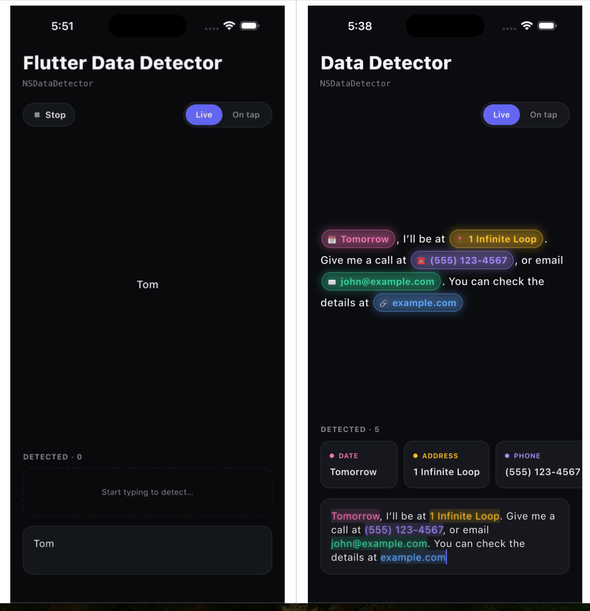
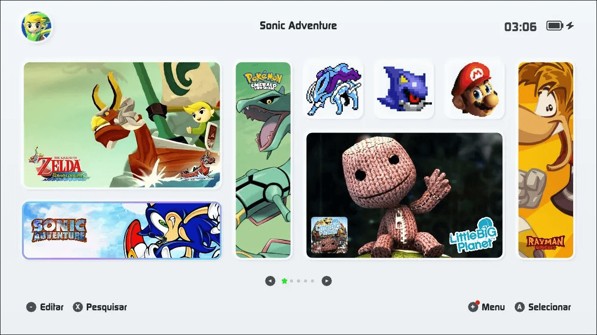
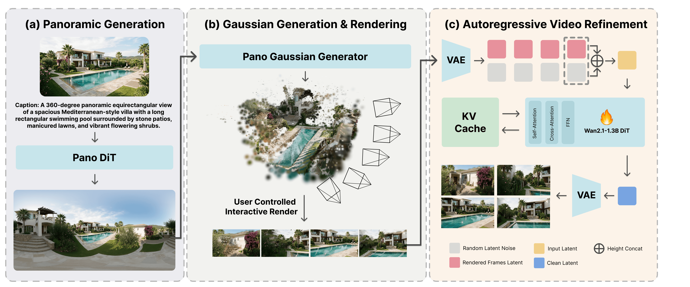

## 📕 精选文章

* 📄[小米版Claude Code正式发布，这次开源给到夯。](https://juejin.cn/post/7650451521307770923)
* 📄[终于，Flutter 修复 Android 中文字体异常，但是很草台，不知怎么吐槽](https://juejin.cn/post/7639006640004251667)
* 📄[《置身钉内》之后：普通前端的出路在哪里？](https://juejin.cn/post/7650089863865565219)
* 📄[阿里元安离职万字文（2025年元安，转载）](https://zhuanlan.zhihu.com/p/1916446273436903361)
* 📄[钉钉内网幽素7万字长文《置身钉内》（2026转载）](https://zhuanlan.zhihu.com/p/2047067667811537005)
* 📄[《置身钉内》为何让阿里合伙人恼羞成怒？](https://www.21jingji.com/article/20260611/herald/217810c42898a44748fe261603ef8cc5.html)
* 📄[钉钉换帅后《置身钉内》作者再发文：无效的形式化工时既消耗人力，也与技术发展的初衷相悖](https://www.ithome.com/0/963/257.htm)

## 🤖 AI前沿

**CarGuo/image_eye_checker**  

https://github.com/CarGuo/image_eye_checker

本地、离线、跨平台的"闭眼废片"批量筛选器。MediaPipe Face Landmarker 478 点 + OpenCV YuNet 两阶段召回 + EAR / Blendshape 双信号融合 + pHash 连拍去重。支持 JPG / PNG / HEIC / RAW。macOS dmg 零配置内嵌 Python，同一管线作为 Skill / MCP Server 供 OpenClaw / Hermes / Claude 调用。

**kadevin/ilab-gpt-conjure**  

面向 GPT-image-2 的 AI 图片生成 WebUI 工作台，支持 Codex Responses 与 OpenAI 兼容 API 接入，内置公用图库、多类型 Chip 快捷引用、提示词模板、多任务并发和本地队列管理。An AI image generation WebUI workbench for GPT-image-2 with Codex Responses and OpenAI-compatible API support, shared gallery references, multi-type quick chips, prompt templates, concurrent tasks, and local queue management.

https://github.com/kadevin/ilab-gpt-conjure

**Tencent/WeChatReading**  

为 AI Agent 提供微信读书能力的 Skill 集合，支持搜书、书架管理、笔记导出、阅读统计等功能。

https://github.com/Tencent/WeChatReading

## 🔨 实用工具

**Lakr233/AssppWeb**  

一个基于网络的工具，用于在 App Store 之外获取和安装 iOS 应用程序。使用您的 Apple ID 进行身份验证、搜索应用程序、获取许可证并将 IPA 直接安装到您的设备。

https://github.com/Lakr233/AssppWeb

**privatenumber/mac-ocr**  

macOS 命令行工具，可从图像和 PDF 中读取文本并创建可搜索的 PDF。

macOS CLI for OCR and searchable PDFs using Apple's Vision framework.

https://github.com/privatenumber/mac-ocr

**xcc3641/flutter_cleaner**  

使用 Flutter 构建的现代 macOS 应用程序，用于高效管理和清理项目文件。

A modern macOS application built with Flutter for managing and cleaning up project files efficiently.

https://github.com/xcc3641/flutter_cleaner

**lonsty/musicftdl**  

音乐工具，自动补全 MP3 标签（专辑、歌手、曲目号、封面图等）

https://github.com/lonsty/musicftdl

## 📚 宝藏资源

**timqian/chinese-independent-blogs** 

中文独立博客列表

https://github.com/timqian/chinese-independent-blogs

**y-cyfor/JayChou-wiki**  

JayChou‘s wiki 一个周杰伦资料库

https://github.com/y-cyfor/JayChou-wiki
https://www.jaychou.wiki/

**fantasysea/jaychou**  

周杰伦歌词合集

https://github.com/fantasysea/jaychou

## 💡 优秀项目

**xcc3641/flutter_native_data_detector**  

跨平台的 Flutter 文本数据检测插件。iOS 端使用 NSDataDetector，Android 端使用 ML Kit Entity Extraction，检测文本中的电话号码、URL、邮箱、日期和地址，并以结构化结果返回 Dart 层。

Cross-platform text data detection for Flutter — NSDataDetector (iOS) & ML Kit Entity Extraction (Android). Phones, links, emails, addresses, dates.

https://github.com/xcc3641/flutter_native_data_detector

## 🎮 好玩有趣

**ticohq/tico**

tico 是一个支持 libretro 核心和自定义模拟器的游戏启动器。

The first custom emulation frontend for Nintendo Switch. A controller-first interface built for performance and simplicity.

https://github.com/ticohq/tico
https://ticoverse.com/

**Orange-3DV-Team/MoVerse**  

使用全景高斯支架进行实时视频世界建模

MoVerse: Real-Time Video World Modeling with Panoramic Gaussian Scaffold

https://github.com/Orange-3DV-Team/MoVerse

https://orange-3dv-team.github.io/MoVerse/

**GoGBA**  

GoGBA - 专为沉浸式、无打扰游戏体验设计的现代化 GBA、GBC 与 GB 模拟器。触控体验优化后，无论是慢节奏的 RPG 还是快节奏的动作游戏，都能流畅操作。专注稳定、舒适、可靠——像握着一台干净的掌机。

https://play.google.com/store/apps/details?id=com.gogba.emu
https://www.nxgntools.com/tools/gogba
https://github.com/hamberluo/GoGBA-docs
https://gogba.xyz/

## 📝 日常记录