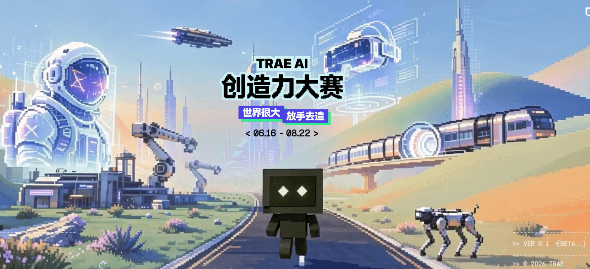
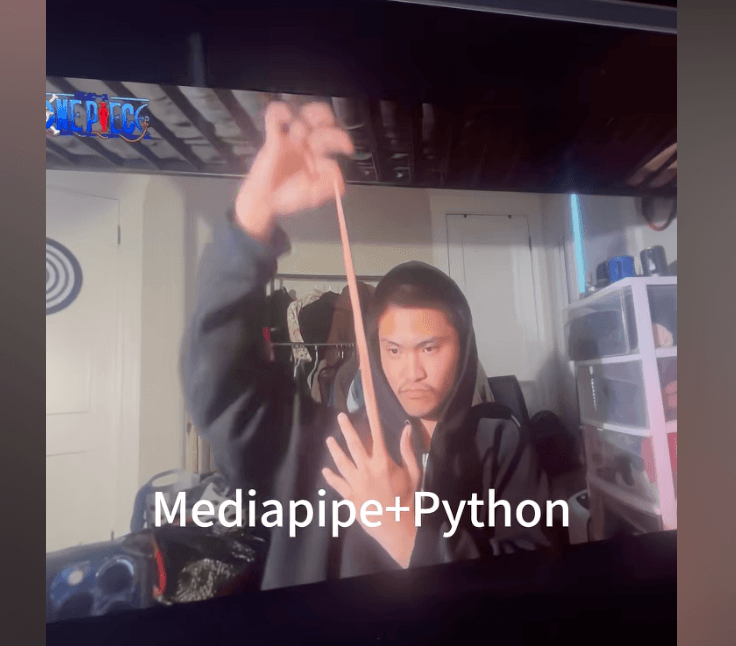
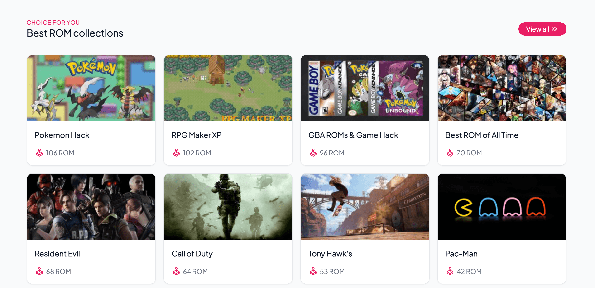
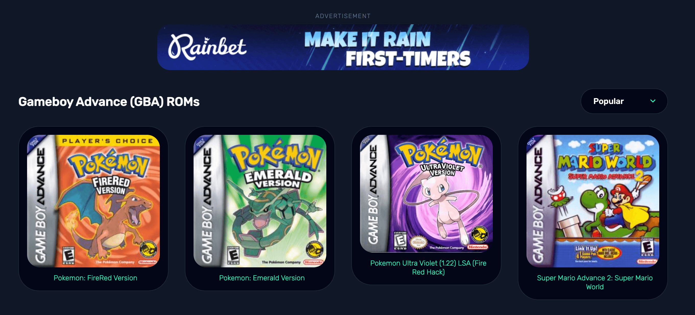
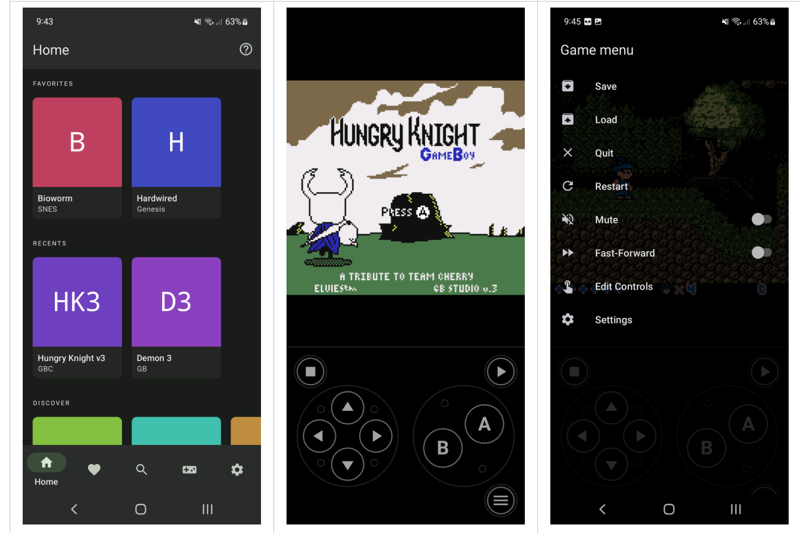
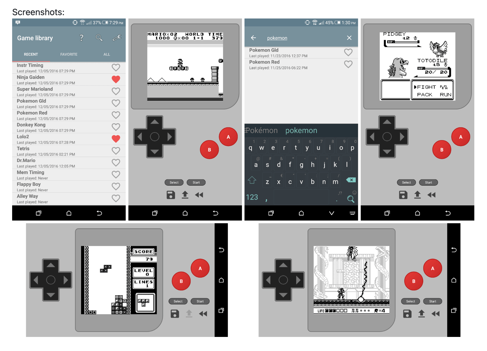
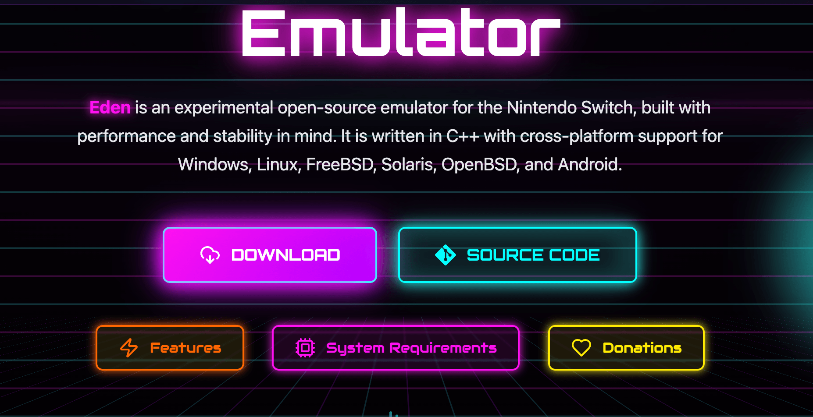
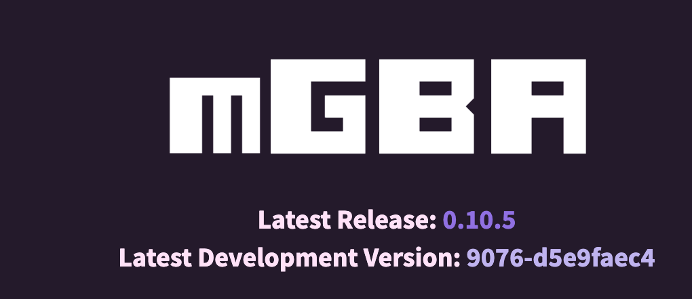
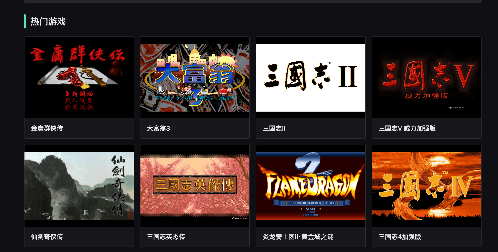
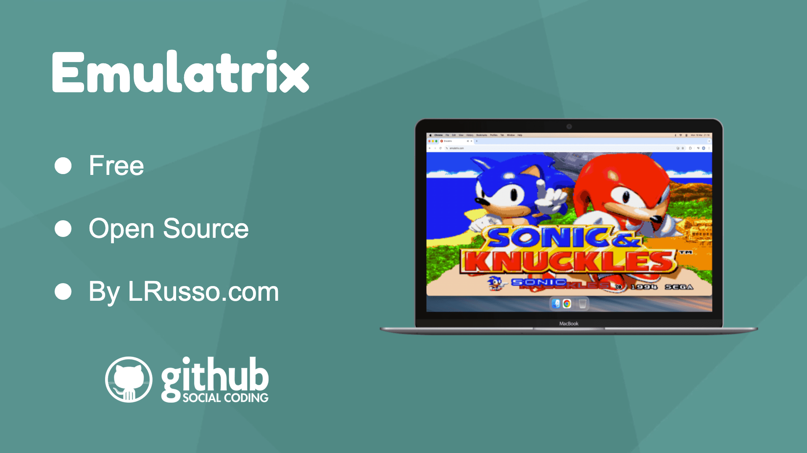

## 📕 精选文章
* 📄[“不卷 AI、不碰币、下班不收消息”——Android 知名技术大牛 Jake Wharton 的求职价值观](https://juejin.cn/post/7566993040856301631)
* 📄[Harness 还没学会，又来了个 Loop Engineering ？](https://juejin.cn/post/7651153611318460425)
* 📄[Cocos Creator Shader 入门 ⒇ —— 液态玻璃效果](https://juejin.cn/post/7575363120798973952)
* 📄[Android View 相关工具包终于成为了历史](https://juejin.cn/post/7641855596430884900)
* 📄[Android 优先采用 Compose Jetpack Compose](https://developer.android.com/develop/ui/compose/first?hl=zh-cn)

## 🤖 AI前沿

**TRAE AI创造力大赛，正式启动！ TRAE AI创造力大赛，正式启动！**

https://aicoding.juejin.cn/post/7651529231939878953

**Mediapipe+Python与VibeCode的魔力！**

https://www.douyin.com/video/7651531036014907377

**Vol.300-Midjourney 精选作品提示词与赏析**

https://mp.weixin.qq.com/s/tueOx20SeUHlvray7WA_aw

**bytedance/UI-TARS-desktop**  

TARS* 是一个多模态 AI Agent Stack，目前包含两个项目：Agent TARS 和 UI-TARS-desktop

The Open-Source Multimodal AI Agent Stack: Connecting Cutting-Edge AI Models and Agent Infra

https://github.com/bytedance/UI-TARS-desktop

## 📚 宝藏资源

**ROMSFUN**

 

 在计算机或手机上玩视频游戏 ROM

Free ROMs Download – Retro & Console Games

https://romsfun.com/

**Roms Games**  

各类模拟器游戏资源

Download ROMs for GBA, SNES, NDS, N64, PSX, 3DS, GBC and more!

https://www.romsgames.net/

**Atmosphere-NX/Atmosphere**  

Atmosphère 是一款正在开发中的 Nintendo Switch 定制固件。

Atmosphère is a work-in-progress customized firmware for the Nintendo Switch.

PS:太过硬核的软破项目，原项目开发者以离开不在继续维护将由其他开发者接棒管理，但发起者不再参与开发迭代多少给项目带来更多未来不确定性。

https://github.com/atmosphere-nx/atmosphere

## 💡 优秀项目

**Swordfish90/Lemuroid**

Android 上的多合一模拟器！

 All in one emulator on Android!

https://github.com/Swordfish90/Lemuroid

**mwpenny/GameDroid**  

适用于 Android 的 GameBoy 模拟器

A GameBoy emulator for Android

https://github.com/mwpenny/GameDroid

**Eden - Open Source Nintendo Switch Emulator**  

Eden 是一款针对 Nintendo Switch 的实验性开源模拟器，在构建时充分考虑了性能和稳定性。它是用 C++ 编写的，跨平台支持 Windows、Linux、FreeBSD、Solaris、OpenBSD 和 Android。

Eden is an experimental open-source emulator for the Nintendo Switch, built with performance and stability in mind. It is written in C++ with cross-platform support for Windows, Linux, FreeBSD, Solaris, OpenBSD, and Android.

https://eden-emu.dev/

**mGBA**  

mGBA Game Boy Advance 模拟器

mGBA is a new generation of Game Boy Advance emulator. The project started in April 2013 with the goal of being fast enough to run on lower end hardware than other emulators support, without sacrificing accuracy or portability. Even in the initial version, games generally played without problems. mGBA has only gotten better since then, and now boasts being the most accurate GBA emulator around.

https://mgba.io/
https://github.com/mgba-emu

## 🎮 好玩有趣

**在线 DOS 游戏**  

https://dos.zczc.cz/

**lrusso/Emulatrix**  

具有移动兼容性的模拟器，设计用于在 ECMAScript 2015 之前的纯 JavaScript 中运行（无 WebAssembly）。支持 Sega Genesis、32x、Nintendo、Super Nintendo、GameBoy、GameBoy Color、GameBoy Advance、MAME 和 DOS。

 Emulator with mobile compatibility designed for running in pure JavaScript pre-ECMAScript 2015 (no WebAssembly). Supports Sega Genesis, 32x, Nintendo, Super Nintendo, GameBoy, GameBoy Color, GameBoy Advance, MAME and DOS.

https://github.com/lrusso/Emulatrix

