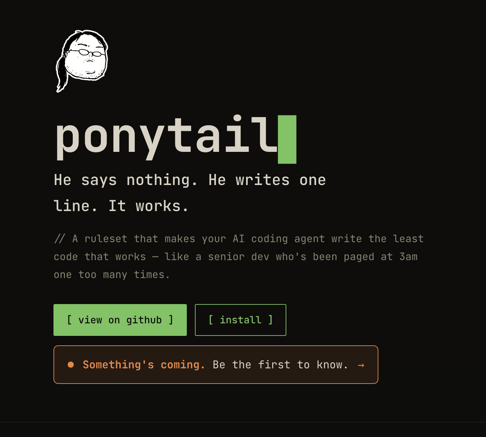
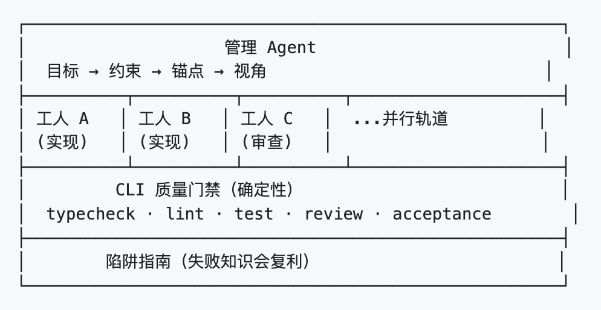
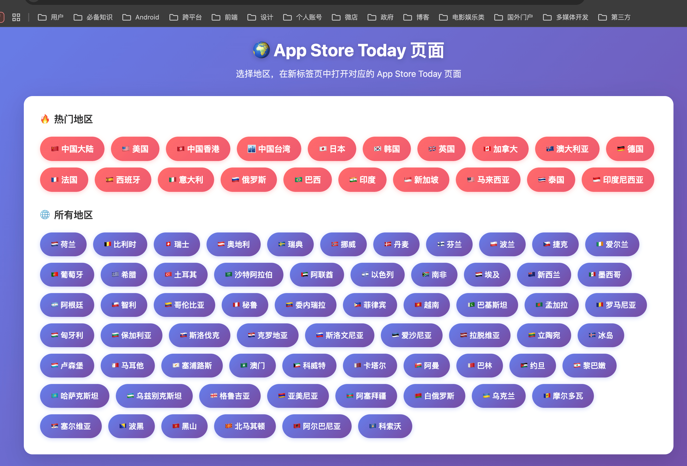
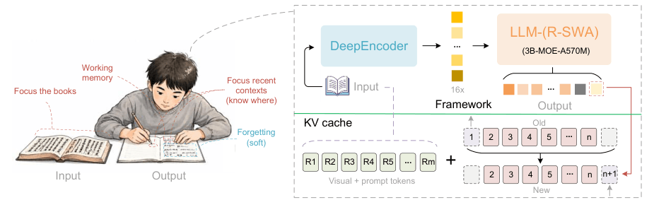
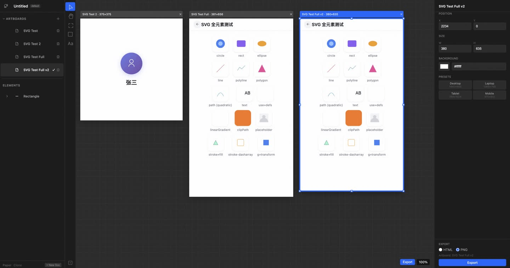

## 📕 精选文章
* 📄[Android 禁止侧载将正式实施，需要等待 24 小时冷静期](https://juejin.cn/post/7618858438484901942)
* 📄[Swift 杀进 Android，Google 和 Apple 都要失眠了？](https://juejin.cn/post/7622935129707446298)
* 📄[Android 17 正式版发布，全新 AI 和各种破坏性更新](https://juejin.cn/post/7651930056574517289)
* 📄[瑞幸 skill 引发的一些思考瑞幸把点咖啡做成了 agent skill。](https://juejin.cn/post/7650146543882518591)
* 📄[Loop Engineering —— 循环的设计与自主执行](https://juejin.cn/post/7655971054037778441)

## 🤖 AI前沿

**ponytail**  

让你的人工智能代理像房间里最懒的高级开发人员一样思考。最好的代码是你从未编写过的代码。

Makes your AI agent think like the laziest senior dev in the room. The best code is the code you never wrote.

https://ponytail.dev/

**SpaceX 收购 Cursor，马斯克花600亿美元买了个代码编辑器**  

https://juejin.cn/post/7651610218149707782

**Harness 还没学会，又来了个 Loop Engineering ？**  

https://juejin.cn/post/7651153611318460425

## 📚 宝藏资源

**Vadaski/va-auto-pilot**

CLI 优先的自治多智能体工程闭环——给出目标，模型自己找路径。

https://github.com/Vadaski/va-auto-pilot

**App Store Today 页面查看器**  

选择地区，在新标签页中打开对应的 App Store Today 页面

https://fenghaigo.github.io/appstore_viewer.html
https://juejin.cn/post/7571102074039386153

## 💡 优秀项目

**baidu/Unlimited-OCR**

无限OCR作品：迎接一次性长视野解析时代。
Welcome the Era of One-shot Long-horizon Parsing.

https://github.com/baidu/Unlimited-OCR

**chenglou/pretext**

Fast, accurate & comprehensive text measurement & layout

 https://github.com/chenglou/pretext

**eisneim/VibeDesignLocalMCP**

本地优先的 UI 设计工具，复刻 Paper 的核心体验。基于真实 HTML/CSS 渲染，通过 MCP 协议让 AI Agent（如 Claude Code）可以直接读写画布。

https://github.com/eisneim/VibeDesignLocalMCP

**baidu/cosui**

一套面向 AI 时代的前端 UI 解决方案，包含 UI 协议、解析渲染 SDK 与 UI 组件库等，可应用于生成式 UI、智能体、AI 对话等多种大模型场景。

https://github.com/baidu/cosui

**android-notes/Cockroach**

降低Android非必要crash

https://github.com/android-notes/Cockroach
