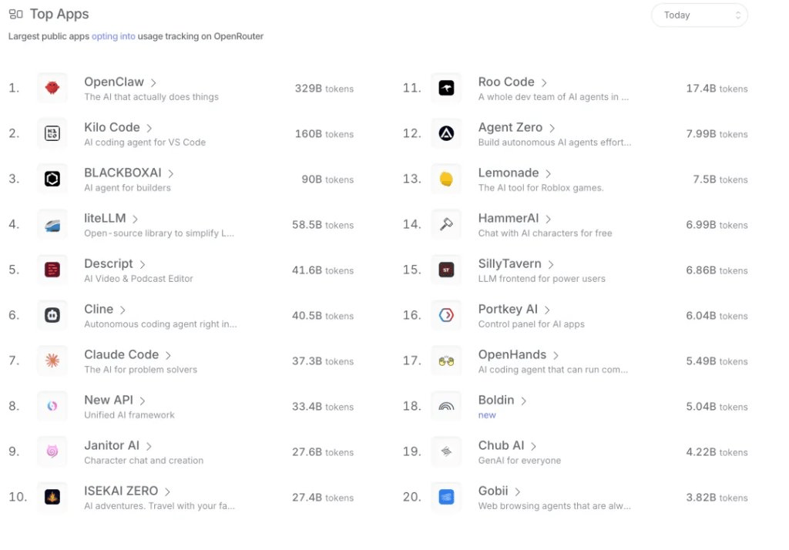
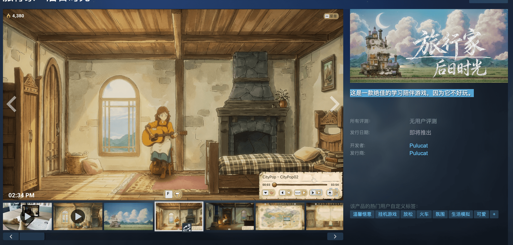
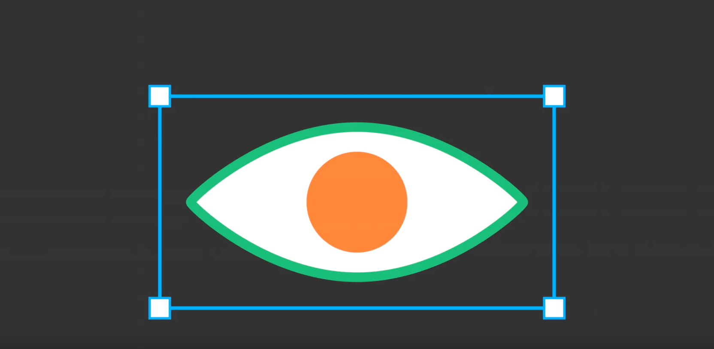
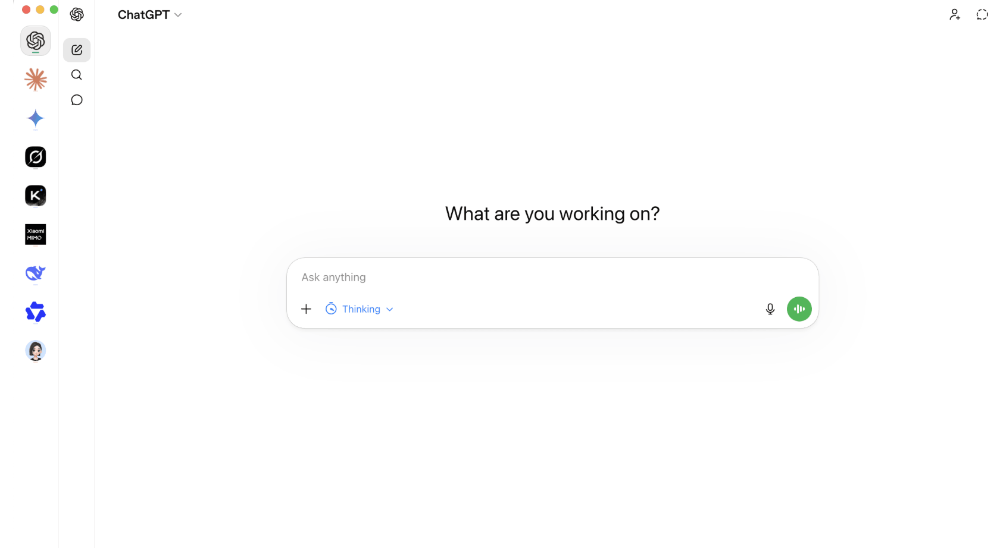
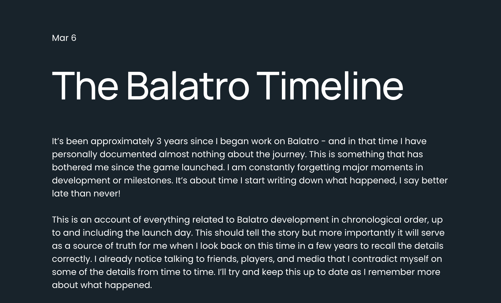
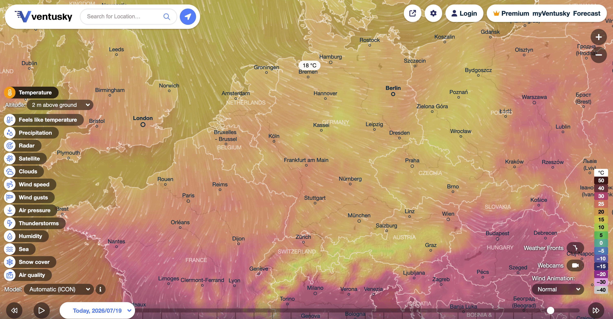

## 📕 精选文章
* 📄[Flutter Liquid Glass 🪟魔法指南：让你的界面闪耀光彩](https://juejin.cn/post/7553823229522575369)
* 📄[3位工程师靠“删AI代码”创业，一周收费1万美元：以后最贵的能力，可能不是写代码](https://juejin.cn/post/7661251852345458697)
* 📄[用vue3+pixijs复刻童年记忆里的游戏-猎鸭季节](https://juejin.cn/post/7079944397575421965)
* 📄[Js开发「风来之国」游戏系列1--地图篇！](https://zhuanlan.zhihu.com/p/423273827)
* 📄[OpenUI：AI生成UI开源新标准，比JSON省67%Token](https://mp.weixin.qq.com/s/t7sAvS6BF57FRWU1DcnFvQ)

## 🤖 AI前沿

**Token太贵，中国开源模型一夜之间霸榜了 - 华尔街见闻**  

OpenRouter数据显示，2026年2月中国AI模型调用量三周大涨127%，首次超越美国，全球前五中占据四席，合计占比85.7%。一年前份额尚不足2%。爆发源于AI应用从 “对话式”向“流程型”切换，成本敏感度放大。中国开源模型凭极致性价比（价格仅为美国模型的1/6至1/13）吃到红利，行业正从价格战转向需求驱动时代。

https://wallstreetcn.com/articles/3766364

**旅行家：后日时光**  

这是一款绝佳的学习陪伴游戏，因为它不好玩。
作者利用AI开发的独立游戏作品：我花了 4 个月，用 AI 做了一款游戏。真正改变我的，不是 AI，而是我终于意识到：AI 做游戏最大的误区，从来都不是 AI。

https://store.steampowered.com/app/4618130/Travelling_Home_Ever_After/?l=schinese
https://www.xiaohongshu.com/user/profile/673b2f8e000000001c0191a5
https://www.xiaohongshu.com/explore/6a4a360d0000000016026d10

## 🔨 实用工具

**penpot/penpot**  

Penpot 是一个开源设计平台，适合大规模构建数字产品的团队。

The open-source design platform for Product teams that need scalable collaboration.

https://github.com/penpot/penpot

**JS-banana/AmberKeeper**  

本地优先的多 AI 对话留存与管理桌面工作台。
继续使用官方网页聊天，同时把每一次问答自动沉淀为属于你自己的本地资产。

Local-first desktop workspace for capturing and managing conversations across ChatGPT, Claude, DeepSeek, and Gemini.

https://github.com/JS-banana/amberkeeper
https://github.com/js-banana/anychat

## 📚 宝藏资源

**硬AI - 华尔街见闻**  

https://wallstreetcn.com/news/ai

**stardewvalley**

星露谷物开发者的博客日记

https://www.stardewvalley.net/blog/

**Donchitos/Claude-Code-Game-Studios**  

将单个 Claude Code 会话转变为完整的游戏开发工作室。

Turn Claude Code into a full game dev studio — 49 AI agents, 72 workflow skills, and a complete coordination system mirroring real studio hierarchy.

https://github.com/donchitos/claude-code-game-studios

**《小丑牌》作者公布开发日记：他最初只是为了让简历好看一点**

https://localthunk.com/blog/balatro-timeline-3aarh
https://www.bilibili.com/video/BV1iCQnYRECv/?vd_source=a7e2287c99c30ec7d715c362b6698898
https://store.steampowered.com/app/2379780/Balatro

**Ventusky - Live Weather Forecast & Radar Maps**  

 

台风路径实时查看

https://www.ventusky.com/

## 💡 优秀项目

**team-reflect/reflect-open**  

适用于 Mac 和 iPhone 的纯文件笔记：每日笔记、wiki 链接、本地搜索以及基于您自己的 Markdown 的可选 AI。

Open-source Reflect rewrite: A local-first AI agent-friendly Markdown note-taking app

https://github.com/team-reflect/reflect-open

**XiaoMi/xiaomi-miloco**  

小米面向未来的全屋智能 AI 开源方案，以米家摄像头的画面与声音为全模态感知入口，以自研 MiMo 大模型为智能大脑，以 Agent 插件形式运行在 OpenClaw 之上，联动全屋设备带来主动智能体验。

Xiaomi's open-source AI solution for the future of whole-home intelligence. It uses the video and audio from Mi Home cameras as a full-modal perception gateway, the in-house MiMo large model as its intelligent brain, and runs as an Agent plugin on top of OpenClaw to orchestrate whole-home devices for a proactive, intelligent experience.

https://github.com/XiaoMi/xiaomi-miloco

** PixiJS**  

使用最快的 2D WebGPU/WebGL 渲染器创建精美的游戏、应用程序和交互式数字内容。

Create beautiful games, apps, and interactive digital content with the fastest 2D WebGPU/WebGL renderer.

https://pixijs.com/8.x/guides/getting-started/intro

