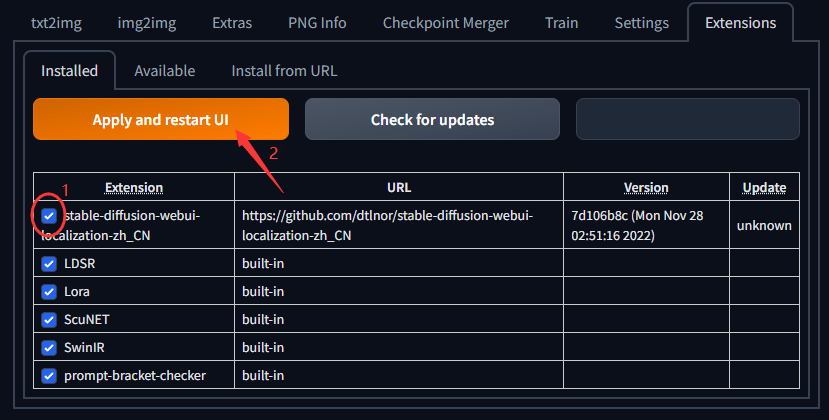
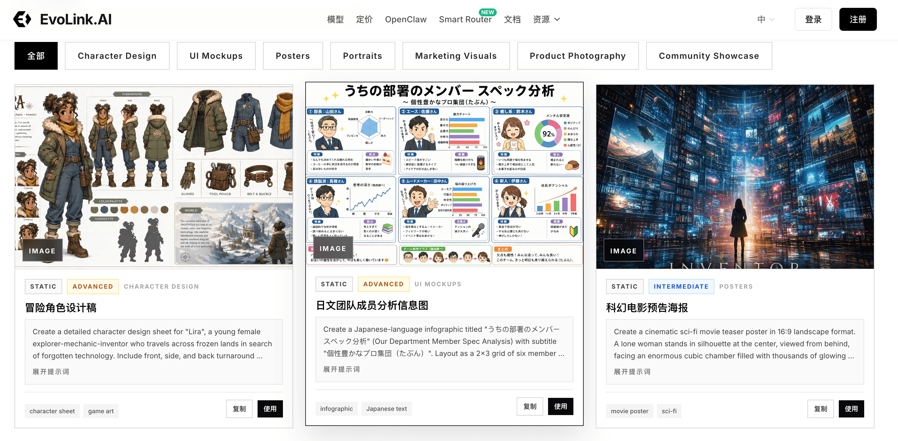
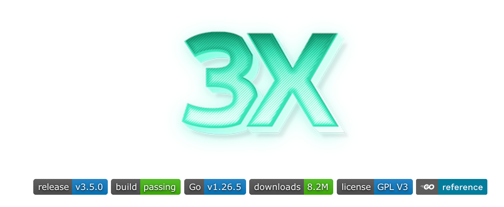
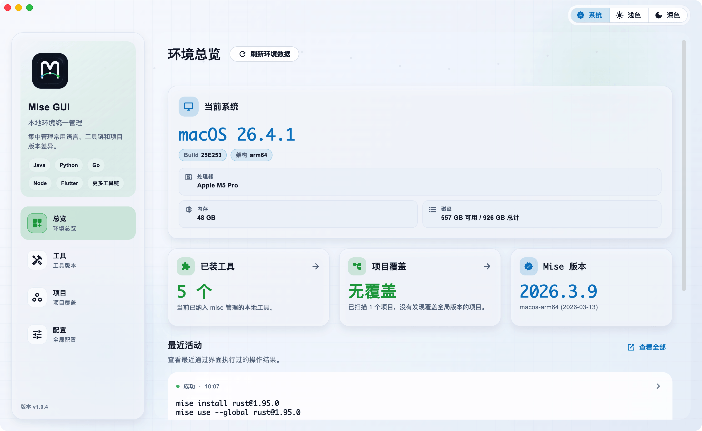
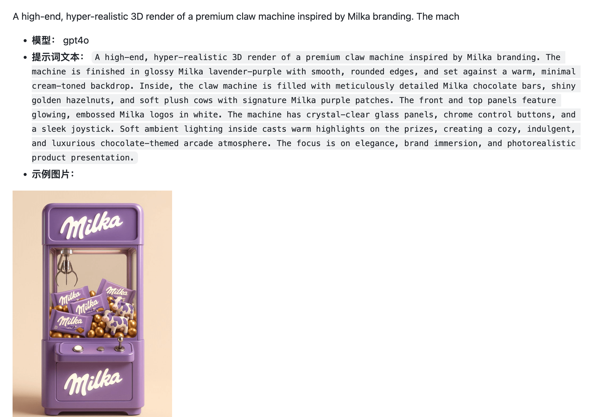
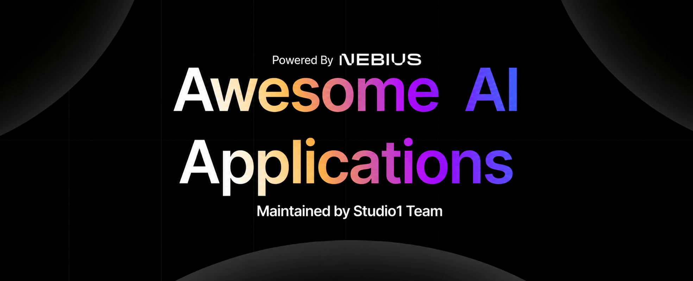
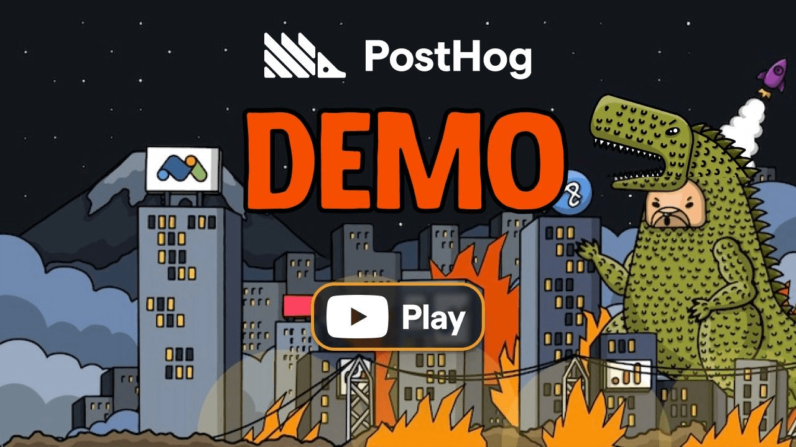

## 📕 精选文章

* 📄[AI 又又造词，Graph 就又要替代 Loop 了？](https://juejin.cn/post/7664063148857442347)
* 📄[我用 GPT-image2 跑了几十张图，总结出这套提示词写法](https://cloud.tencent.com/developer/article/2661804)
* 📄[Flutter material/cupertino 解耦最新进展，已经在做新样式了](https://juejin.cn/post/7660030380293357609)

## 🤖 AI未来

**dtlnor/stable-diffusion-webui-localization-zh_CN**  

简体中文翻译扩展，用于AUTOMATIC1111的稳定扩散webui

Simplified Chinese translation extension for AUTOMATIC1111's stable diffusion webui

https://github.com/dtlnor/stable-diffusion-webui-localization-zh_CN

**mattpocock/skills**  

AI Skill大全

Skills for Real Engineers. Straight from my .agents directory.

https://github.com/mattpocock/skills

**LingyiChen-AI/image-prompts**  

一套完整的 AI 图像/视频生成提示词系统

https://github.com/LingyiChen-AI/image-prompts

**GPT Image 2 提示词 | AI 图像生成示例与模板 2026**  

围绕海报、人像、UI mockup、角色设定和营销视觉整理的精选图像提示词。

https://evolink.ai/zh/gpt-image-2-prompts

**杀戮三国**  

使用AI生成的三国卡片游戏

https://slaythewarlords.com/

**GenielabsOpenSource/spine-animation-ai**  

AI 驱动的 Claude 技能，用于创建、装配和完善 Spine 2D 骨骼动画 - 从原始资源到交互式预览。

AI-powered Claude skill for Spine 2D skeletal animation — auto-rig, animate, and preview characters

https://github.com/GenielabsOpenSource/spine-animation-ai

## 🔨 实用工具

**kiletw/SpineViewerWPF**

這是一個能選擇你要的Spine運行庫來查看Spine動畫並可匯出png或gif的工具。

a tool can view spine files with different version and export gif or png file.

https://github.com/kiletw/SpineViewerWPF

**MHSanaei/3x-ui**

3X-UI 是一个先进的开源 Web 控制面板，用于管理 Xray-core 服务器。它提供简洁、多语言的界面，用于部署、配置和监控各种代理与 VPN 协议——从单台 VPS 到多节点部署。

Xray panel supporting multi-protocol multi-user expire day & traffic & IP limit (Vmess, Vless, Trojan, ShadowSocks, Wireguard, Hysteria, Tunnel, Mixed, HTTP, Tun, MTProto)

https://github.com/MHSanaei/3x-ui

**likaia/mise_gui**

一个面向开发者的 mise 可视化管理软件，通过图形化界面快速管理本地工具链版本以及项目内所依赖工具版本。

https://github.com/likaia/mise_gui

**KevinGong2013/apkgo** 

一行命令，将 APK 发布到所有主流安卓应用商店

https://github.com/KevinGong2013/apkgo
https://apkgo.com.cn/

## 📚 宝藏资源

**ImgEdify/Awesome-GPT4o-Image-Prompts**  

 

这是一个精心策划的 GPT-4o 图像生成提示词集合。本仓库旨在帮助创作者更好地理解和使用 GPT-4o 的图像生成功能。

📚 GPT4o Prompts Dictionary | Curated Collection of AI Image Generation Prompts

https://github.com/ImgEdify/Awesome-GPT4o-Image-Prompts

**bojieli/ai-agent-book**  

《深入理解 AI Agent：设计原理与工程实践》（李博杰 著）开源主仓库：全书正文、编译版 PDF 与按章配套代码

https://github.com/bojieli/ai-agent-book

**Arindam200/awesome-ai-apps**  

该存储库全面收集了 129 个实用项目、教程和配方，用于构建强大的 LLM 支持的应用程序，包括文本代理、语音助手、RAG 应用程序和 MCP 支持的工具。这些项目为使用各种人工智能框架和堆栈的开发人员提供了指南。

A collection of projects showcasing RAG, agents, workflows, and other AI use cases

https://github.com/Arindam200/awesome-ai-apps

## 💡 优秀项目

**PostHog/posthog**  

PostHog 是用于构建自动驾驶产品的开源平台

hedgehog: PostHog is the leading platform for building self-driving products. Our developer tools – AI observability, analytics, session replay, flags, experiments, error tracking, logs, and more – capture all the context agents need to diagnose problems, uncover opportunities, and ship fixes. Steer it all from Slack, web, desktop, or the MCP.

https://github.com/PostHog/posthog

## 🎮 好玩有趣

## 📝 日常记录

https://github.com/ruanyf/weekly/blob/master/docs/issue-390.md