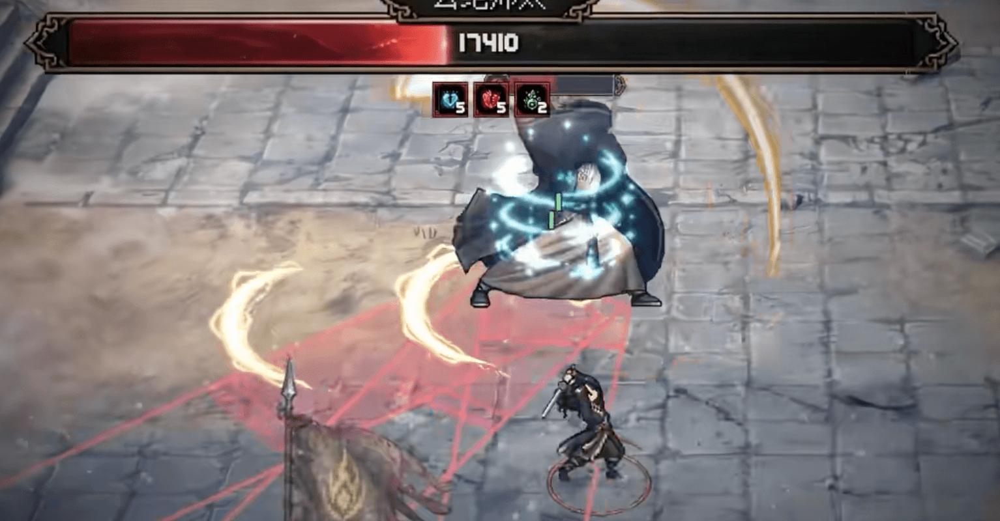
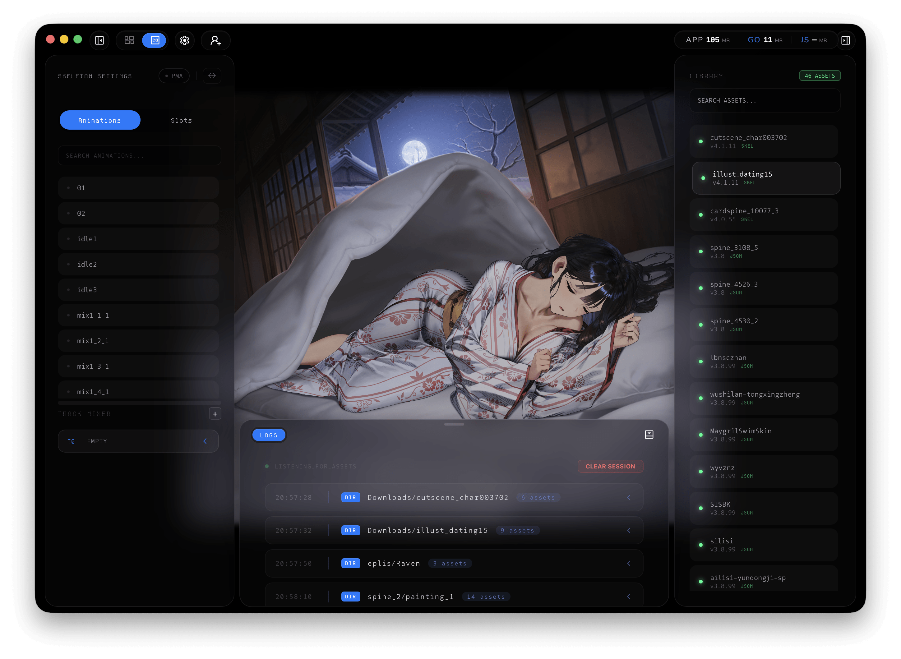
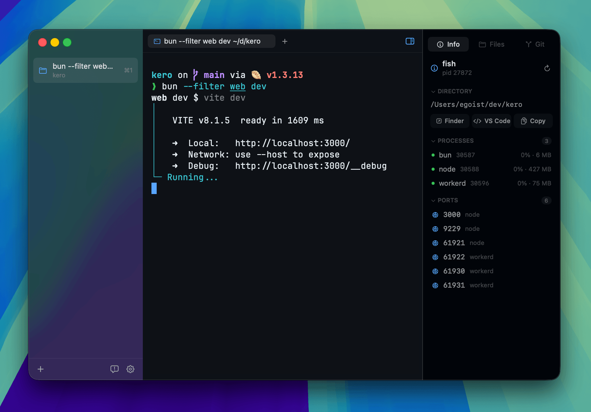
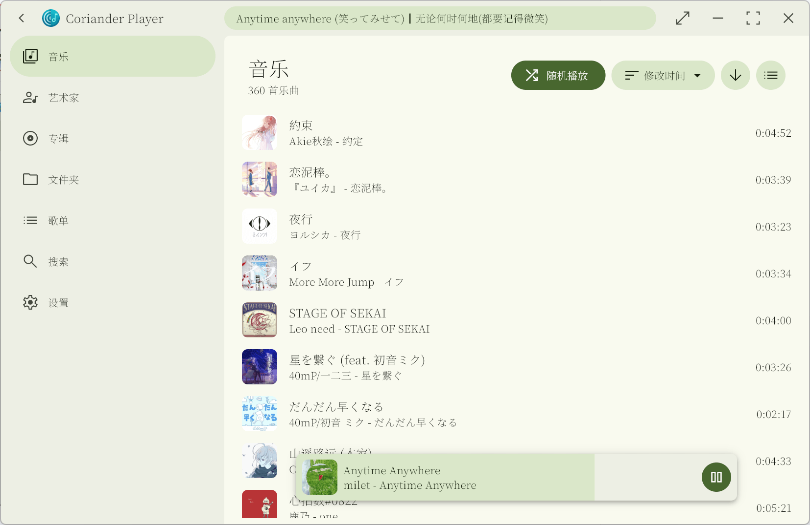
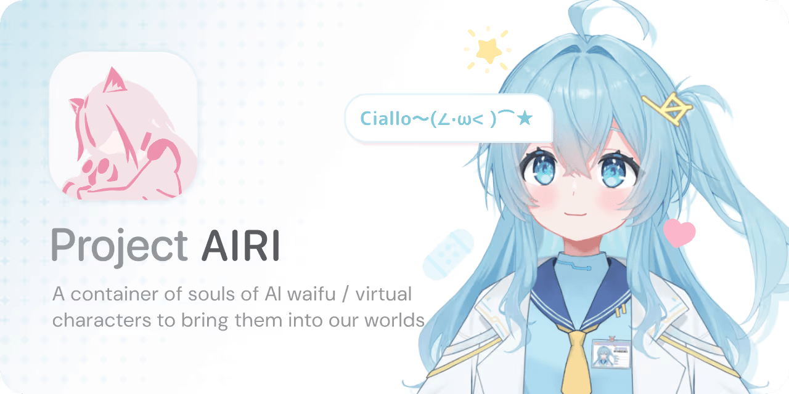
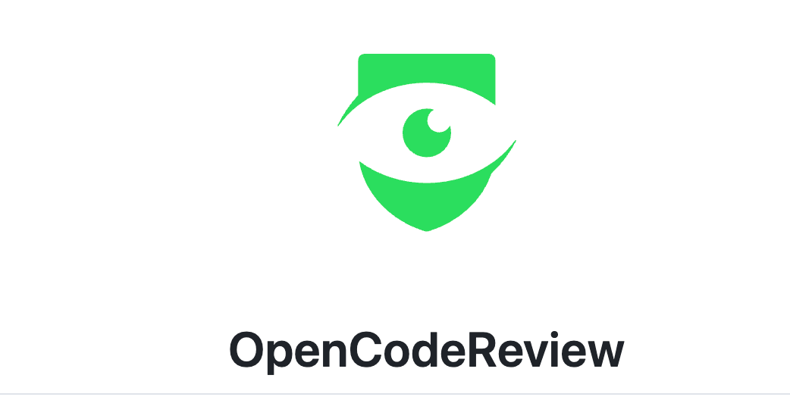

## 📕 精选文章
* 📄[最近公司烧token比招员工还贵，老板干懵了...](https://juejin.cn/post/7646256871183024128)
* 📄[AOSP 整机源码 Harness 工程探索](https://mp.weixin.qq.com/s/jCblt34Ea_p72YnHGRTu3g)
* 📄[Claude 对接 NanoBanana MCP](https://mp.weixin.qq.com/s/i9xWKeg9iq3vl7muESRxIA)
* 📄[又是梁文锋，有点猛啊。](https://juejin.cn/post/7651461757568811060)
* 📄[现在的AI热潮，恰恰证明了世界就是个草台班子](https://juejin.cn/post/7613716728385929226)
* 📄[完整案例:Kotlin+Compose+Multiplatform跨平台之桌面端实现（二）](https://juejin.cn/post/7535335090902532136)

## 🤖 AI前沿
**AI技术已经发展到这种地步了**

https://xmax.ai/
https://www.douyin.com/video/7666784609396492515

**我一个人做了款"4A"大作？ 一个不会写代码的人，能不能自己做出一款游戏？**
 
https://www.douyin.com/video/7666472872021445928

**我用AI杀死了史上最难的跑步游戏**

https://github.com/LYiHub/QWOP_rl_training_public
https://www.douyin.com/video/7664571016194084131

**Vibe Coding 能把简历玩出什么花样？？**

https://www.douyin.com/video/7665363756997725480

## 🔨 实用工具

**o0Nomar0o/Motiv2D**  

一款专为 Spine 资产预览、管理和批量导入设计的工具。基于 Go, Wails 和 Svelte 构建，追求极致效率。

Spine2d and Live2d Viewer

https://github.com/o0Nomar0o/Motiv2D

**BuSung-dev/Root-My-Galaxy**

Root My Galaxy 是一个一键式安装程序，适用于明确支持的三星型号和内核组合。应用程序本身与设备偏移、本机漏洞利用有效负载和 KernelSU 构建工件分开。
Root My Galaxy is a one-click installer for explicitly supported Samsung model and kernel combinations. The application itself is kept separate from device offsets, native exploit payloads, and KernelSU build artifacts.

https://github.com/BuSung-dev/Root-My-Galaxy

**egoist/kero**  

适用于 macOS 的本机终端工作区。
A native terminal workspace for macOS.
https://github.com/egoist/kero

**Ferry-200/coriander_player**

Coriander Player：一款使用 Material You 配色的本地音乐播放器。
https://github.com/Ferry-200/coriander_player

## 📚 宝藏资源

**violet-wdream/GamesArchive**

Live2D/Spine模型素材库
https://github.com/violet-wdream/GamesArchive

**o0Nomar0o/SpineCollections**  

Spine和 Live2D模型数据素材库。
A curated repository for Spine and Live2D model data, intended for research, learning, and digital preservation.

https://github.com/o0Nomar0o/SpineCollections

## 💡 优秀项目

**moeru-ai/airi**  

复刻 Neuro-sama，让 AI waifu / 虚拟角色也能来到我们的世界。
💖🧸 Self hosted, you-owned Grok Companion, a container of souls of waifu, cyber livings to bring them into our worlds, wishing to achieve Neuro-sama's altitude. Capable of realtime voice chat, Minecraft, Factorio playing. Web / macOS / Windows supported.

早期介绍过该项目，近期再次关注时发现有新更新。
https://github.com/moeru-ai/airi

**Justin-sky/Nice-TS**  
基于puerts的Unity游戏框架，集成fairygui，protobufjs并采用addressables管理资源
https://github.com/Justin-sky/Nice-TS

**alibaba/open-code-review**  

Open Code Review 是一款 AI 驱动的代码审查 CLI 工具。它的前身是阿里集团内部官方 AI 代码审查助手，过去两年在内部服务了数万开发者，识别了数百万个代码缺陷。经过大规模充分验证后，我们将其孵化为开源项目，对社区开放。只需配置一个模型端点即可使用。
Open-source & free — Battle-tested at Alibaba's scale. Hybrid architecture code review tool: deterministic pipelines + LLM Agent, precise line-level comments, built-in fine-tuned ruleset (NPE, thread-safety, XSS, SQL injection), OpenAI & Anthropic compatible.

https://github.com/alibaba/open-code-review

