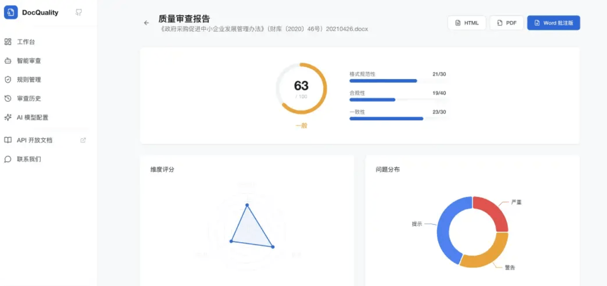
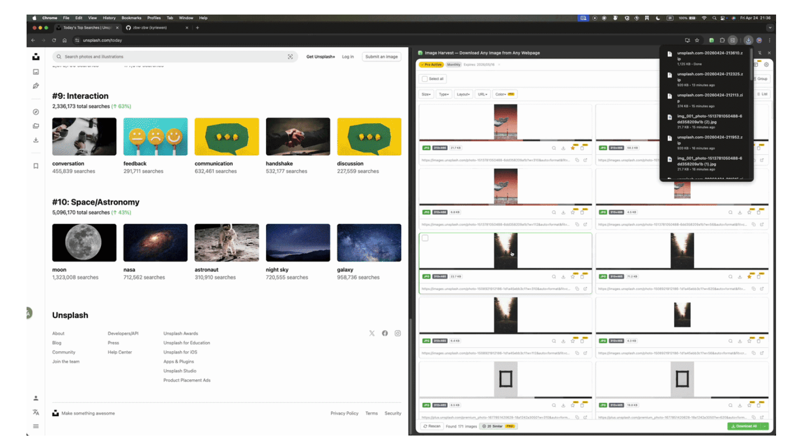
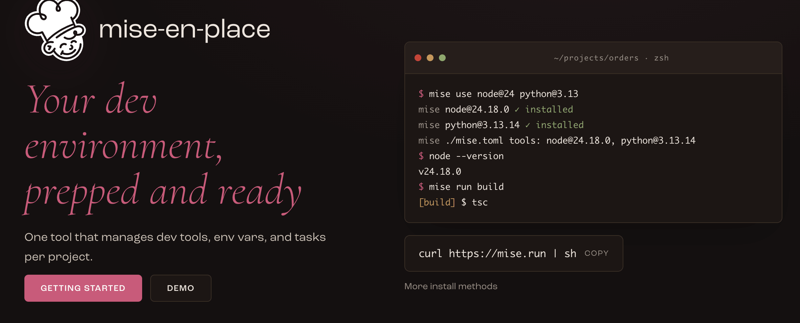
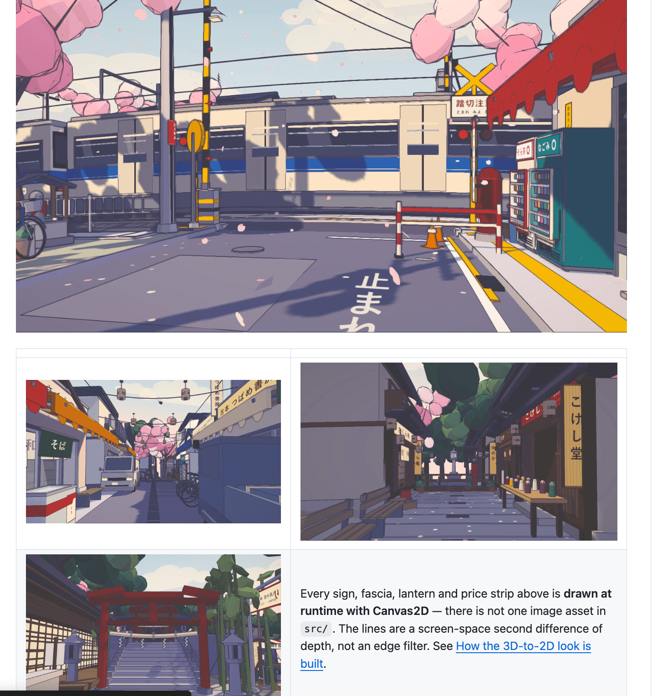
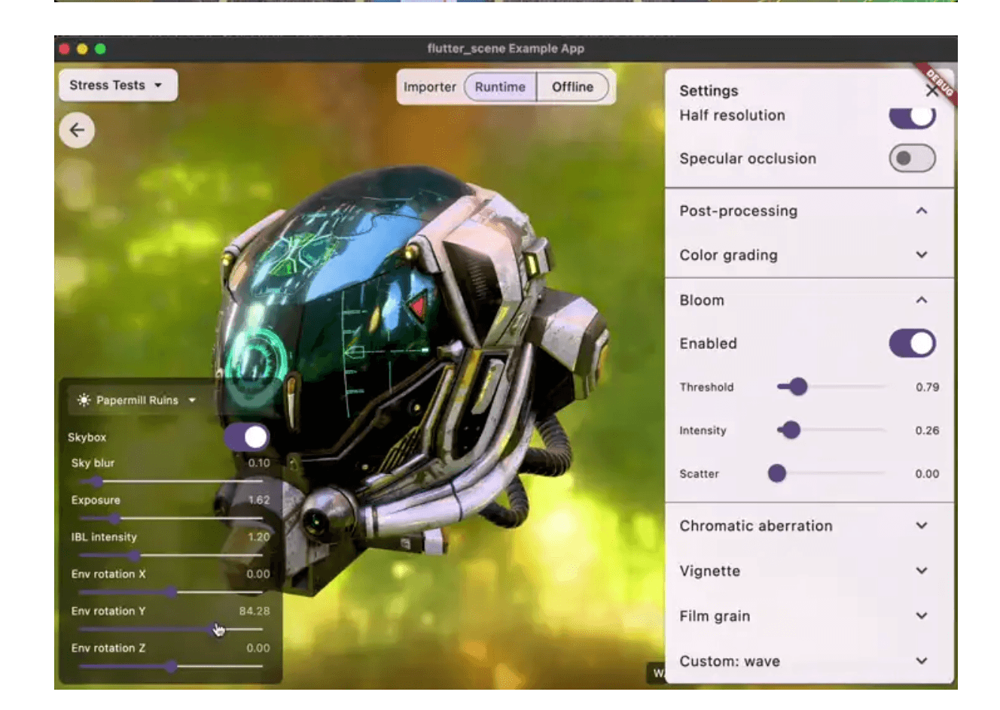

## 📕 精选文章
* 📄[格力之🐯王自如48天做出AI App：这不是“技术神话”，而是工程能力的重构！](https://juejin.cn/post/7635653259488182308)
* 📄[小程序上线半年我赚了多少钱？](https://juejin.cn/post/7593338828196626472)
* 📄[做了个AI日志平台，零代码接入，嘎嘎好用](https://juejin.cn/post/7670783499005362222)
* 📄[网页端OCR, 加载6mb大小模型, 又快又准, 百度这次真香](https://juejin.cn/post/7669068704309329960)
* 📄[Luban 2 Flutter：一行代码在 Flutter 开发中实现图片压缩功能](https://juejin.cn/post/7592765004807667763)
* 📄[Flutter GPU 纯作品欣赏，Flutter 已经在进入一个完全不同的领域](https://mp.weixin.qq.com/s/BkenqVd5E5gEVooYvMYglg)
* 📄[我要给 Vibe Coding 泼一盆冷水](https://www.kittenyang.com/blog/2025/05/argue_vibe_coding)

## 🤖 AI前沿

**Tencent/WeKnora**

💡 WeKnora — 让文档活起来：RAG、Agent 推理与自动 Wiki 一体化的知识框架

Open-source LLM knowledge platform: turn raw documents into a queryable RAG, an autonomous reasoning agent, and a self-maintaining Wiki.

https://github.com/Tencent/WeKnora

**jitOffice/DocQuality**  

基于 JitWord 开放 API 的文档解析与编辑能力，构建的集格式检查、合规扫描、一致性验证、质量评分、报告导出于一体的智能文档质量审查工具。

https://juejin.cn/post/7667013663632080896
http://qudoc.jitword.com/login
https://github.com/jitOffice/DocQuality

## 🔨 实用工具

**EsotericSoftware/spine-scripts**  

此 GitHub 项目托管脚本，用于从 Adob​​e PhotoShop、Illustrator 和其他图像编辑工具导出图像，以便在 2D 骨骼动画工具 Spine 中使用。

Scripts to export from PhotoShop and other tools to Spine's JSON data format.

https://github.com/EsotericSoftware/spine-scripts

**zbw-zbw/image-harvest**  

智能识别并批量下载任意网页中的所有图片。
🖼️ Bulk download images from any webpage — Chrome extension with multi-tab extract, Shadow DOM/CSS background support, similar-image detection, and reverse search. 100% local, zero tracking.

https://github.com/zbw-zbw/image-harvest/

**jdx/mise**

 

一种管理开发工具、环境变量和每个项目任务的工具。

dev tools, env vars, task runner

https://github.com/jdx/mise

https://mise.jdx.dev/

## 📚 宝藏资源

**lyfeyaj/awesome-resources**  

开发实战资源整合 Awesome

Awesome resources for coding and learning: open source projects, websites, books e.g.

https://github.com/lyfeyaj/awesome-resources

**Brandon DeRosier**  

Brandon DeRosier的个人github，手搓flutter_scene的大佬。

https://github.com/bdero

## 💡 优秀项目

**k2-fsa/sherpa-onnx**

sherpa 支持在具有各种语言绑定的各种平台上部署与语音相关的预训练模型。

sherpa is the deployment framework of the Next-gen Kaldi project.
sherpa supports deploying speech related pre-trained models on various platforms with various language bindings.

开源的语音能力库

https://github.com/k2-fsa/sherpa-onnx

**Kenton-GMI/sakura-crossing**  

花季中值得探索的日本郊区，在 Three.js 中构建为真实的 3D 场景，并渲染为看起来像手绘的 2D 动画背景。

An explorable Japanese suburban railway-crossing neighbourhood on a small planet, rendered 3D-to-2D as a cel-shaded anime background. Three.js, no image assets.

https://github.com/Kenton-GMI/sakura-crossing

**bdero/flutter_scene**

Scene 将 Flutter 扩展为一个完整的工具包，用于构建令人难以置信的 3D 多平台应用程序。渲染、物理、音频、工具和完整的资产管道。

A realtime 3D engine for Flutter.

https://github.com/bdero/flutter_scene

## 🎮 好玩有趣

## 📝 日常记录