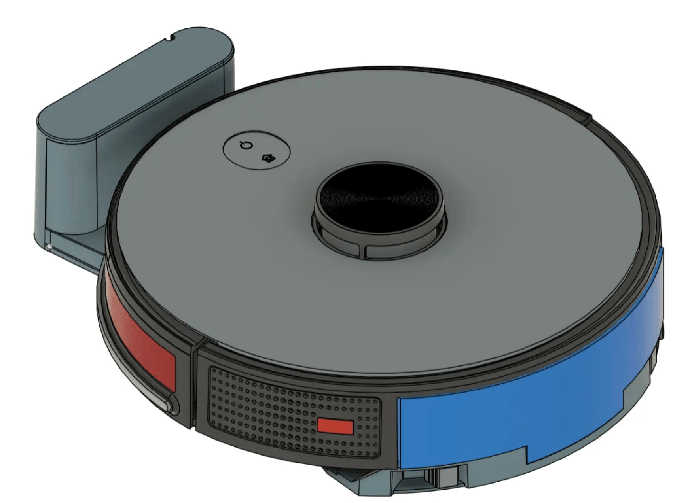
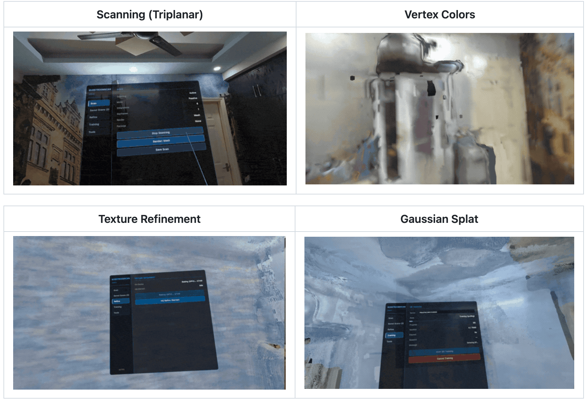
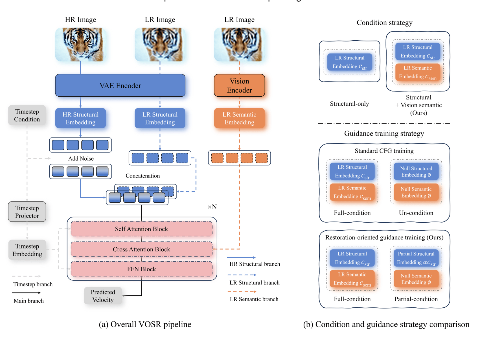
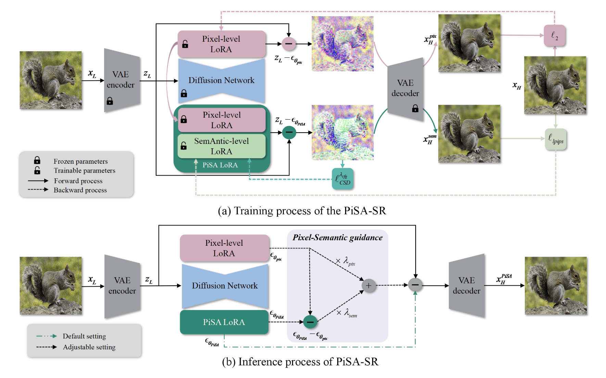
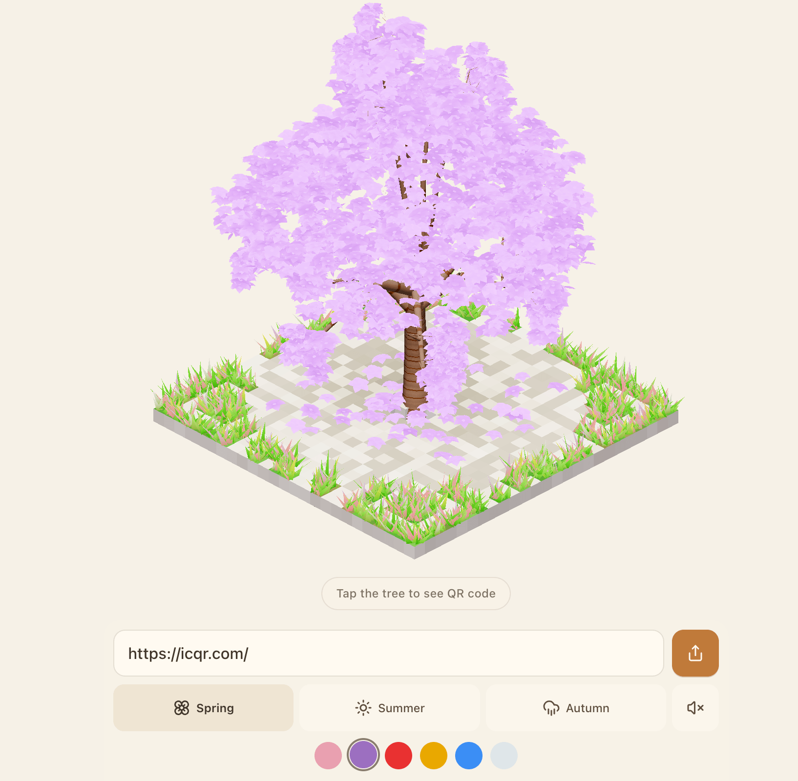
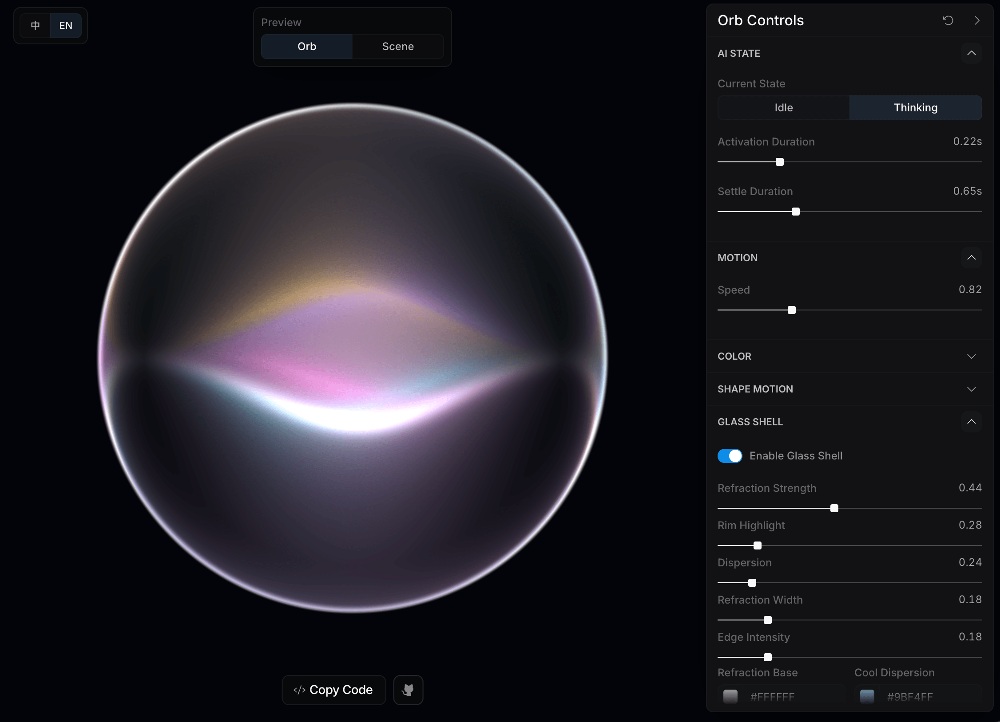
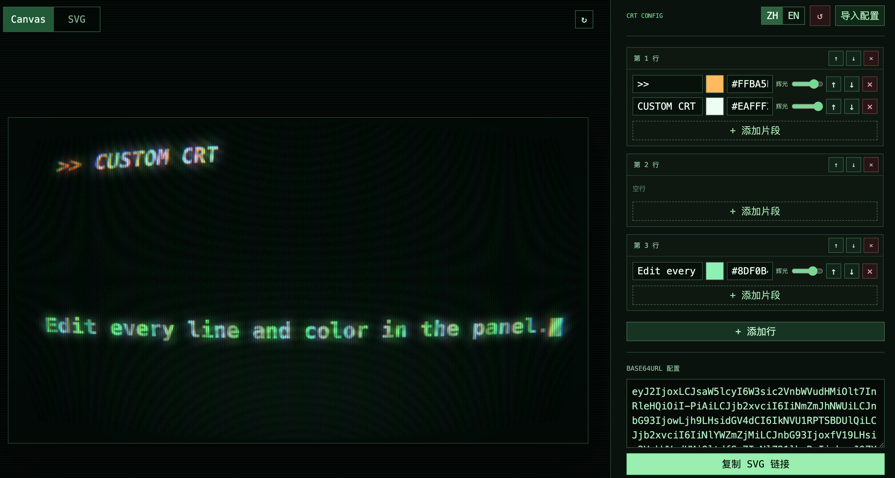

## 📕 精选文章

* 📄[当 Flutter 撞上 3D 性能之墙 —— Fluorite（萤石）](https://juejin.cn/post/7625240953956007962)
* 📄[太尴尬了！Opus5把GPT6按在地上摩擦了！我狂吹了两波 GPT-6！](https://juejin.cn/post/7681913265295867930)
* 📄[GitHub上面有人开源了一个扫地机器人项目，自己动手也能造一台扫地机器人了？]（https://mp.weixin.qq.com/s/ljmw8xCRVAxZ9bI9Kqgw4Q?mpshare=1&scene=1&srcid=0905IvMVcfa63kszw9VcmUKG）

## 🤖 AI前沿

**handsomestWei/patent-disclosure-skill**  

专利.skill：专利点挖掘与交底书（发明/实用/外观）编写，通俗解读专利，嗅探动向，辅助答复。

https://github.com/handsomestWei/patent-disclosure-skill

## 🔨 实用工具

**abiosoft/colima**

只需最少的设置即可在 macOS（和 Linux）上运行容器运行时

Container runtimes on macOS (and Linux) with minimal setup

https://github.com/abiosoft/colima

## 📚 宝藏资源

**makerspet/oomwoo**  

OOMWOO 是一款您可以自行构建的开源家用机器人真空吸尘器，使用 Raspberry Pi、3D 打印、Home Assistant、Arduino 和 ROS2 构建。它使用价格实惠的 2D LiDAR 来绘制您的房屋地图并自行导航。本地，常规功能不需要云，没有供应商锁定。

Open-source vacuum robot cleaner

https://github.com/makerspet/oomwoo

## 💡 优秀项目

**Dimezis/BlurView**  

Dynamic iOS-like blur of underlying Views for Android

https://github.com/Dimezis/BlurView

**arghyasur1991/QuestRoomScan**  

Meta Quest 3 上的实时 3D 房间重建。使用 GPU TSDF 体积集成和 Surface Nets 网格提取，通过基于服务器的 Gaussian Splat 训练和通过 Unity Gaussian Splatting 进行设备上渲染，从深度 + RGB 相机数据生成纹理网格。

Real-time 3D room reconstruction on Meta Quest 3. GPU TSDF + Surface Nets meshing, passthrough texturing, on-device texture refinement with Sobel normals, AI object detection (YOLO/Sentis + GPU NMS), MRUK scene understanding, Gaussian Splat training & rendering, multi-scan persistence with spatial anchors. Unity 6 URP package.

https://github.com/arghyasur1991/QuestRoomScan

**LSPosed/LSPlant**  

LSPlant 是一个 Android ART hook 库，提供 Java 方法 hook/unhook 和内联去优化。

LSPlant is an Android ART hook library, providing Java method hook/unhook and inline deoptimization.

A hook framework for Android Runtime (ART)

https://github.com/LSPosed/LSPlant

**cswry/VOSR**  

VOSR：仅视觉的图像超分辨率生成模型

[CVPR2026] VOSR: A Vision-Only Generative Model for Image Super-Resolution

https://github.com/cswry/VOSR

**csslc/PiSA-SR**  

 

“像素级和语义级可调超分辨率：双 LoRA 方法”的官方代码存储库

[CVPR 2025] Official code repository for "Pixel-level and Semantic-level Adjustable Super-resolution: A Dual-LoRA Approach

https://github.com/csslc/PiSA-SR

## 🎮 好玩有趣

**ICQR Magic Tree** 

 

将二维转成3D的一颗树 — 3D QR Code Generator

https://tree.icqr.com/

**Liquid Orb Editor** 

一个使用 React、WebGPU/WGSL 和 Toolcraft UI 构建的实时液态玻璃球编辑器。

https://github.com/LerSent001/orb
https://lersent001.github.io/orb/

**Typed CRT**  

模拟CRT效果的前端页面

https://crt.twimark.cc.cd/edit

