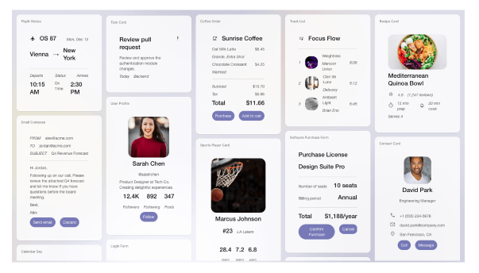
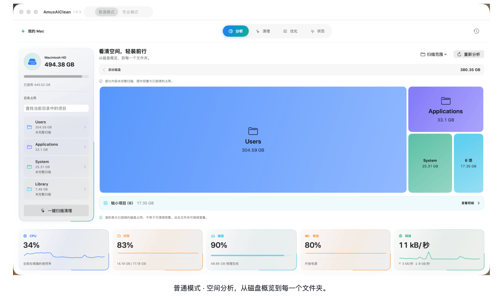
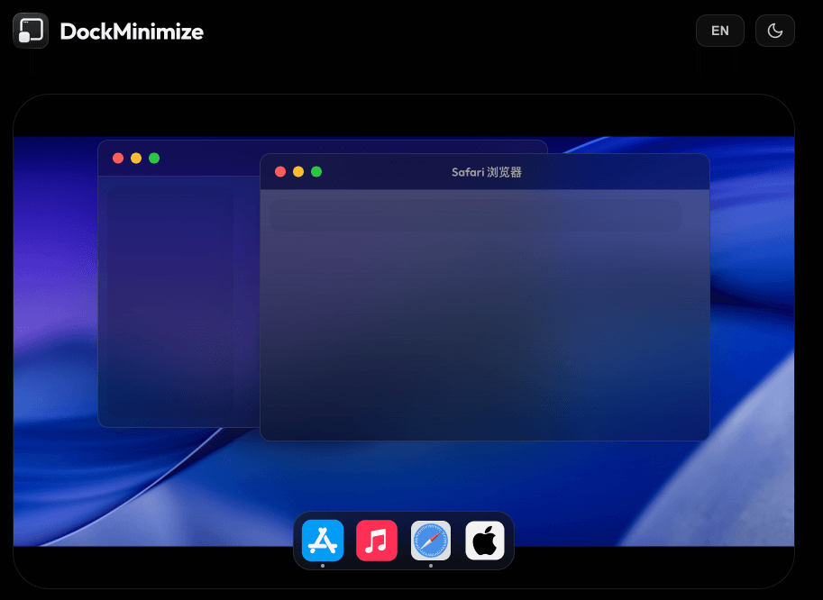
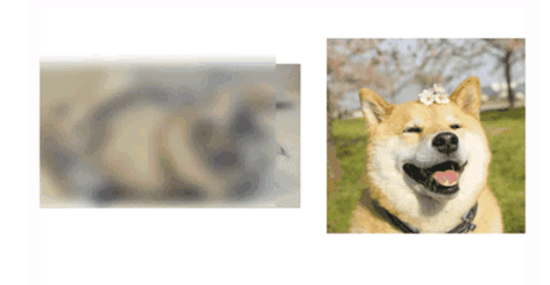
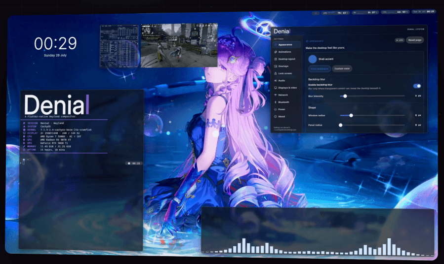
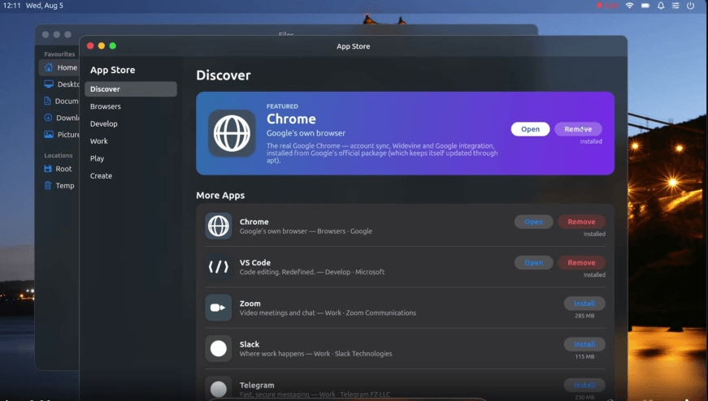
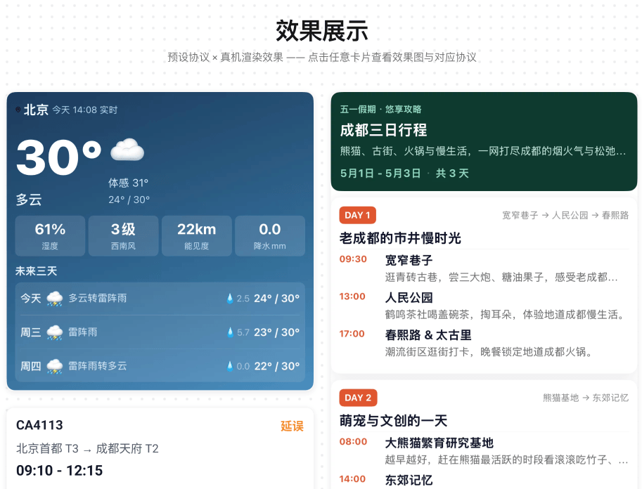
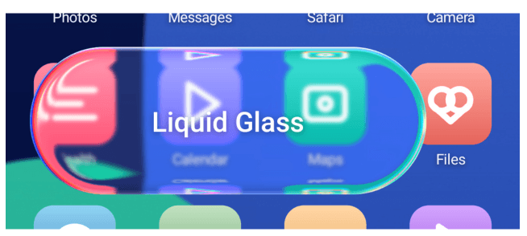
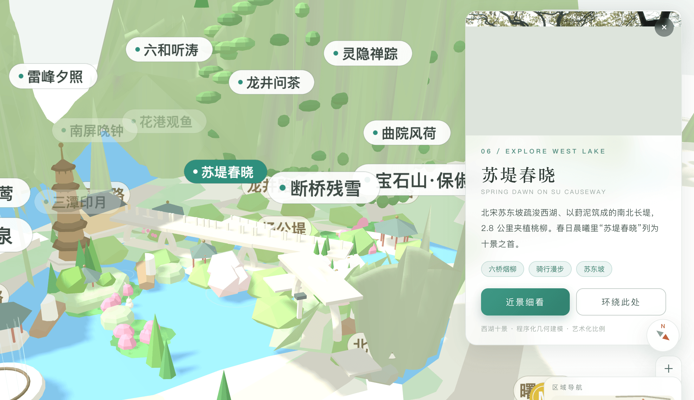

## 📕 精选文章

* 📄[三年了，AI为何还没有抢走程序员饭碗？](https://juejin.cn/post/7682262550978936884)
* 📄[Impeller 时代：Shader Jank 消失了，但渲染性能的战场也变了](https://juejin.cn/post/7672365802431856676)
* 📄[提前还贷，缩短年限和降低月供其实是一样的](https://juejin.cn/post/7682013859251896320#heading-9)
* 📄[Flutter Zero 是什么？它的出现有什么意义？为什么你需要了解下？](https://juejin.cn/post/7603769956976377897)
* 📄[Flutter Starling : 用 Swift和 Flutter 写了一个 Linux 桌面系统，震惊我一整年](https://juejin.cn/post/7668191994554073142)

## 🤖 AI前沿

**a2ui-project/a2ui**  

A2UI 是一个开源项目，具有针对表示可更新代理生成的 UI 进行优化的格式和一组初始渲染器，允许代理生成或填充丰富的用户界面。
A2UI is an open-source project, complete with a format optimized for representing updatable agent-generated UIs and an initial set of renderers, that allows agents to generate or populate rich user interfaces.

https://github.com/a2ui-project/a2ui

## 🔨 实用工具

**CarGuo/AmuxAICleanRelease**  

AmuxAIClean 官方发布仓库：原生 macOS 空间分析与清理工具，支持可视化磁盘占用、一键扫描清理、开发者缓存管理与实时系统状态监测，提供普通模式和专业模式。 - CarGuo/AmuxAICleanRelease

https://github.com/CarGuo/AmuxAICleanRelease

**oidd/DockMinimize**  

Fill the gap in macOS interaction: Click Dock icons to minimize windows. Minimalist, Stable, Fast.  弥补 macOS 缺失的交互：点击 Dock 图标隐藏窗口。极致、轻量、稳定。 - oidd/DockMinimize

https://github.com/oidd/DockMinimize

## 💡 优秀项目

**HokoFly/HokoBlur**  

动态模糊组件HokoBlur

an easy-to-use blur library for Android, support efficient dynamic blur tasks.

https://github.com/HokoFly/HokoBlur

**denialwm/denial**  

Denial 是一款 Flutter 原生 Wayland 合成器，它将 Flutter 置于桌面的基础上，将 shell、动作和应用程序组合统一为一种流畅的体验。
Denial is a Flutter-native Wayland compositor that puts Flutter at the foundation of the desktop, unifying the shell, motion, and application composition into one   fluid experience. - denialwm/denial

https://denialwm.org/

https://github.com/denialwm/denial

**starling-build/starling**  

Starling — 一个新的 Linux 桌面环境：Swift shell、自己的合成器、Flutter-to-Swift 框架端口和第一方应用程序
Starling — a new Linux desktop environment: Swift shell, its own compositor, a Flutter-to-Swift framework port, and first-party apps - starling-build/starling

https://starling.build/

https://github.com/starling-build/starling

**AGenUI/AGenUI**  

AGenUI: 同步支持 iOS、Android 和 HarmonyOS 的高性能 A2UI 渲染引擎

Native A2UI Renderer for iOS/Android/HarmonyOS. High performance streaming Generative UI. Custom Components, Styles and more.  - AGenUI/AGenUI

https://genui.amap.com/

https://github.com/AGenUI/AGenUI

**QWEA0/Liquid-Glass-Android**  

把 iOS 26 的液态玻璃搬到 Android View 体系 —— 真实 SDF 折射 / 物理色散 / 重力感应高光，

Liquid Glass for the Android View system — real SDF refraction, physical dispersion, sensor-driven specular. Drop into existing XML layouts, no Compose required. API 24+ - QWEA0/Liquid-Glass-Android

https://github.com/QWEA0/Liquid-Glass-Android

## 🎮 好玩有趣

**ruanyf/seed-westlake**  

Seed Evolving 模型生成的互动式 3D 西湖地图
 Contribute to ruanyf/seed-westlake development by creating an account on GitHub.

https://ruanyf.github.io/seed-westlake/

https://github.com/ruanyf/seed-westlake

