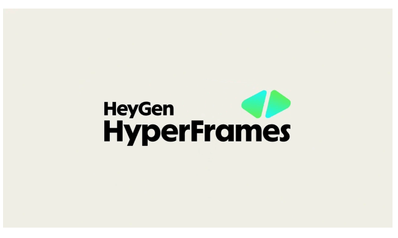
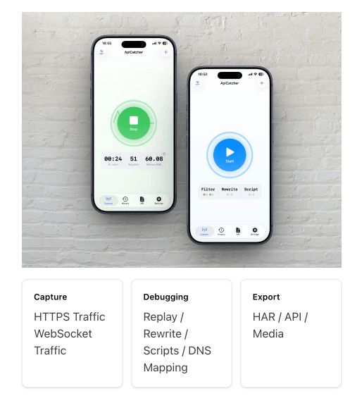
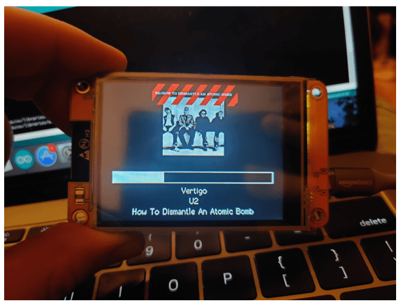
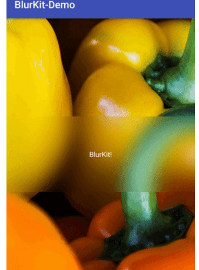
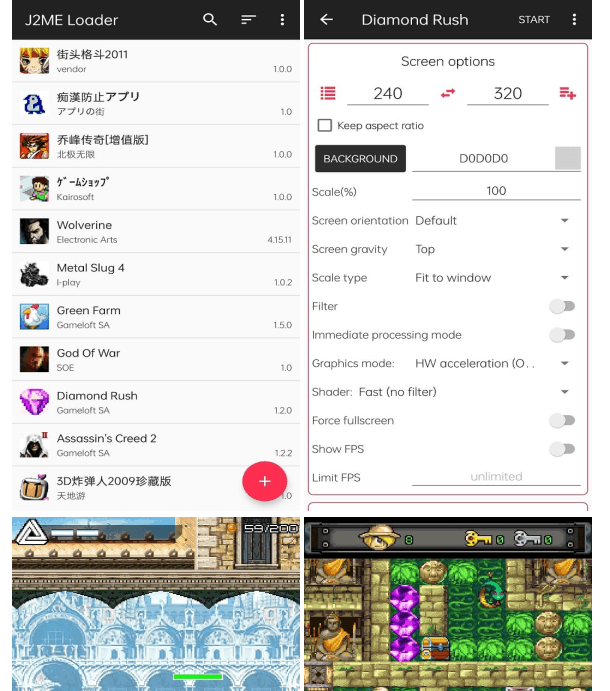

## 📕 精选文章

* 📄[关于导航栏颜色透明这件事](https://juejin.cn/post/7686592866278391827)
* 📄[适配小米“中”折屏，非得买一台吗各位 Android 爱好者们，大家好。 Android 正在全面推进自适应布局。应用不 - 掘金](https://juejin.cn/post/7682593227544805382)
* 📄[📱iPhone Duo 开屏动画咋实现的？](https://juejin.cn/post/7688737629098999843)
* 📄[FFmpeg 9.0正式发布：代号“Lei”，以纪念中国开发者雷霄骅](https://juejin.cn/post/7670447828808007718)
* 📄[由于 iOS 26 的键盘变化，Flutter 又要重构键盘区域逻辑](https://juejin.cn/post/7651505036707512383)
* 📄[AI 知识库 WeKnora（腾讯微信团队出品）](https://juejin.cn/post/7688530195554140194)
* 📄[Godot 游戏编辑器移植鸿蒙 PC：难度与可行性分析](https://juejin.cn/post/7691153237450391595)

## 🤖 AI前沿

**yi1108/printfilm**  

PRINTFILM：AI 视频获客与 AI短剧创作平台. Contribute to yi1108/printfilm development by creating an account on GitHub.

https://github.com/yi1108/printfilm

## 🔨 实用工具

**heygen-com/hyperframes**  

HyperFrames 是一个开源框架，用于将 HTML、CSS、媒体和可搜索动画转换为确定性 MP4 视频。通过 CLI 在本地使用它，通过具有技能的 AI 编码代理，或作为托管创作工作流程背后的渲染核心。
Write HTML. Render video. Built for agents. Contribute to heygen-com/hyperframes development by creating an account on GitHub.

https://github.com/heygen-com/hyperframes

**识打字 - 识打字,不忘字**  

识打字 v2.0.0 上线四大新模块:打字游戏、内容广场、我的创作、微信读书导入。覆盖新手指法、英文、拼音、五笔、文章练习,搭配统计与 8 套主题,让练习更专注、更高效。支持 macOS、Windows、Linux,免费使用,数据本地保存。

https://shidazi.com/

**KKKKhazix/AIHOT:**  

一个自己找热点、自己写日报的网站框架。把信源和精选标准换成你的，它就是你的行业热点站。. Contribute to KKKKhazix/AIHOT development by creating an account on GitHub.

https://github.com/KKKKhazix/AIHOT

**ApiCatcher - iOS HTTP/HTTPS Capture & Debugging Tool**  

专注于为 iOS 创建直观且易于使用的 HTTP/HTTPS 捕获和调试工具。无需 PC 代理，直接在 iPhone 或 iPad 上捕获数据包。
ApiCatcher is a focused HTTP/HTTPS capture and debugging tool for iOS. No PC proxy needed. Supports HTTPS capture, filters, replay, rewrite, AI scripts, timed replay, and HAR/API export.

https://apicatcher.net/en

**ChatTCP - Interactive PCAP Viewer & AI Network Analyzer**  

ChatTCP 使查看网络数据包就像阅读聊天记录一样简单！支持 TCP 和 UDP。

ChatTCP turns complex PCAP packet captures into intuitive, chat-style message logs. Diagnose TCP/UDP traffic anomalies, decode HTTP, WebSocket, MySQL, and DNS payloads, and troubleshoot latency bottlenecks with the help of a built-in AI assistant. The modern alternative to traditional Wireshark.

https://chattcp.com/en

## 📚 宝藏资源

**lxgw/LxgwWenkaiGB**  

一款开源中文字体，基于 FONTWORKS 出品字体 Klee One 衍生。
An open-source Simplified Chinese font derived from Klee One. - lxgw/LxgwWenkaiGB

https://github.com/lxgw/LxgwWenkaiGB

**stefan-jansen/machine-learning-for-trading**  

交易机器学习代码，第三版 — 从数据源到实时执行。
Code for Machine Learning for Trading, 3rd edition — from data sourcing to live execution. - stefan-jansen/machine-learning-for-trading

https://github.com/stefan-jansen/machine-learning-for-trading

## 💡 优秀项目

**witnessmenow/ESP32-Cheap-Yellow-Display**  

有一款内置 320 x 240 2.8" LCD 显示屏和触摸屏的 ESP32，名为“ESP32-2432S028R”，因为这不会轻易说出口，我建议将其更名为“Cheap Yellow Display”或简称 CYD。这款显示屏仅需 15 美元左右，因此我认为它非常物有所值。
Building a community around a cheap ESP32 Display with a touch screen - witnessmenow/ESP32-Cheap-Yellow-Display

https://github.com/witnessmenow/ESP32-Cheap-Yellow-Display

**linroid/Ketch**  

功能齐全的 Kotlin 多平台下载管理器 - 本地、远程或嵌入到您的应用程序中运行。支持 Android、iOS、桌面和 Web。
A full-featured Kotlin Multiplatform download manager — run locally, remotely, or embedded in your app. Supports Android, iOS, Desktop, and Web. - linroid/Ketch

https://github.com/linroid/Ketch

**CameraKit/blurkit-android**  

BlurKit 是一个非常易于使用和高性能的实用程序，用于在 Android 中渲染实时模糊效果。
The missing Android blurring library. Fast blur-behind layout that parallels iOS. - CameraKit/blurkit-android

https://github.com/CameraKit/blurkit-android

## 🎮 好玩有趣

**nikita36078/J2ME-Loader**  

J2ME-Loader 是适用于 Android 的 J2ME 模拟器。它支持大多数 2D 和 3D 游戏（包括 Mascot Capsule 3D 游戏）。模拟器有一个虚拟键盘，每个应用程序的单独设置，缩放支持。该项目是 J2meLoader 的一个分支。
A J2ME emulator for Android. Contribute to nikita36078/J2ME-Loader development by creating an account on GitHub.

https://github.com/nikita36078/J2ME-Loader

